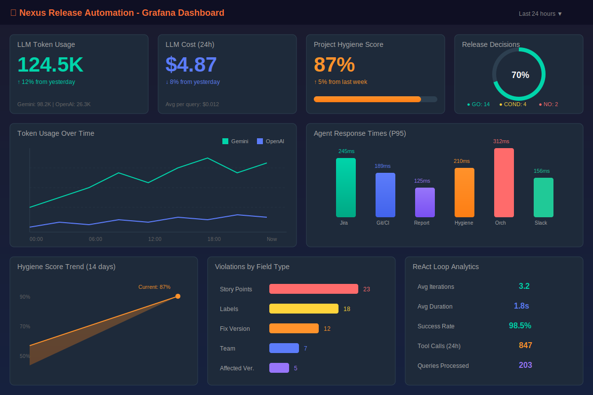

# 🚀 Nexus Release Automation System

<div align="center">


**Intelligent Multi-Agent System for Automated Release Readiness Assessments**

*Now with Admin Dashboard, Dynamic Configuration, Analytics, Webhooks, Google Gemini 2.0, and more!*

[Documentation](docs/index.md) • [User Guide](docs/user_guide.md) • [Architecture](docs/architecture.md) • [Demo](demo/feature_walkthrough_script.md)

</div>

---

## 🎯 Overview

Nexus is an AI-powered release automation system that uses a **ReAct (Reasoning + Acting)** architecture to coordinate specialized agents. It connects to your existing tools—Jira, GitHub, Jenkins, and Confluence—to provide intelligent **Go/No-Go release decisions** through natural language interactions.

### ✨ Key Features

- 🎛️ **Admin Dashboard** - Web UI for system management, mode switching, and credential configuration
- 🔍 **Smart Root Cause Analysis** - AI-powered build failure diagnosis with auto-trigger and Slack notifications
- 📊 **Advanced Analytics Dashboard** - DORA metrics, predictive analytics, anomaly detection
- 🔔 **Webhook Integrations** - Real-time notifications to external systems with HMAC security
- 🤖 **Google Gemini Integration** - Production-ready LLM with streaming and function calling
- 🧠 **Intelligent Orchestration** - ReAct engine that reasons and acts with transparent traces
- 💡 **AI Recommendations** - Pattern-based intelligent suggestions for release optimization
- 🏠 **Slack App Home** - Rich dashboard with quick actions and real-time widgets
- 🏢 **Multi-Tenant Support** - Enterprise-ready organization isolation with plan tiers
- 🔗 **Multi-Tool Integration** - Jira, GitHub, Jenkins, Confluence, Slack
- 📋 **Rich Reports** - Beautiful HTML reports with Go/No-Go decisions
- 💬 **Natural Language** - Ask questions in plain English via Slack
- 🔧 **Proactive Hygiene** - Automated Jira data quality checks with interactive fixes
- 📈 **Full Observability** - Prometheus metrics, Grafana dashboards, OpenTelemetry tracing
- 🔐 **Production Ready** - JWT auth, Kubernetes deployment, Helm charts

---

## 🏗️ Architecture

```
┌─────────────────────────────────────────────────────────────────────────────┐
│                              Slack Workspace                                 │
│              (User: /nexus status v2.0 | App Home Dashboard)                 │
└───────────────────────────────┬─────────────────────────────────────────────┘
                                │
                                ▼
┌─────────────────────────────────────────────────────────────────────────────┐
│                              Slack Agent                                     │
│           (Commands, Modals, DMs, App Home, Notifications)                   │
└───────────────────────────────┬─────────────────────────────────────────────┘
                                │
                ┌───────────────┼───────────────┐
                │               │               │
                ▼               ▼               ▼
┌───────────────────────┐ ┌──────────────┐ ┌──────────────────────────────────┐
│  Central Orchestrator │ │Hygiene Agent │ │        Advanced Services         │
│  ┌─────────────────┐  │ │  Scheduled   │ │ ┌──────────────┐ ┌─────────────┐ │
│  │ReAct + Gemini   │  │ │  Checks      │ │ │  Analytics   │ │  Webhooks   │ │
│  │Thought→Act→Obs  │  │ │  Validation  │ │ │  Dashboard   │ │  Service    │ │
│  └─────────────────┘  │ │  Scoring     │ │ │  DORA/KPIs   │ │  Events     │ │
│  ┌──────┐ ┌────────┐  │ │  Modals      │ │ │  Predictions │ │  Delivery   │ │
│  │Memory│ │AI Recs │  │ └──────────────┘ │ │  Anomalies   │ │  Retries    │ │
│  └──────┘ └────────┘  │                  │ └──────────────┘ └─────────────┘ │
│  ┌─────────────────┐  │                  └──────────────────────────────────┘
│  │ Multi-Tenancy   │  │                                  │
│  └─────────────────┘  │                                  ▼
└───────┬───────────────┘                         ┌──────────────────┐
        │                                         │ External Systems │
  ┌─────┴────────────┬──────────────┐             │ CI/CD, PagerDuty │
  ▼                  ▼              ▼             │ Datadog, Slack   │
┌─────────┐  ┌─────────────┐  ┌──────────┐        └──────────────────┘
│  Jira   │  │   Git/CI    │  │Reporting │
│  Agent  │  │    Agent    │  │  Agent   │
└────┬────┘  └──────┬──────┘  └────┬─────┘
     │              │              │
     ▼              ▼              ▼
┌─────────┐  ┌───────────┐  ┌───────────┐
│  Jira   │  │  GitHub   │  │Confluence │
│  Cloud  │  │  Jenkins  │  │           │
└─────────┘  └───────────┘  └───────────┘
```

---

## 🚀 Quick Start

### One-Click Setup (Recommended)

The easiest way to get started is using our automated setup script:

```bash
git clone https://github.com/IKRedHat/Nexus-Release-Readiness-Bot.git
cd Nexus-Release-Readiness-Bot

# Run the one-click setup
./scripts/setup.sh
```

The setup script automatically:
- ✅ Checks all prerequisites (Python, Docker, etc.)
- ✅ Creates Python virtual environment
- ✅ Installs all dependencies
- ✅ Configures environment variables
- ✅ Builds and starts Docker services
- ✅ Verifies everything is working

**Setup Options:**
```bash
./scripts/setup.sh --help        # Show all options
./scripts/setup.sh --dev         # Include dev tools (pytest, black, etc.)
./scripts/setup.sh --skip-docker # Python setup only (no Docker)
./scripts/setup.sh --clean       # Fresh install (removes existing setup)
```

### Prerequisites

- Python 3.10+
- Docker & Docker Compose
- (Optional) Kubernetes for production

### Manual Setup

If you prefer manual setup:

```bash
# Start with Docker Compose
docker-compose up -d
```

### 2. Verify Services

```bash
# Check orchestrator health
curl http://localhost:8080/health

# Check hygiene agent health
curl http://localhost:8005/health

# View all services
docker-compose ps
```

### 3. Try a Query

```bash
curl -X POST http://localhost:8080/query \
  -H "Content-Type: application/json" \
  -d '{"query": "Is the v2.0 release ready?"}'
```

### 4. Run a Hygiene Check

```bash
curl -X POST http://localhost:8005/run-check \
  -H "Content-Type: application/json" \
  -d '{"project_key": "PROJ", "notify": false}'
```

### 5. Access Dashboards

| Service | URL | Credentials |
|---------|-----|-------------|
| Orchestrator API | http://localhost:8080/docs | - |
| Hygiene Agent API | http://localhost:8005/docs | - |
| Report Preview | http://localhost:8083/preview | - |
| Grafana | http://localhost:3000 | admin / nexus_admin |
| Prometheus | http://localhost:9090 | - |
| Jaeger | http://localhost:16686 | - |

---

## 🆕 What's New

### v2.3 - Admin Dashboard & Dynamic Configuration
- 🎛️ **Admin Dashboard** - Web UI for managing system configuration
- 🔄 **Dynamic Configuration** - Change settings without restart via Redis
- ⚡ **Live Mode Switching** - Instantly toggle Mock/Live mode for all agents
- 🔐 **Secure Credential Management** - Masked secrets with Redis storage

### v2.2 - Smart Root Cause Analysis
- 🔍 **RCA Agent** - AI-powered build failure analysis
- 🔔 **Auto-Trigger** - Jenkins webhook triggers RCA on failure
- 💬 **Slack Notifications** - RCA results sent to release channel
- 🎯 **Fix Suggestions** - Actionable code fixes with confidence scores

### v2.1 - Analytics & Webhooks
- 📊 **Advanced Analytics** - DORA metrics, KPIs, predictions, anomalies
- 🔔 **Webhook Integrations** - Real-time event delivery to external systems
- 📈 **Team Performance** - Compare teams by velocity and quality

### v2.0 - Core Platform
- 🤖 **Google Gemini Integration** - Production LLM with streaming
- 💡 **AI Recommendations Engine** - Pattern-based intelligent suggestions
- 🏠 **Slack App Home Dashboard** - Rich widgets and quick actions
- 🏢 **Multi-Tenant Support** - Enterprise organization isolation

---

## 💬 Slack Commands

Once configured with Slack:

```
/nexus status v2.0       # Check release readiness
/nexus ticket PROJ-123   # Get ticket details
/nexus blockers          # List all blockers
/jira-update             # Update ticket via modal
/nexus report            # Generate release report
/nexus help              # Show all commands
```

### 🔧 Jira Hygiene Notifications

Nexus proactively monitors Jira data quality:

1. **Scheduled Checks**: Weekdays at 9:00 AM
2. **DM Notifications**: Sent to assignees with violations
3. **Interactive Fixes**: Click "Fix Tickets Now" to open a modal
4. **Update Fields**: Labels, Fix Version, Story Points, Team - directly from Slack!

---

## 📁 Project Structure

```
Nexus-Release-Readiness-Bot/
├── services/
│   ├── orchestrator/              # Central brain (ReAct engine)
│   └── agents/
│       ├── jira_agent/            # Jira integration
│       ├── git_ci_agent/          # GitHub + Jenkins
│       ├── reporting_agent/       # Report generation
│       ├── slack_agent/           # Slack interface
│       ├── jira_hygiene_agent/    # Proactive quality checks
│       └── rca_agent/             # Root cause analysis
│   ├── analytics/                 # 🆕 Advanced analytics service
│   ├── webhooks/                  # 🆕 Webhook integrations
│   └── admin_dashboard/           # 🆕 Admin Dashboard (React + FastAPI)
├── shared/
│   └── nexus_lib/                 # Shared library
│       ├── schemas/               # Pydantic models
│       ├── llm/                   # 🆕 LLM clients (Gemini, OpenAI)
│       ├── multitenancy/          # 🆕 Tenant isolation
│       ├── recommendations/       # 🆕 AI recommendations engine
│       ├── middleware.py          # JWT auth, metrics, tenant
│       ├── instrumentation.py     # OTEL, Prometheus
│       └── utils.py               # HTTP client, helpers
├── infrastructure/
│   ├── docker/                    # Dockerfiles
│   ├── k8s/nexus-stack/           # Helm chart
│   ├── grafana/                   # Dashboards
│   └── terraform/                 # Cloud infrastructure
├── scripts/                       # 🆕 Automation scripts
│   ├── setup.sh                   # One-click setup
│   ├── dev.sh                     # Development helper
│   ├── verify.sh                  # Health verification
│   └── uninstall.sh               # Clean uninstall
├── docs/                          # MkDocs documentation
├── tests/                         # Unit & E2E tests
└── demo/                          # Demo scripts
```

---

## 🔌 Service Ports

| Service | Port | Description |
|---------|------|-------------|
| Orchestrator | 8080 | Central coordination |
| Jira Agent | 8081 | Jira operations |
| Git/CI Agent | 8082 | GitHub + Jenkins |
| Reporting Agent | 8083 | Report generation |
| Slack Agent | 8084 | Slack interface |
| **Jira Hygiene Agent** | **8005** | **Proactive quality checks** |
| **RCA Agent** | **8006** | **Root cause analysis** |
| **Analytics** | **8086** | **Advanced analytics** |
| **Webhooks** | **8087** | **Webhook integrations** |
| **Admin Dashboard** | **8088** | **System management UI** |
| PostgreSQL | 5432 | Database |
| Redis | 6379 | Cache + Dynamic Config |
| Prometheus | 9090 | Metrics |
| Grafana | 3000 | Dashboards |

---

## 🔧 Configuration

### Environment Variables

| Variable | Description | Default |
|----------|-------------|---------|
| `NEXUS_ENV` | Environment (development/production) | development |
| `LLM_PROVIDER` | LLM provider (google/openai/mock) | mock |
| `LLM_MODEL` | Model name (gemini-2.0-flash, gpt-4o) | gemini-2.0-flash |
| `LLM_API_KEY` | API key for LLM | - |
| `LLM_TEMPERATURE` | Generation temperature | 0.7 |
| `MEMORY_BACKEND` | Vector store (chromadb/pgvector/mock) | mock |
| `MULTI_TENANT_ENABLED` | Enable multi-tenancy | false |
| `RECOMMENDATIONS_ENABLED` | Enable AI recommendations | true |
| `JIRA_MOCK_MODE` | Use mock Jira data | true |
| `GITHUB_MOCK_MODE` | Use mock GitHub data | true |
| `HYGIENE_SCHEDULE_HOUR` | Hour for hygiene checks (0-23) | 9 |
| `HYGIENE_SCHEDULE_DAYS` | Days for checks (mon-fri/daily) | mon-fri |

### Production Configuration

See [Deployment Runbook](docs/runbooks/deployment.md) for production setup.

---

## 📊 Observability

### Prometheus Metrics

```
# LLM Usage
nexus_llm_tokens_total{model_name, type}
nexus_llm_latency_seconds{model_name}
nexus_llm_cost_dollars_total{model_name}

# Agent Performance
nexus_tool_usage_total{tool_name, status}
http_request_duration_seconds{agent_type}

# ReAct Engine
nexus_react_iterations_count{task_type}

# Hygiene Metrics (NEW)
nexus_project_hygiene_score{project_key}
nexus_hygiene_checks_total{project_key, trigger_type}
nexus_hygiene_violations_total{project_key, violation_type}

# Business Metrics
nexus_release_decisions_total{decision}
```

### Grafana Dashboard

Import `infrastructure/grafana/dashboard.json` for comprehensive observability:



**Panels include:**
- LLM economics (tokens, cost per provider)
- Agent latency (P95/P99)
- ReAct loop analytics
- Hygiene score tracking
- Release decision tracking

---

## 🛠️ Development Scripts

We provide helper scripts for common development tasks:

```bash
# Development helper (run from project root)
./scripts/dev.sh <command>

# Available commands:
./scripts/dev.sh start        # Start all Docker services
./scripts/dev.sh stop         # Stop all Docker services
./scripts/dev.sh restart      # Restart all Docker services
./scripts/dev.sh logs         # Follow Docker logs
./scripts/dev.sh logs <svc>   # Follow specific service logs
./scripts/dev.sh status       # Show service status
./scripts/dev.sh health       # Run health checks
./scripts/dev.sh test         # Run all tests
./scripts/dev.sh test-unit    # Run unit tests only
./scripts/dev.sh lint         # Run linters
./scripts/dev.sh format       # Format code with black/isort
./scripts/dev.sh query "..."  # Send a query to orchestrator
./scripts/dev.sh hygiene PROJ # Run hygiene check
./scripts/dev.sh rebuild      # Rebuild and restart services
./scripts/dev.sh clean        # Remove containers and volumes
```

### Quick Health Check

```bash
./scripts/verify.sh    # Check all service health
```

## 🧪 Testing

Nexus has a comprehensive test suite with ~370 tests across 4 categories:

| Category | Tests | Purpose |
|----------|-------|---------|
| **Unit** | ~200 | Test individual components in isolation |
| **E2E** | ~100 | Test complete service endpoints |
| **Integration** | ~30 | Test inter-service communication |
| **Smoke** | ~40 | Quick health verification |

### Running Tests

```bash
# Run all tests
pytest

# Run by category (using markers)
pytest -m unit           # Unit tests only
pytest -m e2e            # E2E tests only
pytest -m integration    # Integration tests only
pytest -m smoke          # Smoke tests (quick health checks)

# Exclude slow tests
pytest -m "not slow"

# Run specific test file
pytest tests/unit/test_rca_logic.py -v

# With coverage
pytest --cov=shared --cov=services --cov-report=html

# Run tests in parallel (faster)
pytest -n auto

# Or use the dev script
./scripts/dev.sh test
./scripts/dev.sh test-unit
```

### Test Structure

```
tests/
├── conftest.py                      # Shared fixtures
├── unit/                            # Unit tests
│   ├── test_schemas.py              # Pydantic models
│   ├── test_react_engine.py         # Orchestrator ReAct engine
│   ├── test_hygiene_logic.py        # Hygiene agent logic
│   ├── test_rca_logic.py            # RCA log parsing
│   ├── test_config_manager.py       # Dynamic configuration
│   ├── test_analytics.py            # Analytics engine
│   ├── test_webhooks.py             # Webhook management
│   ├── test_instrumentation.py      # Metrics & tracing
│   └── test_llm_client.py           # LLM abstraction
├── e2e/                             # End-to-end tests
│   ├── test_release_flow.py         # Orchestrator E2E
│   ├── test_slack_flow.py           # Slack agent E2E
│   ├── test_reporting_flow.py       # Reporting agent E2E
│   ├── test_jira_agent.py           # Jira agent E2E
│   ├── test_git_ci_agent.py         # Git/CI agent E2E
│   ├── test_hygiene_agent.py        # Hygiene agent E2E
│   └── test_rca_agent.py            # RCA agent E2E
├── integration/                     # Integration tests
│   └── test_agent_communication.py  # Inter-agent workflows
└── smoke/                           # Smoke tests
    └── test_all_services.py         # All service health checks
```

📖 **[Full Testing Documentation](docs/testing.md)**

---

## 🚢 Kubernetes Deployment

```bash
# Add Helm dependencies
cd infrastructure/k8s/nexus-stack
helm dependency update

# Deploy
helm upgrade --install nexus . \
  --namespace nexus \
  --create-namespace \
  --values production-values.yaml
```

---

## 🗺️ Roadmap

- [x] Core ReAct Engine
- [x] Jira, GitHub, Jenkins integrations
- [x] Confluence report publishing
- [x] Slack Block Kit interface
- [x] Prometheus/Grafana observability
- [x] Kubernetes Helm charts
- [x] **Jira Hygiene Agent with interactive fixes**
- [x] **Google Gemini live integration**
- [x] **Multi-tenant support**
- [x] **AI-powered recommendations**
- [x] **Slack App Home dashboard**
- [x] **Advanced analytics dashboard**
- [x] **Webhook integrations for external systems**
- [x] **Smart Root Cause Analysis (RCA)** ✨ NEW in v2.2
- [x] **Admin Dashboard with dynamic configuration** ✨ NEW in v2.3
- [ ] Anthropic Claude integration
- [ ] Custom LLM model fine-tuning
- [ ] Mobile app companion

---

## 🤝 Contributing

Contributions welcome! We value every contribution, whether it's code, documentation, bug reports, or feature suggestions.

### Quick Start for Contributors

1. Read our [Contributing Guide](CONTRIBUTING.md)
2. Check open [issues](https://github.com/IKRedHat/Nexus-Release-Readiness-Bot/issues) (look for `good first issue`)
3. Fork the repository
4. Create your feature branch (`git checkout -b feature/amazing`)
5. Make your changes and commit (`git commit -m 'feat: add amazing feature'`)
6. Push and open a Pull Request

### Community Guidelines

- 📜 [Code of Conduct](CODE_OF_CONDUCT.md) - How we treat each other
- 🔒 [Security Policy](SECURITY.md) - How to report vulnerabilities
- 👥 [Contributors](CONTRIBUTORS.md) - Our amazing contributors

### Templates

- 🐛 [Bug Report](.github/ISSUE_TEMPLATE/bug_report.md)
- 💡 [Feature Request](.github/ISSUE_TEMPLATE/feature_request.md)
- 📝 [Pull Request Template](.github/PULL_REQUEST_TEMPLATE.md)

---

## 🔄 CI/CD

This project uses GitHub Actions for continuous integration and deployment:

| Workflow | Trigger | Purpose |
|----------|---------|---------|
| **CI** | Push, PR | Lint, test, security scan, Docker build |
| **Release** | Tags (v*) | Build images, create GitHub release |
| **Dependabot** | Weekly | Automated dependency updates |
| **Stale** | Daily | Clean up inactive issues/PRs |

See [GitHub Setup Guide](docs/GITHUB_SETUP.md) for branch protection and configuration details.

## 📋 Changelog

See [CHANGELOG.md](CHANGELOG.md) for a detailed history of changes.

## 📄 License

This project is licensed under the MIT License - see the [LICENSE](LICENSE) file.

---

<div align="center">

**Built with ❤️ by the Nexus Team**

[⬆ Back to top](#-nexus-release-automation-system)

</div>
