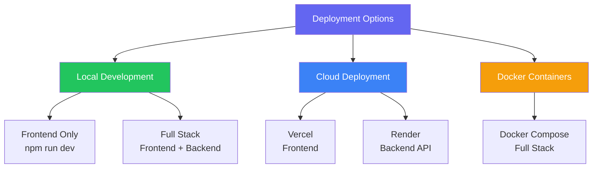

# 🚀 Nexus Admin Dashboard - Deployment Options Guide

<div align="center">

**Complete Guide to All Deployment Methods for Testing, Demo & Production**

*Quick Start • Local Development • Cloud Deployment • Scripts Reference*

**Version 3.0.0** | **Last Updated:** December 2025

[](https://nextjs.org/)
[](https://vercel.com/)
[](https://render.com/)

</div>

---

## 📋 Table of Contents

1. [Overview](#-overview)
2. [Prerequisites](#-prerequisites)
3. [Deployment Resources](#-deployment-resources)
4. [Quick Start Options](#-quick-start-options)
   - [Option 1: Local Development](#option-1-local-development-fastest-for-demo)
   - [Option 2: One-Click Script](#option-2-using-one-click-script)
   - [Option 3: Cloud Deployment](#option-3-cloud-deployment-vercel--render)
   - [Option 4: Vercel CLI](#option-4-vercel-cli-frontend-only)
5. [Deployment Checklist](#-complete-deployment-checklist)
6. [Recommended Demo Path](#-recommended-path-for-demo)
7. [Troubleshooting](#-troubleshooting)
8. [Related Documentation](#-related-documentation)

---

## 🎯 Overview

The **Nexus Admin Dashboard** can be deployed in multiple ways depending on your use case:



| Use Case | Recommended Method | Time to Deploy |
|----------|-------------------|----------------|
| **Quick Demo** | Local Frontend (Mock Mode) | 2 minutes |
| **Development** | Local Full Stack | 5 minutes |
| **Testing** | Cloud (Vercel + Render) | 10 minutes |
| **Production** | Cloud with CI/CD | 15 minutes |

---

## 🔧 Prerequisites

### Required Tools

| Tool | Version | Check Command | Installation |
|------|---------|---------------|--------------|
| **Node.js** | 18.x or 20.x | `node --version` | [nodejs.org](https://nodejs.org/) |
| **npm** | 9.x+ | `npm --version` | Comes with Node.js |
| **Git** | 2.x+ | `git --version` | [git-scm.com](https://git-scm.com/) |
| **Python** | 3.10+ | `python --version` | [python.org](https://python.org/) (for backend) |

### Optional Tools

| Tool | Purpose | Installation |
|------|---------|--------------|
| **Vercel CLI** | Cloud deployment | `npm install -g vercel` |
| **Docker** | Container deployment | [docker.com](https://docker.com/) |

### Verify Prerequisites

```bash
# Check all versions at once
echo "Node.js: $(node --version)"
echo "npm: $(npm --version)"
echo "Git: $(git --version)"
echo "Python: $(python3 --version 2>/dev/null || echo 'Not installed')"
```

---

## 📚 Deployment Resources

### Documentation

| Document | Path | Description |
|----------|------|-------------|
| 📘 **Frontend Deployment Guide** | [`docs/frontend-deployment-guide.md`](frontend-deployment-guide.md) | Complete Vercel deployment (500+ lines) |
| 📗 **Backend Deployment Runbook** | [`docs/runbooks/deployment.md`](runbooks/deployment.md) | Render backend deployment |
| 📙 **Admin Dashboard Guide** | [`docs/admin-dashboard.md`](admin-dashboard.md) | Feature documentation |
| 📕 **Tutorial** | [`docs/admin-dashboard-tutorial.md`](admin-dashboard-tutorial.md) | Step-by-step usage guide |

### Scripts

| Script | Path | Description |
|--------|------|-------------|
| ⚡ **Quick Start Demo** | [`scripts/quick-demo.sh`](../scripts/quick-demo.sh) | One-command demo setup |
| 🎯 **One-Click Master** | [`scripts/one-click.sh`](../scripts/one-click.sh) | Interactive menu for all operations |
| 🚀 **Unified Deploy** | [`scripts/deploy.sh`](../scripts/deploy.sh) | REST API-based cloud deployment |
| 🛠️ **Dev Helper** | [`scripts/dev.sh`](../scripts/dev.sh) | Local development commands |
| ☁️ **Vercel Deploy** | [`services/admin_dashboard/deploy-vercel.sh`](../services/admin_dashboard/deploy-vercel.sh) | Frontend-specific Vercel script |

---

## 🚀 Quick Start Options

### Option 1: Local Development (Fastest for Demo)

**Best for:** Quick demos, UI exploration, feature testing

**Time:** ~2 minutes

> 💡 **Note:** The frontend works in **Mock Mode** by default, so you don't need the backend running to demo the UI!

#### Frontend Only (Recommended for Demo)

```bash
# Navigate to frontend directory
cd services/admin_dashboard/frontend-next

# Install dependencies
npm install

# Start development server
npm run dev
```

🎉 **Open:** [http://localhost:3000](http://localhost:3000)

#### Full Stack (Frontend + Backend)

**Terminal 1 - Backend:**
```bash
# Navigate to backend
cd services/admin_dashboard/backend

# Create and activate virtual environment
python3 -m venv venv
source venv/bin/activate  # On Windows: venv\Scripts\activate

# Install dependencies
pip install -r requirements.txt

# Start backend server
uvicorn main:app --host 0.0.0.0 --port 8088 --reload
```

🎉 **Backend:** [http://localhost:8088](http://localhost:8088)
📊 **API Docs:** [http://localhost:8088/docs](http://localhost:8088/docs)

**Terminal 2 - Frontend:**
```bash
# Navigate to frontend
cd services/admin_dashboard/frontend-next

# Install and start
npm install
npm run dev
```

🎉 **Frontend:** [http://localhost:3000](http://localhost:3000)

---

### Option 2: Using One-Click Script

**Best for:** Full environment setup, service management

**Time:** ~5 minutes

```bash
# From project root
./scripts/one-click.sh
```

**Interactive Menu:**
```
╔═══════════════════════════════════════════════════════════════════╗
║                                                                   ║
║   ███╗   ██╗███████╗██╗  ██╗██╗   ██╗███████╗                    ║
║   ████╗  ██║██╔════╝╚██╗██╔╝██║   ██║██╔════╝                    ║
║   ██╔██╗ ██║█████╗   ╚███╔╝ ██║   ██║███████╗                    ║
║   ██║╚██╗██║██╔══╝   ██╔██╗ ██║   ██║╚════██║                    ║
║   ██║ ╚████║███████╗██╔╝ ██╗╚██████╔╝███████║                    ║
║   ╚═╝  ╚═══╝╚══════╝╚═╝  ╚═╝ ╚═════╝ ╚══════╝                    ║
║                                                                   ║
║           Release Automation Command Center v3.0                  ║
║                                                                   ║
╚═══════════════════════════════════════════════════════════════════╝

  System Status:
    ● Docker: Running
    ● Services: Offline
    ● Mode: Mock (Development)

╔═══════════════════════════════════════════════════════════════════╗
║                         MAIN MENU                                  ║
╠═══════════════════════════════════════════════════════════════════╣
║  1. 🚀 Full Setup           - Complete environment setup          ║
║  2. 🔧 Start Services       - Start all Nexus services            ║
║  3. 📊 Health Check         - Check service health                ║
║  4. 📋 View Logs            - Aggregate and view logs             ║
║  5. 🌐 Deploy to Cloud      - Deploy to Vercel/Render             ║
║  6. 🧹 Uninstall            - Clean uninstall with backup         ║
║  0. Exit                                                           ║
╚═══════════════════════════════════════════════════════════════════╝
```

---

### Option 3: Cloud Deployment (Vercel + Render)

**Best for:** Sharing demos, persistent environments, production

**Time:** ~10 minutes

#### Prerequisites

1. **Vercel Account:** [vercel.com](https://vercel.com/) (free tier available)
2. **Render Account:** [render.com](https://render.com/) (free tier available)
3. **API Tokens:**
   - Vercel: Settings → Tokens → Create
   - Render: Account Settings → API Keys → Create

#### Automated Deployment

```bash
# Set your API tokens
export VERCEL_TOKEN="your-vercel-token"
export RENDER_API_KEY="your-render-api-key"

# Run unified deployment script
./scripts/deploy.sh
```

**What the script does:**
- ✅ Creates Vercel project for frontend
- ✅ Creates Render service for backend
- ✅ Configures all environment variables
- ✅ Sets up CORS automatically
- ✅ Enables auto-deploy on git push
- ✅ Provides deployment URLs

#### Manual Vercel Deployment

1. **Push to GitHub:**
   ```bash
   git add -A
   git commit -m "deploy: Admin Dashboard"
   git push origin main
   ```

2. **Import to Vercel:**
   - Go to [vercel.com/new](https://vercel.com/new)
   - Click "Import Git Repository"
   - Select your repository
   - Configure:
     - **Root Directory:** `services/admin_dashboard/frontend-next`
     - **Framework:** Next.js (auto-detected)
   - Add Environment Variable:
     - `NEXT_PUBLIC_API_URL` = `https://your-backend.onrender.com`
   - Click "Deploy"

---

### Option 4: Vercel CLI (Frontend Only)

**Best for:** Quick frontend deployments, testing builds

**Time:** ~5 minutes

```bash
# Navigate to frontend
cd services/admin_dashboard/frontend-next

# Login to Vercel (one-time)
vercel login

# Deploy to preview
vercel

# Deploy to production
vercel --prod

# Set environment variable
vercel env add NEXT_PUBLIC_API_URL production
# Enter: https://your-backend.onrender.com
```

**One-Click Deploy Button:**

[](https://vercel.com/new/clone?repository-url=https://github.com/IKRedHat/Nexus-Release-Readiness-Bot&root-directory=services/admin_dashboard/frontend-next)

---

## ✅ Complete Deployment Checklist

### Prerequisites Checklist

- [ ] Node.js 18+ or 20+ installed
- [ ] npm 9+ installed
- [ ] Git installed
- [ ] Project cloned locally
- [ ] Vercel account created (for cloud deployment)

### Frontend Deployment Checklist

- [ ] Navigate to `services/admin_dashboard/frontend-next`
- [ ] Run `npm install` successfully
- [ ] Run `npm run build` (verify no errors)
- [ ] Deploy to chosen platform
- [ ] Set `NEXT_PUBLIC_API_URL` environment variable
- [ ] Verify homepage loads

### Backend Deployment Checklist (Optional)

- [ ] Navigate to `services/admin_dashboard/backend`
- [ ] Create Python virtual environment
- [ ] Install dependencies with `pip install -r requirements.txt`
- [ ] Start server with `uvicorn main:app --port 8088`
- [ ] Verify `/health` endpoint responds

### Verification Checklist

| Check | Expected Result | Status |
|-------|-----------------|--------|
| Homepage loads | Dashboard displays | ☐ |
| Mode toggle works | Mock ↔ Production | ☐ |
| Navigation works | All pages load | ☐ |
| Theme toggle | Dark ↔ Light | ☐ |
| Stats display | Numbers visible | ☐ |
| Responsive | Works on mobile | ☐ |

---

## 🎯 Recommended Path for Demo

For a **quick demo** without any backend setup:

```bash
# One command to start demo
cd services/admin_dashboard/frontend-next && npm install && npm run dev
```

Then open [http://localhost:3000](http://localhost:3000)

**Demo Features Available in Mock Mode:**
- ✅ Full UI/UX exploration
- ✅ Mode toggle (Mock/Production)
- ✅ Theme switching (Dark/Light)
- ✅ All navigation pages
- ✅ Dashboard with sample data
- ✅ Releases page
- ✅ Feature requests
- ✅ Settings page
- ✅ User/Role management UI

---

## 🐛 Troubleshooting

### Common Issues

#### npm install fails

```bash
# Clear npm cache
npm cache clean --force

# Delete node_modules and reinstall
rm -rf node_modules package-lock.json
npm install
```

#### Port already in use

```bash
# Find process using port 3000
lsof -i :3000

# Kill process
kill -9 <PID>

# Or use different port
npm run dev -- -p 3001
```

#### Build fails with TypeScript errors

```bash
# Run type check to see errors
npm run type-check

# Fix errors, then rebuild
npm run build
```

#### Backend won't start

```bash
# Check Python version
python3 --version  # Should be 3.10+

# Recreate virtual environment
rm -rf venv
python3 -m venv venv
source venv/bin/activate
pip install -r requirements.txt
```

---

## 📚 Related Documentation

| Document | Description |
|----------|-------------|
| [Frontend Deployment Guide](frontend-deployment-guide.md) | Detailed Vercel deployment |
| [Admin Dashboard Guide](admin-dashboard.md) | Feature documentation |
| [Admin Dashboard Tutorial](admin-dashboard-tutorial.md) | Step-by-step usage |
| [Architecture Overview](architecture.md) | System architecture |
| [Backend Deployment](runbooks/deployment.md) | Render deployment runbook |

---

## 📞 Support

- **Documentation Issues:** Create an issue in the repository
- **Deployment Help:** Check troubleshooting section above
- **Feature Requests:** Submit via the Admin Dashboard itself!

---

<div align="center">

**Happy Deploying! 🚀**

*Nexus Admin Dashboard v3.0.0*

</div>

