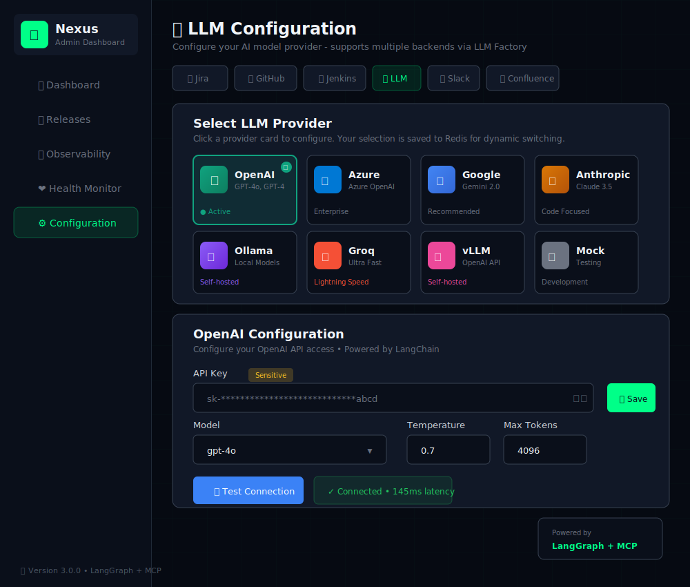
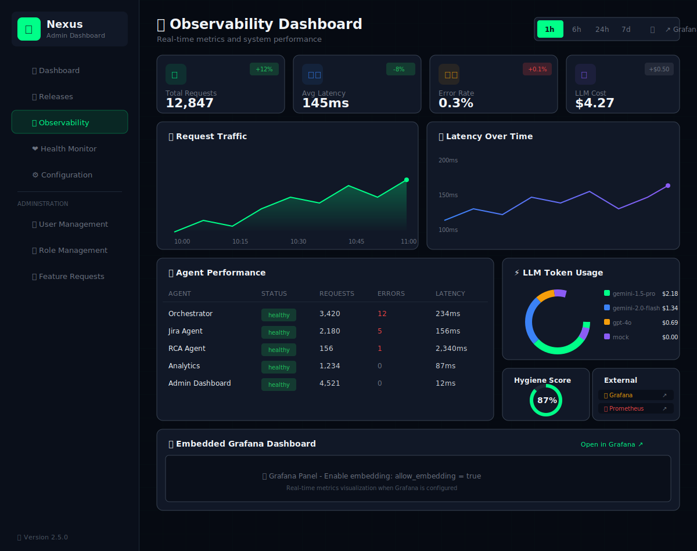
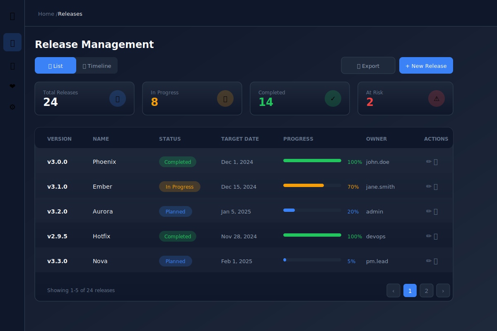
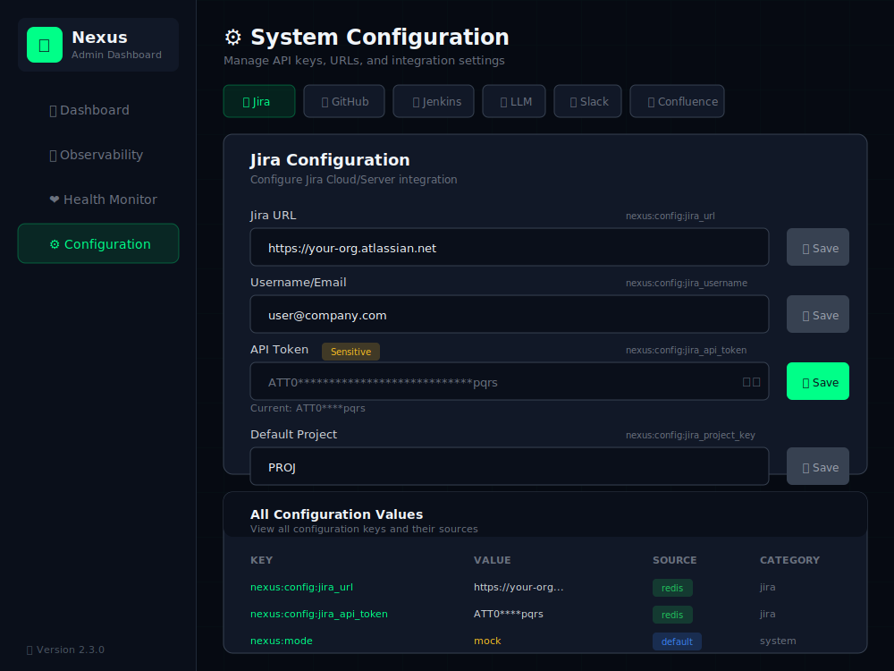

# Admin Dashboard Tutorial

A step-by-step guide for using the Nexus Admin Dashboard. This tutorial is designed for users who prefer a visual, no-code approach to managing the Nexus system.

## Table of Contents

1. [Accessing the Dashboard](#1-accessing-the-dashboard)
2. [Understanding the Interface](#2-understanding-the-interface)
3. [Checking System Health](#3-checking-system-health)
4. [Switching Between Modes](#4-switching-between-modes)
5. [Configuring LLM Provider](#5-configuring-llm-provider)
6. [Viewing Observability Metrics](#6-viewing-observability-metrics)
7. [Managing Releases](#7-managing-releases)
8. [Configuring Integrations](#8-configuring-integrations)
9. [Configuration Tab - Going from Mock to Live](#9-configuration-tab---going-from-mock-to-live)
10. [Monitoring Agents & MCP Servers](#10-monitoring-agents--mcp-servers)
11. [Common Tasks](#11-common-tasks)
12. [Troubleshooting](#12-troubleshooting)

---

## 1. Accessing the Dashboard

### Step 1: Open Your Browser

Open your preferred web browser (Chrome, Firefox, Safari, or Edge).

### Step 2: Navigate to the Dashboard

Type the dashboard URL in the address bar:

```
http://localhost:8088
```

> **Note**: If Nexus is deployed on a server, replace `localhost` with your server's address.

### Step 3: Wait for the Dashboard to Load

You should see the Nexus Admin Dashboard with a dark theme and green accent colors.


---

## 2. Understanding the Interface

### Main Navigation

The dashboard has a **sidebar** on the left with five main sections:

| Icon | Section | Purpose |
|------|---------|---------|
| 📊 | **Dashboard** | System overview and quick actions |
| 📅 | **Releases** | Manage releases and target dates |
| 📈 | **Observability** | Metrics, charts, and performance data |
| ❤️ | **Health Monitor** | Real-time agent and MCP server status |
| ⚙️ | **Configuration** | Manage settings, credentials, and LLM providers |

### Dashboard Overview

The main dashboard shows:

1. **Mode Switch** (top right) - Toggle between Mock and Live modes
2. **Status Cards** - System mode, agent health, Redis connection, uptime
3. **Agent Grid** - Health status of each agent and MCP server
4. **Quick Actions** - Common tasks like refresh and mode switching
5. **Architecture Badge** - Shows "LangGraph + MCP" indicating the v3.0 architecture

---

## 3. Checking System Health

### Step 1: Go to Health Monitor

Click on **"Health Monitor"** in the sidebar.

### Step 2: View Overall Status

At the top, you'll see a banner showing:
- **System Status**: Healthy (green), Degraded (yellow), or Unhealthy (red)
- **Active Agents**: How many agents are running (e.g., "7 of 9 operational")
- **MCP Servers**: Connection status for all MCP tool servers
- **Current Mode**: Mock or Live

### Step 3: Review Individual Agents

Each agent is shown in a card with:
- **Name**: e.g., "Jira Agent"
- **Status**: Green dot = healthy, Red dot = unhealthy
- **Response Time**: How fast the agent responds (in milliseconds)
- **URL**: The agent's internal address
- **MCP Status**: SSE connection status (for v3.0 agents)

### Step 4: Click for Details

Click on any agent card to see more information:
- Detailed status
- Last check time
- Error messages (if any)
- Available MCP tools (for v3.0 agents)

### Step 5: Enable Auto-Refresh

Toggle **"Auto-refresh"** at the top right to automatically update health status every 10 seconds.

---

## 4. Switching Between Modes

### Understanding Modes

| Mode | What It Does | When to Use |
|------|--------------|-------------|
| **Mock** | Uses simulated data | Testing, demos, development |
| **Live** | Connects to real systems | Production use |

### Step 1: Locate the Mode Switch

Find the **mode toggle** in the top-right corner of the Dashboard page.

It shows:
- **Mock** on the left
- **Live** on the right
- A switch in between

### Step 2: Click the Switch

To change modes:
1. Click on the switch toggle
2. It will slide from one side to the other
3. Wait 1-2 seconds for the change to propagate

### Step 3: Confirm the Change

You'll see:
- A notification confirming the mode change
- All status cards update to reflect the new mode
- The mode indicator changes color (Yellow for Mock, Green for Live)

### Step 4: Verify Agents Updated

Go to **Health Monitor** to ensure all agents are operating in the new mode.

> ⚠️ **Warning**: Switching to Live mode will make real API calls to Jira, GitHub, LLM providers, etc. Make sure your credentials are configured first!

---

## 5. Configuring LLM Provider

The LLM Configuration page allows you to select and configure your AI model provider. Nexus 3.0 supports 7 different providers through the LLM Factory.



### Step 1: Navigate to LLM Configuration

1. Click **"⚙️ Configuration"** in the sidebar
2. Click the **"🤖 LLM"** tab at the top

### Step 2: Select Your Provider

The provider grid shows all available options:

| Provider | Best For | Requirements |
|----------|----------|--------------|
| **OpenAI** | General use, high quality | API Key |
| **Azure OpenAI** | Enterprise compliance | API Key, Endpoint, Deployment Name |
| **Google Gemini** | Large context, cost-effective | API Key |
| **Anthropic** | Code analysis, detailed responses | API Key |
| **Ollama** | Self-hosted, privacy-focused | Local server URL |
| **Groq** | Ultra-fast inference | API Key |
| **vLLM** | Self-hosted at scale | Server URL |
| **Mock** | Testing and development | None |

To select a provider:
1. Click on the provider card
2. The card will highlight with a colored border
3. The configuration form below will update with provider-specific fields

### Step 3: Configure Provider Settings

#### For OpenAI:

| Field | What to Enter | Example |
|-------|---------------|---------|
| **API Key** | Your OpenAI API key | `sk-proj-abc123...` |
| **Model** | Select from dropdown | `gpt-4o`, `gpt-4-turbo` |
| **Temperature** | Generation randomness (0.0-2.0) | `0.7` |
| **Max Tokens** | Maximum output length | `4096` |

#### For Google Gemini:

| Field | What to Enter | Example |
|-------|---------------|---------|
| **API Key** | Your Google AI API key | `AIzaSy...` |
| **Model** | Select from dropdown | `gemini-2.0-flash`, `gemini-1.5-pro` |
| **Temperature** | Generation randomness | `0.7` |
| **Max Tokens** | Maximum output length | `8192` |

#### For Anthropic:

| Field | What to Enter | Example |
|-------|---------------|---------|
| **API Key** | Your Anthropic API key | `sk-ant-api03-...` |
| **Model** | Select from dropdown | `claude-3-5-sonnet-20241022` |
| **Temperature** | Generation randomness | `0.7` |
| **Max Tokens** | Maximum output length | `4096` |

#### For Azure OpenAI:

| Field | What to Enter | Example |
|-------|---------------|---------|
| **API Key** | Your Azure OpenAI API key | `abc123...` |
| **Endpoint** | Your Azure endpoint | `https://myorg.openai.azure.com` |
| **Deployment Name** | Your deployment name | `gpt-4o-deployment` |
| **API Version** | API version | `2024-02-15-preview` |
| **Temperature** | Generation randomness | `0.7` |
| **Max Tokens** | Maximum output length | `4096` |

#### For Ollama (Self-hosted):

| Field | What to Enter | Example |
|-------|---------------|---------|
| **Base URL** | Your Ollama server URL | `http://localhost:11434` |
| **Model** | Model name | `llama3`, `mistral`, `codellama` |
| **Temperature** | Generation randomness | `0.7` |

#### For Groq:

| Field | What to Enter | Example |
|-------|---------------|---------|
| **API Key** | Your Groq API key | `gsk_...` |
| **Model** | Select from dropdown | `llama-3.1-70b-versatile` |
| **Temperature** | Generation randomness | `0.7` |
| **Max Tokens** | Maximum output length | `4096` |

#### For vLLM (Self-hosted):

| Field | What to Enter | Example |
|-------|---------------|---------|
| **API Base** | Your vLLM server URL | `http://vllm-server:8000/v1` |
| **Model** | Model name | `meta-llama/Llama-3.1-8B-Instruct` |
| **Temperature** | Generation randomness | `0.7` |
| **Max Tokens** | Maximum output length | `4096` |

### Step 4: Test the Connection

Before saving, always test your configuration:

1. Click the **"🔌 Test Connection"** button
2. Wait for the test to complete (1-3 seconds)
3. Check the result:
   - ✅ **Green**: "Connected • 145ms latency" - Configuration is correct
   - ❌ **Red**: "Connection failed: Invalid API key" - Fix the error

### Step 5: Save the Configuration

Once the test passes:
1. Click the **"💾 Save"** button next to each field
2. Wait for the success message
3. The configuration is now stored in Redis

### Step 6: Verify in Configuration Table

Scroll down to the **"All Configuration Values"** table to verify:
- `nexus:config:llm_provider` shows your selected provider
- `nexus:config:llm_model` shows your selected model
- Source column shows "redis" (green badge)

### Switching Providers

You can switch providers at any time:
1. Select a different provider from the grid
2. Enter the required credentials
3. Test the connection
4. Save the configuration

The change takes effect immediately - no restart required!

---

## 6. Viewing Observability Metrics

The **Observability** page provides a consolidated view of all system metrics, integrating data from Prometheus and Grafana.



### Step 1: Navigate to Observability

Click **"📈 Observability"** in the sidebar (third item).

### Step 2: Review Summary Cards

At the top, you'll see four key metrics:

| Card | What It Shows | Good Value |
|------|---------------|------------|
| **Total Requests** | All API requests processed | Depends on usage |
| **Avg Latency** | Average response time | < 200ms |
| **Error Rate** | Percentage of failed requests | < 1% |
| **LLM Cost** | Total AI API costs | Budget-dependent |

Each card shows:
- Current value
- Change percentage (green = good, red = bad)

### Step 3: Select Time Range

Use the time selector at the top right:

| Option | Shows Data From |
|--------|-----------------|
| **1h** | Last 1 hour |
| **6h** | Last 6 hours |
| **24h** | Last 24 hours |
| **7d** | Last 7 days |

### Step 4: Analyze Traffic Chart

The **Request Traffic** chart shows:
- X-axis: Time
- Y-axis: Number of requests
- Area filled in green

Look for:
- 📈 **Spikes**: Sudden traffic increases
- 📉 **Drops**: Possible issues
- 📊 **Patterns**: Regular usage patterns

### Step 5: Check Latency Trends

The **Latency Over Time** chart shows response times:
- Blue line = Average latency
- Higher = Slower responses

Watch for:
- Sudden spikes (performance issues)
- Gradual increases (capacity problems)

### Step 6: Review Agent Performance Table

The table shows per-agent metrics:

| Column | Meaning |
|--------|---------|
| **Agent** | Service name |
| **Status** | healthy/degraded/unhealthy |
| **Requests** | Number of requests handled |
| **Errors** | Failed requests |
| **Latency** | Average response time |
| **MCP Tools** | Available tools (v3.0) |

> 💡 **Tip**: Click on column headers to sort

### Step 7: Analyze LLM Usage

The **LLM Token Usage** section shows:
- Token distribution by provider/model
- Cost per provider
- Color-coded by provider

This helps you:
- Understand AI costs per provider
- Compare provider efficiency
- Track mock vs live usage

### Step 8: Check Hygiene Score

The circular **Hygiene Score** indicator shows:
- Percentage of compliant Jira tickets
- Color-coded: Green (>80%), Yellow (60-80%), Red (<60%)

### Step 9: Access External Dashboards

Click the quick links to open:
- **Grafana**: Full detailed dashboards
- **Prometheus**: Raw metrics queries
- **Jaeger**: Distributed tracing

### Step 10: View Embedded Grafana (Optional)

If Grafana is configured for embedding:
1. Scroll to the bottom
2. View embedded Grafana panels
3. Click "Open in Grafana" for full view

> **Note**: To enable embedding, set `allow_embedding = true` in Grafana configuration.

---

## 7. Managing Releases

The **Releases** page allows you to track release versions, target dates, and readiness metrics. You can create releases manually or import from external sources like Smartsheet, CSV, or webhooks.



### Step 1: Navigate to Releases

Click **"📅 Releases"** in the sidebar (second item).

### Step 2: Review Summary Cards

At the top, you'll see four summary cards:

| Card | What It Shows | Color |
|------|---------------|-------|
| **Total Releases** | All tracked releases | Blue |
| **Upcoming** | Releases on schedule | Green |
| **At Risk** | Releases within 14 days of target | Amber |
| **Overdue** | Releases past target date | Red |

### Step 3: Create a New Release

1. Click the **"+ New Release"** button (top right)
2. Fill in the required fields:
   - **Version**: e.g., `v2.1.0`
   - **Target Date**: Select from calendar
3. Optional fields:
   - **Release Name**: e.g., "Phoenix"
   - **Description**: Brief description
   - **Release Type**: Major, Minor, Patch, Hotfix, Feature
   - **Jira Project Key**: e.g., `PROJ`
   - **Repository**: e.g., `nexus-backend`
   - **Release Manager**: Email address
4. Click **"Create Release"**

### Step 4: Import from Smartsheet

To sync releases from Smartsheet:

1. Click the **"Import"** button
2. Select the **"Smartsheet"** tab
3. Enter your Smartsheet API token
4. Enter the Sheet ID
5. Click **"Sync from Smartsheet"**

The system will automatically map these columns:
- Release Version
- Target Date
- Status
- Release Name (optional)

### Step 5: Import from CSV

To import from a CSV file:

1. Click the **"Import"** button
2. Select the **"CSV"** tab
3. Paste CSV data in this format:

```csv
version,target_date,name,status
v2.1.0,2025-02-15,Phoenix,planning
v2.2.0,2025-03-01,Ember,in_progress
```

4. Click **"Import CSV"**

### Step 6: Configure Webhook Integration

For automated syncing from external systems:

1. Click the **"Import"** button
2. Select the **"Webhook"** tab
3. Copy the webhook URL shown
4. Configure your external system to POST to this URL

**Webhook Payload Format:**
```json
{
  "action": "create",
  "source": "your-system",
  "release": {
    "version": "v2.1.0",
    "target_date": "2025-02-15T00:00:00Z",
    "name": "Phoenix"
  }
}
```

### Step 7: View Release Details

Each release card shows:

| Element | Description |
|---------|-------------|
| **Status Badge** | Planning, In Progress, Testing, Ready, Deployed |
| **Type Badge** | Major, Minor, Patch, Hotfix |
| **Source Badge** | Where the release came from |
| **Version** | Release version number |
| **Description** | Brief description |
| **Meta Info** | Target date, project, repo, manager |
| **Days Counter** | Days until release (red if overdue) |
| **Metrics** | Readiness score, ticket %, critical issues |

### Step 8: Track Milestones

For each release, you can track milestones:

1. Click on a release to expand
2. View milestone progress bar
3. Milestones show:
   - ✅ Green: Completed
   - 🔴 Red: Overdue
   - ⚪ Gray: Upcoming

### Step 9: Refresh Release Metrics

To update metrics from Jira, Jenkins, etc.:

1. Find the release card
2. Click the **🔄 Refresh** button
3. Wait for metrics to update

Metrics include:
- Ticket completion rate
- Build success rate
- Test coverage
- Critical vulnerabilities
- Readiness score

### Step 10: Delete a Release

1. Find the release card
2. Click the **🗑️ Delete** button
3. Confirm deletion in the popup

> ⚠️ **Warning**: Deletion is permanent. Make sure you want to remove this release.

---

## 8. Configuring Integrations

### Step 1: Go to Configuration

Click on **"Configuration"** in the sidebar.

### Step 2: Select an Integration

At the top, you'll see tabs for different integrations:
- **Jira** - Issue tracking
- **GitHub** - Code repository
- **Jenkins** - CI/CD pipelines
- **LLM** - AI/Language models (see Section 5)
- **Slack** - Messaging
- **Confluence** - Documentation
- **MCP** - Model Context Protocol servers

Click on the tab you want to configure.

### Step 3: Fill in the Fields

Each integration has specific fields:

#### Jira Configuration

| Field | What to Enter | Example |
|-------|---------------|---------|
| Jira URL | Your Atlassian URL | `https://mycompany.atlassian.net` |
| Username/Email | Your login email | `user@company.com` |
| API Token | Your Jira API token | `xxxxxxxxxx` |
| Default Project | Project key | `PROJ` |

#### GitHub Configuration

| Field | What to Enter | Example |
|-------|---------------|---------|
| Personal Access Token | GitHub PAT | `ghp_xxxxxx` |
| Organization | Your org name | `mycompany` |
| Default Repository | Main repo | `main-app` |

#### MCP Configuration (v3.0)

| Field | What to Enter | Example |
|-------|---------------|---------|
| Jira Agent URL | Jira MCP server | `http://jira-agent:8001/sse` |
| Git/CI Agent URL | Git MCP server | `http://git-agent:8002/sse` |
| Reporting Agent URL | Reports MCP server | `http://reporting-agent:8003/sse` |
| Auto-Reconnect | Enable auto-reconnect | `true` |

### Step 4: Save Each Field

After entering a value:
1. Click the **"Save"** button next to the field
2. Wait for the success message
3. The button turns gray when saved

### Step 5: Verify Configuration

Scroll down to see the **"All Configuration Values"** table showing:
- All configured keys
- Their current values (masked for secrets)
- The source (Redis, Environment, or Default)

---

## 9. Configuration Tab - Going from Mock to Live

The Configuration tab is where you set up all your integrations to move from Mock mode to Live mode. This is the most important section for production deployment.



### Understanding Configuration Sources

Configuration values come from three sources (in priority order):

| Source | Color | Description |
|--------|-------|-------------|
| **Redis** | 🟢 Green | Dynamically set via Admin Dashboard |
| **Environment** | 🔵 Blue | Set via Docker/K8s environment variables |
| **Default** | ⚪ Gray | Built-in fallback values |

### Step 1: Navigate to Configuration

1. Click **"Configuration"** (⚙️) in the sidebar
2. You'll see tabs for each integration category

### Step 2: Configure LLM Provider (CRITICAL)

1. Click the **"LLM"** tab
2. Select your preferred provider (OpenAI, Gemini, Anthropic, etc.)
3. Enter API credentials
4. Click **"Test Connection"** to verify
5. Save the configuration

See [Section 5: Configuring LLM Provider](#5-configuring-llm-provider) for detailed instructions.

### Step 3: Configure Jira

1. Click the **"Jira"** tab
2. Fill in the following fields:

| Field | What to Enter | How to Get It |
|-------|---------------|---------------|
| **Jira URL** | `https://your-org.atlassian.net` | Your Jira Cloud URL |
| **Username/Email** | Your Atlassian email | e.g., `user@company.com` |
| **API Token** | Jira API token | Create at [Atlassian API Tokens](https://id.atlassian.com/manage-profile/security/api-tokens) |
| **Default Project** | Project key | e.g., `PROJ`, `NEXUS` |

3. Click **"Save"** after each field
4. Wait for the green success message

### Step 4: Configure GitHub

1. Click the **"GitHub"** tab
2. Fill in:

| Field | What to Enter | How to Get It |
|-------|---------------|---------------|
| **Personal Access Token** | `ghp_xxxxxxxxxxxx` | Create at GitHub → Settings → Developer Settings → Personal access tokens |
| **Organization** | Your GitHub org name | e.g., `mycompany` |
| **Default Repository** | Main repo name | e.g., `nexus-app` |

**Required Token Scopes:**
- `repo` - Full repository access
- `read:org` - Read organization data
- `workflow` - Trigger GitHub Actions

### Step 5: Configure Jenkins

1. Click the **"Jenkins"** tab
2. Fill in:

| Field | What to Enter | How to Get It |
|-------|---------------|---------------|
| **Jenkins URL** | `http://jenkins.company.com:8080` | Your Jenkins server URL |
| **Username** | Jenkins username | Usually your login |
| **API Token** | Jenkins API token | Jenkins → User → Configure → API Token |

### Step 6: Configure Slack (Optional)

1. Click the **"Slack"** tab
2. Fill in:

| Field | What to Enter | How to Get It |
|-------|---------------|---------------|
| **Bot Token** | `xoxb-xxxx` | Slack App → OAuth & Permissions |
| **Signing Secret** | `xxxxxxxx` | Slack App → Basic Information |
| **App Token** | `xapp-xxxx` | Slack App → Basic Information → App-Level Tokens |

### Step 7: Configure Confluence (Optional)

1. Click the **"Confluence"** tab
2. Fill in:

| Field | What to Enter |
|-------|---------------|
| **Confluence URL** | `https://your-org.atlassian.net/wiki` |
| **Username/Email** | Same as Jira |
| **API Token** | Same as Jira API token |
| **Space Key** | Target space key (e.g., `DOCS`) |

### Step 8: Verify Configuration

After configuring all integrations:

1. Scroll down to **"All Configuration Values"** table
2. Verify each key shows:
   - ✅ Your entered value (or masked for secrets)
   - ✅ Source shows "redis" (green)
   - ✅ Correct category

### Step 9: Switch to Live Mode

Once all configurations are saved:

1. Go back to **Dashboard**
2. Click the **Mode Switch** to toggle from Mock → Live
3. The switch will turn green
4. Go to **Health Monitor** to verify all agents connect successfully

### Troubleshooting Configuration

| Problem | Solution |
|---------|----------|
| "Save" button stays gray | Enter a different value than current |
| Value not saving | Check Redis connection in health check |
| Source shows "env" not "redis" | Click Save again to override |
| Agent unhealthy after config | Verify credentials are correct, check agent logs |
| LLM test fails | Verify API key and provider selection |

### Quick Reference: Required vs Optional

| Integration | Required for Live? | Notes |
|-------------|-------------------|-------|
| LLM | ✅ Required | Choose a provider (OpenAI, Gemini, etc.) |
| Jira | ✅ Required | Core functionality |
| GitHub | ✅ Required | For PR and repo analysis |
| Jenkins | ⚠️ Recommended | For build status |
| Slack | ⚠️ Recommended | For notifications |
| Confluence | ⚪ Optional | For report publishing |

---

## 10. Monitoring Agents & MCP Servers

### Step 1: Go to Health Monitor

Click **"Health Monitor"** in the sidebar.

### Step 2: Check the Overview Banner

The top banner shows system-wide health:
- 🟢 **System Healthy**: All agents working
- 🟡 **System Degraded**: Some agents down
- 🔴 **System Unhealthy**: Critical failures

### Step 3: Review Agent Cards

Each card shows:
- **Agent Name**: What the agent does
- **Status Dot**: Green (healthy) or Red (unhealthy)
- **Connection**: "Connected" or "Disconnected"
- **Response Time**: Speed in milliseconds
- **MCP Tools**: Number of tools available (v3.0 agents)

### Step 4: Review MCP Server Status

In v3.0, agents expose tools via MCP (Model Context Protocol):

| Agent | MCP Port | Tools |
|-------|----------|-------|
| Jira Agent | 8001 | get_ticket, search_tickets, update_ticket |
| Git/CI Agent | 8002 | get_pr_status, trigger_build, get_logs |
| Reporting Agent | 8003 | generate_report, publish_confluence |
| Hygiene Agent | 8005 | check_hygiene, get_violations |
| RCA Agent | 8006 | analyze_failure, get_build_logs |

### Step 5: Investigate Issues

If an agent shows red:
1. Click on the card
2. Review the error details
3. Note the error message
4. Check the agent logs for more information

### Step 6: Manual Refresh

Click **"Refresh Now"** to immediately check all agents.

### Step 7: Reconnect MCP Servers

If an MCP server disconnects:
1. Go to **Configuration** → **MCP** tab
2. Click **"Reconnect All"** button
3. Wait for SSE connections to re-establish

---

## 11. Common Tasks

### Task 1: Preparing for a Demo

1. Go to **Dashboard**
2. Ensure the mode is set to **Mock**
3. Check **Health Monitor** - all agents should be green
4. Go to **Configuration** → **LLM**
5. Select **Mock** provider
6. Save the setting

### Task 2: Going Live for Production

1. Go to **Configuration** → **LLM**
2. Select your LLM provider (OpenAI, Gemini, Anthropic, etc.)
3. Enter API key and test connection
4. Save the configuration
5. Configure all other integrations:
   - Jira URL and credentials
   - GitHub token
   - Jenkins credentials
   - Slack tokens (optional)
6. Go to **Dashboard**
7. Click the mode switch to **Live**
8. Monitor **Health Monitor** for any issues

### Task 3: Changing LLM Provider

1. Go to **Configuration** → **LLM**
2. Click on a different provider card
3. Enter the required credentials
4. Click **"Test Connection"**
5. If successful, click **"Save"**
6. The change takes effect immediately

### Task 4: Updating API Credentials

1. Go to **Configuration**
2. Select the integration (e.g., Jira, LLM)
3. Find the credential field (e.g., API Token)
4. Enter the new value
5. Click **Save**
6. Verify in the table below that the source shows "redis"

### Task 5: Troubleshooting an Agent

1. Go to **Health Monitor**
2. Find the unhealthy agent (red status)
3. Click on the agent card
4. Note the error message
5. Common fixes:
   - Check credentials in Configuration
   - Verify the external service is accessible
   - Restart the agent container
   - Check MCP SSE connection status

---

## 12. Troubleshooting

### Problem: Dashboard Won't Load

**Symptoms**: Blank page or "Connection Refused"

**Solutions**:
1. Check if Docker containers are running:
   ```bash
   docker ps
   ```
2. Ensure the admin-dashboard container is up
3. Try accessing http://localhost:8088/health

### Problem: "Redis Not Available" Warning

**Symptoms**: Yellow warning about Redis connection

**Solutions**:
1. Check if Redis is running:
   ```bash
   docker ps | grep redis
   ```
2. The dashboard will still work using environment variables

### Problem: Agent Shows Unhealthy

**Symptoms**: Red status dot on an agent

**Solutions**:
1. Click the agent card for details
2. Check the error message
3. Verify the agent container is running
4. Check agent-specific credentials in Configuration
5. For MCP agents, verify SSE connection is established

### Problem: LLM Connection Failed

**Symptoms**: Test connection shows error

**Solutions**:
1. Verify the API key is correct
2. Check if the provider is selected correctly
3. For self-hosted (Ollama/vLLM), verify server is running
4. Check network connectivity to the LLM service
5. Verify API key has required permissions

### Problem: Configuration Not Saving

**Symptoms**: Save button doesn't work or no success message

**Solutions**:
1. Check Redis connectivity (see above)
2. Ensure the value is not empty
3. Try refreshing the page
4. Check browser console for errors

### Problem: Mode Switch Doesn't Work

**Symptoms**: Switch toggles but mode doesn't change

**Solutions**:
1. Wait a few seconds for propagation
2. Refresh the page
3. Check if Redis is connected
4. Verify no other errors are shown

### Problem: MCP Server Disconnected

**Symptoms**: Agent shows "SSE Disconnected"

**Solutions**:
1. Check if the agent container is running
2. Verify the SSE endpoint is accessible
3. Go to Configuration → MCP and click "Reconnect"
4. Check agent logs for SSE errors

### Problem: Health Checks Are Slow

**Symptoms**: Agent cards take a long time to update

**Solutions**:
1. Network latency may be high
2. Disable auto-refresh temporarily
3. Use manual refresh for specific checks
4. Check if agents are overloaded

---

## Quick Reference Card

### Keyboard Shortcuts

| Key | Action |
|-----|--------|
| `R` | Refresh health status |
| `D` | Go to Dashboard |
| `H` | Go to Health Monitor |
| `S` | Go to Settings |

### Color Codes

| Color | Meaning |
|-------|---------|
| 🟢 Green | Healthy / Success / Live Mode |
| 🟡 Yellow/Amber | Warning / Mock Mode |
| 🔴 Red | Error / Unhealthy |
| 🔵 Blue | LLM / Information |
| 🟣 Purple | MCP / Self-hosted |
| ⚪ Gray | Disabled / Neutral |

### Status Icons

| Icon | Meaning |
|------|---------|
| ✓ | Success / Healthy |
| ✗ | Error / Unhealthy |
| ⟳ | Loading / Refreshing |
| ⚠ | Warning |
| 🔒 | Sensitive / Secure |
| 🔌 | MCP Connected |

### LLM Provider Quick Reference

| Provider | API Key Format | Endpoint |
|----------|---------------|----------|
| OpenAI | `sk-proj-...` | api.openai.com |
| Azure OpenAI | Custom | your-resource.openai.azure.com |
| Google Gemini | `AIzaSy...` | generativelanguage.googleapis.com |
| Anthropic | `sk-ant-api03-...` | api.anthropic.com |
| Groq | `gsk_...` | api.groq.com |
| Ollama | N/A | localhost:11434 |
| vLLM | Optional | your-server:8000 |

---

## Getting Help

If you encounter issues not covered in this tutorial:

1. **Check the logs**: Use `docker logs admin-dashboard`
2. **Review documentation**: See `/docs/admin-dashboard.md`
3. **Ask in Slack**: Post in #nexus-support
4. **File an issue**: GitHub Issues for bugs

---

*Last updated: December 2025 • Nexus v3.0 (LangGraph + MCP)*
