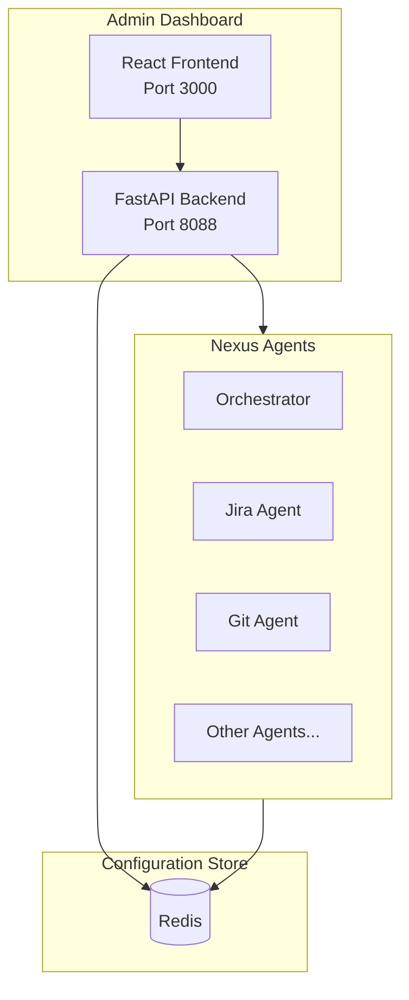

# Admin Dashboard

The Nexus Admin Dashboard is a web-based interface for managing and monitoring your Nexus release automation system. It provides real-time control over system configuration, agent health, and operational modes.

## Overview


The Admin Dashboard enables you to:

- **Toggle System Mode**: Instantly switch between Mock and Live modes
- **Manage Credentials**: Securely update API keys and URLs
- **Monitor Health**: Real-time status of all connected agents
- **Configure Integrations**: Set up Jira, GitHub, Jenkins, Slack, and LLM providers

## Quick Start

### Accessing the Dashboard

```bash
# Start the stack with Docker Compose
docker-compose up -d

# Access the dashboard
open http://localhost:8088
```

### First-Time Setup

1. Navigate to `http://localhost:8088`
2. The system starts in **Mock Mode** by default
3. Go to **Settings** to configure your integrations
4. Switch to **Live Mode** when ready to connect to real services

## Features

### 🔄 Mode Switching

The central feature is the ability to toggle between **Mock Mode** and **Live Mode**:

| Mode | Description | Use Case |
|------|-------------|----------|
| **Mock** | All external API calls return simulated data | Development, testing, demos |
| **Live** | Connects to real Jira, GitHub, Jenkins, etc. | Production use |

When you switch modes:
- All agents automatically pick up the change
- No restart required
- Changes take effect within seconds

### 🔐 Credential Management

Securely manage all integration credentials:

- **Jira**: URL, username, API token, project key
- **GitHub**: Personal access token, organization, repository
- **Jenkins**: URL, username, API token
- **LLM**: Provider selection, API keys (Gemini/OpenAI)
- **Slack**: Bot token, signing secret, app token
- **Confluence**: URL, username, API token, space key

**Security Features:**
- Passwords and tokens are masked in the UI
- Sensitive values stored encrypted in Redis
- Environment variable fallback for secrets

### 📊 Health Monitoring

Real-time health status for all agents:

- **Status Indicators**: Healthy (green), Unhealthy (red)
- **Response Times**: Millisecond-level latency tracking
- **Auto-Refresh**: Updates every 10 seconds
- **Manual Check**: Force refresh individual agents

### ⚙️ Dynamic Configuration

The ConfigManager enables dynamic configuration without restarts:

```
Priority Order:
1. Redis (dynamic config) - Highest priority
2. Environment variables - Fallback
3. Default values - Last resort
```

## Architecture



## API Reference

### Endpoints

| Method | Endpoint | Description |
|--------|----------|-------------|
| `GET` | `/health` | Backend health check |
| `GET` | `/stats` | Dashboard statistics |
| `GET` | `/mode` | Get current system mode |
| `POST` | `/mode` | Set system mode |
| `GET` | `/config` | Get all configuration |
| `GET` | `/config/{key}` | Get specific config value |
| `POST` | `/config` | Update config value |
| `DELETE` | `/config/{key}` | Delete config value |
| `GET` | `/health-check` | Check all agent health |
| `GET` | `/health-check/{agent}` | Check specific agent |
| `GET` | `/config/templates` | Get config form templates |

### Set System Mode

```bash
# Switch to Live Mode
curl -X POST http://localhost:8088/mode \
  -H "Content-Type: application/json" \
  -d '{"mode": "live"}'

# Switch to Mock Mode
curl -X POST http://localhost:8088/mode \
  -H "Content-Type: application/json" \
  -d '{"mode": "mock"}'
```

### Update Configuration

```bash
# Set Jira URL
curl -X POST http://localhost:8088/config \
  -H "Content-Type: application/json" \
  -d '{
    "key": "nexus:config:jira_url",
    "value": "https://your-org.atlassian.net"
  }'

# Set Jira API Token (sensitive)
curl -X POST http://localhost:8088/config \
  -H "Content-Type: application/json" \
  -d '{
    "key": "nexus:config:jira_api_token",
    "value": "your-api-token"
  }'
```

### Check Agent Health

```bash
# Check all agents
curl http://localhost:8088/health-check

# Check specific agent
curl http://localhost:8088/health-check/jira_agent
```

## Configuration Reference

### System Mode

| Key | Values | Description |
|-----|--------|-------------|
| `nexus:mode` | `mock`, `live` | System operating mode |

### Jira Configuration

| Key | Description |
|-----|-------------|
| `nexus:config:jira_url` | Jira instance URL |
| `nexus:config:jira_username` | Username or email |
| `nexus:config:jira_api_token` | API token (sensitive) |
| `nexus:config:jira_project_key` | Default project key |

### GitHub Configuration

| Key | Description |
|-----|-------------|
| `nexus:config:github_token` | Personal access token (sensitive) |
| `nexus:config:github_org` | Organization name |
| `nexus:config:github_repo` | Default repository |

### Jenkins Configuration

| Key | Description |
|-----|-------------|
| `nexus:config:jenkins_url` | Jenkins server URL |
| `nexus:config:jenkins_username` | Jenkins username |
| `nexus:config:jenkins_api_token` | API token (sensitive) |

### LLM Configuration

| Key | Description |
|-----|-------------|
| `nexus:config:llm_provider` | `google`, `openai`, or `mock` |
| `nexus:config:llm_model` | Model name (e.g., `gemini-1.5-pro`) |
| `nexus:config:gemini_api_key` | Google AI API key (sensitive) |
| `nexus:config:openai_api_key` | OpenAI API key (sensitive) |

### Slack Configuration

| Key | Description |
|-----|-------------|
| `nexus:config:slack_bot_token` | Bot token (sensitive) |
| `nexus:config:slack_signing_secret` | Signing secret (sensitive) |
| `nexus:config:slack_app_token` | App token (sensitive) |

## Prometheus Metrics

```prometheus
# Configuration Changes
nexus_admin_config_changes_total{key, source}

# Health Checks
nexus_admin_health_checks_total{agent, status}

# Mode Switches
nexus_admin_mode_switches_total{from_mode, to_mode}

# Active Mode (0=mock, 1=live)
nexus_admin_active_mode
```

## Environment Variables

| Variable | Default | Description |
|----------|---------|-------------|
| `REDIS_URL` | `redis://localhost:6379` | Redis connection URL |
| `PORT` | `8088` | Backend server port |
| `ENV` | `development` | Environment (enables hot reload) |

## Deployment

### Docker Compose

```yaml
admin-dashboard:
  build:
    context: .
    dockerfile: infrastructure/docker/Dockerfile.admin-dashboard
  ports:
    - "8088:8088"
  environment:
    - REDIS_URL=redis://redis:6379
  depends_on:
    - redis
```

### Kubernetes

```yaml
# values.yaml
adminDashboard:
  enabled: true
  replicas: 1
  image:
    repository: nexus/admin-dashboard
    tag: latest
  service:
    type: ClusterIP
    port: 8088
  ingress:
    enabled: true
    host: admin.nexus.example.com
```

## Troubleshooting

### Redis Connection Failed

```
⚠️ Redis not available: Connection refused
```

**Solution**: Ensure Redis is running and `REDIS_URL` is correct.

### Agent Health Check Failed

```
Agent 'jira_agent' status: unhealthy
```

**Solution**: 
1. Check if the agent container is running
2. Verify the agent URL configuration
3. Check agent logs for errors

### Configuration Not Updating

**Possible causes**:
1. Redis connection issue
2. Cache not cleared
3. Agent not reading from Redis

**Solution**: 
1. Check Redis connectivity
2. Restart the affected agent
3. Clear ConfigManager cache via API

## Best Practices

1. **Start in Mock Mode**: Always develop and test in mock mode first
2. **Backup Config**: Export configuration before making changes
3. **Monitor Health**: Keep the health dashboard open during deployments
4. **Use Secrets Manager**: In production, use Kubernetes secrets or Vault
5. **Enable Auto-Refresh**: Keep health monitoring in auto-refresh mode

## Security Considerations

1. **Access Control**: Deploy behind authentication (OAuth, SSO)
2. **HTTPS Only**: Use TLS in production
3. **Network Segmentation**: Restrict dashboard access to admin network
4. **Audit Logging**: Monitor configuration changes
5. **Secret Rotation**: Regularly rotate API tokens and keys

