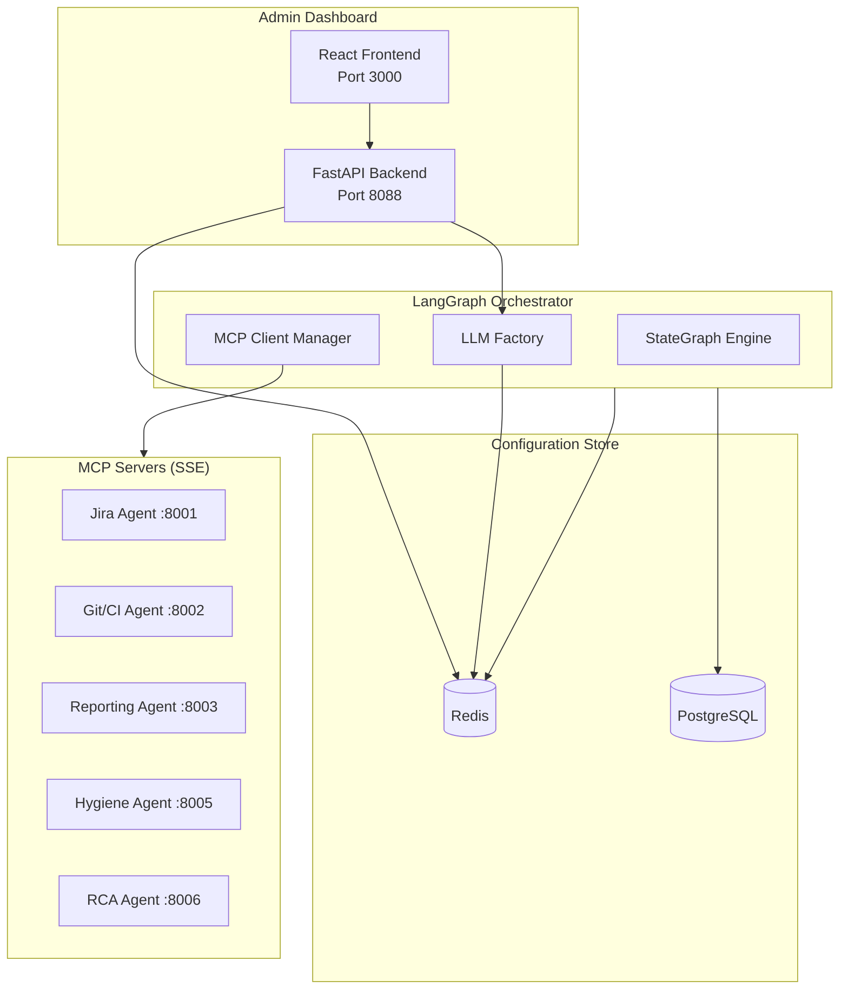

# Admin Dashboard

The Nexus Admin Dashboard is a web-based interface for managing and monitoring your Nexus release automation system. It provides real-time control over system configuration, agent health, LLM provider selection, and operational modes.

## Overview


The Admin Dashboard enables you to:

- **Toggle System Mode**: Instantly switch between Mock and Live modes
- **Configure LLM Providers**: Select and configure AI providers (OpenAI, Gemini, Anthropic, Ollama, Groq, vLLM)
- **Manage Credentials**: Securely update API keys and URLs
- **Monitor Health**: Real-time status of all connected agents and MCP servers
- **Configure Integrations**: Set up Jira, GitHub, Jenkins, Slack, and Confluence
- **View Observability Metrics**: Integrated dashboards with Prometheus/Grafana data
- **Manage MCP Connections**: Monitor and configure Model Context Protocol servers

## What's New in v3.0

### 🧠 LangGraph + MCP Architecture

Nexus 3.0 introduces a completely redesigned orchestration layer:

- **LangGraph StateGraph**: Replaces the legacy ReAct loop with a stateful, graph-based workflow engine
- **MCP Tool Connectivity**: All agents now expose tools via the Model Context Protocol over SSE
- **LLM Factory**: Dynamic multi-provider LLM support with runtime switching

### 🤖 Multi-Provider LLM Support

The new LLM Factory enables you to choose from 7 different LLM providers:

| Provider | Models | Use Case |
|----------|--------|----------|
| **OpenAI** | gpt-4o, gpt-4-turbo, gpt-3.5-turbo | General purpose, high quality |
| **Azure OpenAI** | Azure-hosted GPT models | Enterprise compliance |
| **Google Gemini** | gemini-2.0-flash, gemini-1.5-pro | Large context, cost-effective |
| **Anthropic** | claude-3.5-sonnet, claude-3-opus | Code-focused, detailed analysis |
| **Ollama** | llama3, mistral, codellama | Self-hosted, privacy-focused |
| **Groq** | llama-3.1-70b, mixtral-8x7b | Ultra-fast inference |
| **vLLM** | Any OpenAI-compatible model | Self-hosted at scale |
| **Mock** | - | Development and testing |

## Quick Start

### Accessing the Dashboard

```bash
# Start the stack with Docker Compose
docker-compose up -d

# Access the dashboard
open http://localhost:8088
```

### First-Time Setup

1. Navigate to `http://localhost:8088`
2. The system starts in **Mock Mode** by default
3. Go to **Settings** → **LLM** to configure your AI provider
4. Configure your integrations (Jira, GitHub, etc.)
5. Switch to **Live Mode** when ready to connect to real services

## Features

### 🔄 Mode Switching

The central feature is the ability to toggle between **Mock Mode** and **Live Mode**:

| Mode | Description | Use Case |
|------|-------------|----------|
| **Mock** | All external API calls return simulated data | Development, testing, demos |
| **Live** | Connects to real Jira, GitHub, Jenkins, etc. | Production use |

When you switch modes:
- All agents automatically pick up the change
- No restart required
- Changes take effect within seconds

### 🤖 LLM Provider Configuration


The **LLM** tab in Configuration allows you to:

1. **Select Provider**: Choose from the provider grid (OpenAI, Gemini, Anthropic, etc.)
2. **Configure Credentials**: Enter API keys and endpoints
3. **Set Model Parameters**: Adjust temperature, max tokens
4. **Test Connection**: Verify your configuration works before saving

#### Provider-Specific Configuration

**OpenAI / Azure OpenAI:**
```
nexus:config:llm_provider = openai
nexus:config:llm_model = gpt-4o
nexus:config:openai_api_key = sk-...
nexus:config:llm_temperature = 0.7
nexus:config:llm_max_tokens = 4096
```

**Google Gemini:**
```
nexus:config:llm_provider = google
nexus:config:llm_model = gemini-2.0-flash
nexus:config:gemini_api_key = AIza...
```

**Anthropic:**
```
nexus:config:llm_provider = anthropic
nexus:config:llm_model = claude-3-5-sonnet-20241022
nexus:config:anthropic_api_key = sk-ant-...
```

**Ollama (Self-hosted):**
```
nexus:config:llm_provider = ollama
nexus:config:llm_model = llama3
nexus:config:ollama_base_url = http://localhost:11434
```

**Groq:**
```
nexus:config:llm_provider = groq
nexus:config:llm_model = llama-3.1-70b-versatile
nexus:config:groq_api_key = gsk_...
```

**vLLM (Self-hosted):**
```
nexus:config:llm_provider = vllm
nexus:config:llm_model = meta-llama/Llama-3.1-8B-Instruct
nexus:config:vllm_api_base = http://vllm-server:8000/v1
```

### 🔌 MCP Server Management

The new **MCP** tab allows you to monitor Model Context Protocol server connections:

| Server | Port | Tools Exposed |
|--------|------|---------------|
| Jira Agent | 8001 | get_ticket, search_tickets, update_ticket |
| Git/CI Agent | 8002 | get_pr_status, trigger_build, get_build_logs |
| Reporting Agent | 8003 | generate_report, publish_to_confluence |
| Hygiene Agent | 8005 | check_project_hygiene, get_violations |
| RCA Agent | 8006 | analyze_build_failure, get_rca_history |
| GitHub MCP | 8010 | Official GitHub tools (sidecar) |
| Slack MCP | 8011 | Official Slack tools (sidecar) |

### 🔐 Credential Management

Securely manage all integration credentials:

- **Jira**: URL, username, API token, project key
- **GitHub**: Personal access token, organization, repository
- **Jenkins**: URL, username, API token
- **LLM**: Provider selection, API keys (multi-provider support)
- **Slack**: Bot token, signing secret, app token
- **Confluence**: URL, username, API token, space key

**Security Features:**
- Passwords and tokens are masked in the UI
- Sensitive values stored encrypted in Redis
- Environment variable fallback for secrets

### 📊 Health Monitoring

Real-time health status for all agents and MCP servers:

- **Status Indicators**: Healthy (green), Unhealthy (red)
- **Response Times**: Millisecond-level latency tracking
- **Auto-Refresh**: Updates every 10 seconds
- **Manual Check**: Force refresh individual agents
- **MCP Connection Status**: Monitor SSE connections to MCP servers

### 📈 Integrated Observability Dashboard

The Admin Dashboard includes a comprehensive observability page that consolidates metrics from Prometheus and Grafana:


**Key Metrics Displayed:**

| Metric | Description | Source |
|--------|-------------|--------|
| **Total Requests** | Aggregate request count across all agents | Prometheus |
| **Avg Latency** | Average response time (P50/P95/P99) | Prometheus |
| **Error Rate** | Percentage of failed requests | Prometheus |
| **LLM Cost** | Total cost of LLM API calls | Prometheus |
| **Hygiene Score** | Project data quality percentage | Hygiene Agent |
| **Release Decisions** | Go/No-Go decision counts | Orchestrator |
| **MCP Tool Calls** | Tool invocations across all MCP servers | Prometheus |

**Charts Available:**

- 📈 **Request Traffic**: Real-time request volume over time
- ⏱️ **Latency Trends**: Response time distribution
- 🖥️ **Agent Performance**: Per-agent metrics table
- ⚡ **LLM Token Usage**: Breakdown by provider/model with cost tracking
- 🎯 **Hygiene Score**: Circular progress indicator
- 🔌 **MCP Server Health**: Connection status for all MCP servers

**Time Range Selection:**
- 1 hour (1h)
- 6 hours (6h)
- 24 hours (24h)
- 7 days (7d)

**External Dashboard Links:**
- One-click access to Grafana for detailed dashboards
- Direct link to Prometheus for raw metrics
- Link to Jaeger for distributed tracing

**Embedded Grafana Panels:**
- Configure Grafana to allow embedding (`allow_embedding = true`)
- Panels display directly in the Admin Dashboard
- Maintains dark theme consistency

### 📅 Release Management

The Admin Dashboard includes a comprehensive Release Management system that allows you to:


- **Track Release Versions**: Define and monitor multiple releases
- **Set Target Dates**: Configure release schedules with milestones
- **Import from External Sources**: Sync from Smartsheet, CSV, or webhooks
- **Monitor Readiness**: Real-time metrics and Go/No-Go decisions
- **Manage Milestones**: Track progress through release lifecycle

**Release Sources:**

| Source | Description | Integration |
|--------|-------------|-------------|
| **Manual** | Create releases directly in the UI | Built-in |
| **Smartsheet** | Sync from Smartsheet sheets | API integration |
| **CSV** | Import from CSV files | File upload |
| **Webhook** | Receive from external systems | REST API |
| **Jira** | Import from Jira fix versions | Agent integration |

**Release Lifecycle:**

```
Planning → In Progress → Code Freeze → Testing → UAT → Staging → Ready → Deployed
```

**Key Metrics per Release:**

| Metric | Description |
|--------|-------------|
| **Days Until Release** | Countdown to target date |
| **Ticket Completion** | % of Jira tickets completed |
| **Build Success Rate** | % of CI builds passing |
| **Test Coverage** | Code coverage percentage |
| **Critical Vulnerabilities** | Security scan results |
| **Readiness Score** | Overall release health (0-100) |

### ⚙️ Dynamic Configuration

The ConfigManager enables dynamic configuration without restarts:

```
Priority Order:
1. Redis (dynamic config) - Highest priority
2. Environment variables - Fallback
3. Default values - Last resort
```

## Architecture



## API Reference

### Core Endpoints

| Method | Endpoint | Description |
|--------|----------|-------------|
| `GET` | `/health` | Backend health check |
| `GET` | `/stats` | Dashboard statistics |
| `GET` | `/mode` | Get current system mode |
| `POST` | `/mode` | Set system mode |
| `GET` | `/config` | Get all configuration |
| `GET` | `/config/{key}` | Get specific config value |
| `POST` | `/config` | Update config value |
| `DELETE` | `/config/{key}` | Delete config value |
| `GET` | `/health-check` | Check all agent health |
| `GET` | `/health-check/{agent}` | Check specific agent |
| `GET` | `/config/templates` | Get config form templates |
| `GET` | `/api/metrics` | Get aggregated observability metrics |

### LLM Configuration Endpoints

| Method | Endpoint | Description |
|--------|----------|-------------|
| `GET` | `/llm/providers` | Get available LLM providers and models |
| `GET` | `/llm/config` | Get current LLM configuration |
| `POST` | `/llm/config` | Update LLM configuration |
| `POST` | `/llm/test` | Test LLM connection |

### MCP Management Endpoints

| Method | Endpoint | Description |
|--------|----------|-------------|
| `GET` | `/mcp/servers` | List connected MCP servers |
| `GET` | `/mcp/tools` | List all available tools |
| `POST` | `/mcp/reconnect` | Reconnect to MCP servers |

### Release Management Endpoints

| Method | Endpoint | Description |
|--------|----------|-------------|
| `GET` | `/releases` | List all releases |
| `GET` | `/releases/calendar` | Get calendar view |
| `GET` | `/releases/templates` | Get release templates |
| `GET` | `/releases/{release_id}` | Get specific release |
| `POST` | `/releases` | Create new release |
| `PUT` | `/releases/{release_id}` | Update release |
| `DELETE` | `/releases/{release_id}` | Delete release |
| `GET` | `/releases/{release_id}/metrics` | Get release metrics |
| `POST` | `/releases/{release_id}/milestones` | Add milestone |
| `POST` | `/releases/{release_id}/risks` | Add risk item |
| `POST` | `/releases/sync/smartsheet` | Sync from Smartsheet |
| `POST` | `/releases/sync/csv` | Import from CSV |
| `POST` | `/releases/sync/webhook` | Receive webhook data |

### Set System Mode

```bash
# Switch to Live Mode
curl -X POST http://localhost:8088/mode \
  -H "Content-Type: application/json" \
  -d '{"mode": "live"}'

# Switch to Mock Mode
curl -X POST http://localhost:8088/mode \
  -H "Content-Type: application/json" \
  -d '{"mode": "mock"}'
```

### Configure LLM Provider

```bash
# Set OpenAI as provider
curl -X POST http://localhost:8088/llm/config \
  -H "Content-Type: application/json" \
  -d '{
    "provider": "openai",
    "model": "gpt-4o",
    "api_key": "sk-...",
    "temperature": 0.7,
    "max_tokens": 4096
  }'

# Set Ollama as provider (self-hosted)
curl -X POST http://localhost:8088/llm/config \
  -H "Content-Type: application/json" \
  -d '{
    "provider": "ollama",
    "model": "llama3",
    "base_url": "http://localhost:11434"
  }'

# Test LLM connection
curl -X POST http://localhost:8088/llm/test
```

### Update Configuration

```bash
# Set Jira URL
curl -X POST http://localhost:8088/config \
  -H "Content-Type: application/json" \
  -d '{
    "key": "nexus:config:jira_url",
    "value": "https://your-org.atlassian.net"
  }'

# Set Jira API Token (sensitive)
curl -X POST http://localhost:8088/config \
  -H "Content-Type: application/json" \
  -d '{
    "key": "nexus:config:jira_api_token",
    "value": "your-api-token"
  }'
```

### Check Agent Health

```bash
# Check all agents
curl http://localhost:8088/health-check

# Check specific agent
curl http://localhost:8088/health-check/jira_agent
```

## Configuration Reference

### System Mode

| Key | Values | Description |
|-----|--------|-------------|
| `nexus:mode` | `mock`, `live` | System operating mode |

### LLM Configuration

| Key | Description |
|-----|-------------|
| `nexus:config:llm_provider` | Provider name (`openai`, `google`, `anthropic`, `ollama`, `groq`, `vllm`, `azure`, `mock`) |
| `nexus:config:llm_model` | Model name (e.g., `gpt-4o`, `gemini-2.0-flash`) |
| `nexus:config:llm_temperature` | Generation temperature (0.0-2.0) |
| `nexus:config:llm_max_tokens` | Maximum output tokens |
| `nexus:config:llm_base_url` | Custom API endpoint (for self-hosted) |
| `nexus:config:openai_api_key` | OpenAI API key (sensitive) |
| `nexus:config:gemini_api_key` | Google AI API key (sensitive) |
| `nexus:config:anthropic_api_key` | Anthropic API key (sensitive) |
| `nexus:config:groq_api_key` | Groq API key (sensitive) |
| `nexus:config:azure_openai_api_key` | Azure OpenAI API key (sensitive) |
| `nexus:config:azure_openai_endpoint` | Azure OpenAI endpoint |
| `nexus:config:azure_openai_deployment_name` | Azure deployment name |
| `nexus:config:ollama_base_url` | Ollama server URL |
| `nexus:config:vllm_api_base` | vLLM server URL |

### Jira Configuration

| Key | Description |
|-----|-------------|
| `nexus:config:jira_url` | Jira instance URL |
| `nexus:config:jira_username` | Username or email |
| `nexus:config:jira_api_token` | API token (sensitive) |
| `nexus:config:jira_project_key` | Default project key |

### GitHub Configuration

| Key | Description |
|-----|-------------|
| `nexus:config:github_token` | Personal access token (sensitive) |
| `nexus:config:github_org` | Organization name |
| `nexus:config:github_repo` | Default repository |

### Jenkins Configuration

| Key | Description |
|-----|-------------|
| `nexus:config:jenkins_url` | Jenkins server URL |
| `nexus:config:jenkins_username` | Jenkins username |
| `nexus:config:jenkins_api_token` | API token (sensitive) |

### Slack Configuration

| Key | Description |
|-----|-------------|
| `nexus:config:slack_bot_token` | Bot token (sensitive) |
| `nexus:config:slack_signing_secret` | Signing secret (sensitive) |
| `nexus:config:slack_app_token` | App token (sensitive) |

## Prometheus Metrics

```prometheus
# Configuration Changes
nexus_admin_config_changes_total{key, source}

# Health Checks
nexus_admin_health_checks_total{agent, status}

# Mode Switches
nexus_admin_mode_switches_total{from_mode, to_mode}

# Active Mode (0=mock, 1=live)
nexus_admin_active_mode

# LLM Provider Usage
nexus_llm_requests_total{provider, model, status}
nexus_llm_tokens_total{provider, model, type}
nexus_llm_latency_seconds{provider, model}

# MCP Server Health
nexus_mcp_server_status{server, status}
nexus_mcp_tool_calls_total{server, tool, status}
```

## Environment Variables

| Variable | Default | Description |
|----------|---------|-------------|
| `REDIS_URL` | `redis://localhost:6379` | Redis connection URL |
| `PORT` | `8088` | Backend server port |
| `ENV` | `development` | Environment (enables hot reload) |
| `LLM_PROVIDER` | `mock` | Default LLM provider |
| `LLM_MODEL` | `gpt-4o` | Default LLM model |

## Deployment

### Docker Compose

```yaml
admin-dashboard:
  build:
    context: .
    dockerfile: infrastructure/docker/Dockerfile.admin-dashboard
  ports:
    - "8088:8088"
  environment:
    - REDIS_URL=redis://redis:6379
    - LLM_PROVIDER=openai
  depends_on:
    - redis
```

### Kubernetes

```yaml
# values.yaml
adminDashboard:
  enabled: true
  replicas: 1
  image:
    repository: nexus/admin-dashboard
    tag: latest
  service:
    type: ClusterIP
    port: 8088
  ingress:
    enabled: true
    host: admin.nexus.example.com
  env:
    LLM_PROVIDER: openai
```

## Troubleshooting

### Redis Connection Failed

```
⚠️ Redis not available: Connection refused
```

**Solution**: Ensure Redis is running and `REDIS_URL` is correct.

### Agent Health Check Failed

```
Agent 'jira_agent' status: unhealthy
```

**Solution**: 
1. Check if the agent container is running
2. Verify the agent URL configuration
3. Check agent logs for errors

### LLM Connection Failed

```
LLM test failed: API key invalid
```

**Solution**:
1. Verify API key is correct for the selected provider
2. Check if the API key has required permissions
3. For self-hosted (Ollama/vLLM), verify the server is running

### MCP Server Disconnected

```
MCP server 'jira_agent' disconnected
```

**Solution**:
1. Check if the agent container is running
2. Verify the SSE endpoint is accessible
3. Check for network connectivity issues

### Configuration Not Updating

**Possible causes**:
1. Redis connection issue
2. Cache not cleared
3. Agent not reading from Redis

**Solution**: 
1. Check Redis connectivity
2. Restart the affected agent
3. Clear ConfigManager cache via API

## Best Practices

1. **Start in Mock Mode**: Always develop and test in mock mode first
2. **Test LLM Connection**: Use the "Test Connection" button before going live
3. **Backup Config**: Export configuration before making changes
4. **Monitor Health**: Keep the health dashboard open during deployments
5. **Use Secrets Manager**: In production, use Kubernetes secrets or Vault
6. **Enable Auto-Refresh**: Keep health monitoring in auto-refresh mode
7. **Choose Right LLM**: Match LLM provider to your use case (cost, speed, quality)

## Security Considerations

1. **Access Control**: Deploy behind authentication (OAuth, SSO)
2. **HTTPS Only**: Use TLS in production
3. **Network Segmentation**: Restrict dashboard access to admin network
4. **Audit Logging**: Monitor configuration changes
5. **Secret Rotation**: Regularly rotate API tokens and keys
6. **LLM API Keys**: Store LLM API keys in secure vault, not plain text
