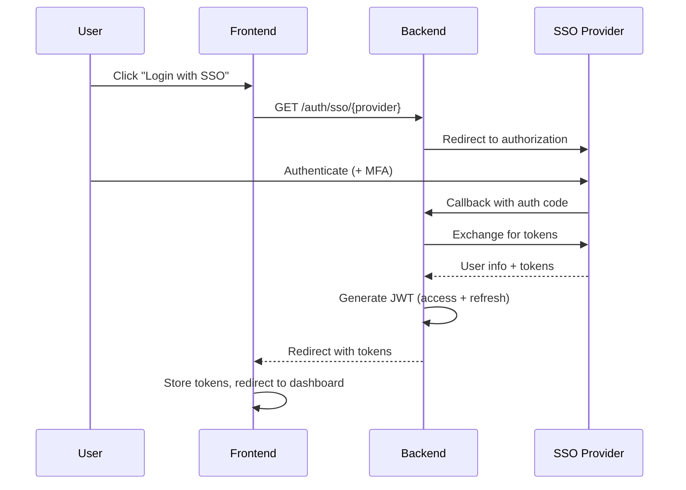
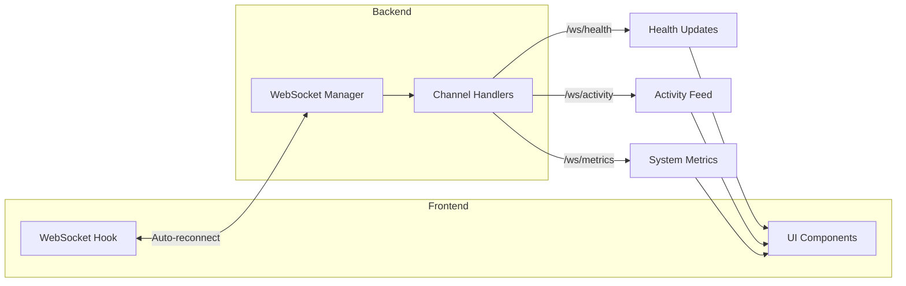
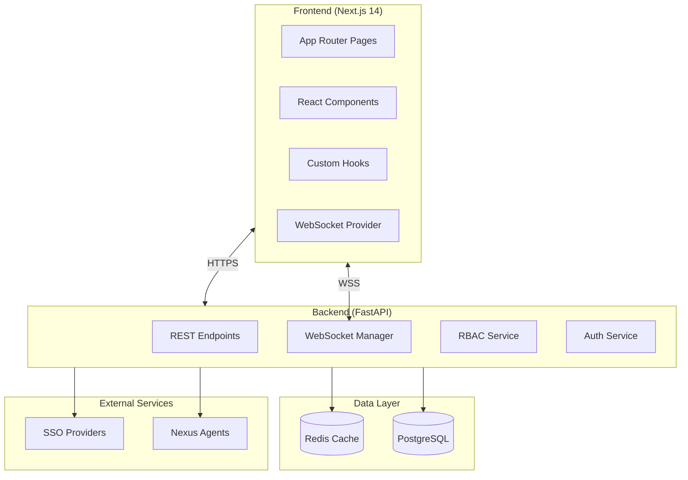

# Admin Dashboard

> **Version:** 3.0.0 | **Last Updated:** December 2025 | **Status:** Production Ready ✅

The Nexus Admin Dashboard is an enterprise-grade web application for managing and monitoring your release automation system. Built with **Next.js 14**, it provides real-time control over system configuration, agent health, and operational modes.

---

## Table of Contents

1. [Overview](#overview)
2. [Quick Start](#quick-start)
3. [Features](#features)
4. [Authentication & SSO](#authentication--sso)
5. [User Management](#user-management)
6. [Role Management](#role-management)
7. [Feature Requests](#feature-requests)
8. [Release Management](#release-management)
9. [Real-Time Updates](#real-time-updates)
10. [Advanced Features](#advanced-features)
11. [Architecture](#architecture)
12. [API Reference](#api-reference)
13. [Configuration](#configuration)
14. [Deployment](#deployment)
15. [Troubleshooting](#troubleshooting)

---

## Overview


The Admin Dashboard enables you to:

| Category | Features |
|----------|----------|
| **🔐 Security** | Enterprise SSO (Okta, Azure AD, Google, GitHub), Full RBAC with 30+ permissions |
| **📊 Monitoring** | Real-time health status, WebSocket updates, System metrics |
| **📅 Releases** | Timeline/Gantt view, CRUD operations, CSV/Excel export |
| **💡 Requests** | Feature requests with voting, Inline comments with @mentions |
| **⚙️ Config** | Mode switching (Mock/Live), Dynamic credential management |
| **📈 Analytics** | Advanced charting, Period comparison, Trend indicators |
| **🔍 Audit** | Complete audit trail, Filterable history, Export capabilities |

---

## Quick Start

### Accessing the Dashboard

```bash
# Start the full stack
docker-compose up -d

# Or start individually
cd services/admin_dashboard/backend
uvicorn main:app --reload --port 8088

cd services/admin_dashboard/frontend-next
npm install && npm run dev
```

**Access URLs:**
| Environment | Frontend | Backend API | API Docs |
|-------------|----------|-------------|----------|
| **Local** | http://localhost:3000 | http://localhost:8088 | http://localhost:8088/docs |
| **Production** | https://your-app.vercel.app | https://your-api.onrender.com | - |

### First-Time Setup

1. Navigate to the dashboard URL
2. Log in with SSO or local credentials
3. System starts in **Mock Mode** by default
4. Configure integrations in **Settings**
5. Switch to **Live Mode** when ready

---

## Features

### 🎛️ Customizable Dashboard

The dashboard features a **drag-and-drop widget grid** for personalized layouts:

- **Widget Types:** Stats, Activity Feed, Quick Actions, Health Overview
- **Resize Options:** Small, Medium, Large, Full-width
- **Persistence:** Layouts saved to localStorage
- **Reset:** One-click restore to defaults

```typescript
// Dashboard widgets are fully customizable
const widgets = ['stats', 'activity', 'health', 'releases', 'requests'];
// Drag to reorder, resize, or hide widgets
```

### 🔄 Mode Switching

Instantly toggle between operating modes:

| Mode | Description | Use Case |
|------|-------------|----------|
| **Mock** | Simulated data, no external calls | Development, testing, demos |
| **Live** | Real integrations active | Production use |
| **Hybrid** | Per-service configuration | Gradual rollout |

```bash
# Via API
curl -X POST http://localhost:8088/mode \
  -H "Content-Type: application/json" \
  -d '{"mode": "live"}'
```

### 📊 Health Monitoring

Real-time service monitoring with:

- **WebSocket Updates:** Live status every 10 seconds
- **Connection Status:** Visual indicator with latency
- **Uptime Tracking:** Percentage and history
- **Response Times:** Millisecond-level metrics
- **Auto-Refresh:** Configurable intervals

### 🔍 Audit Log

Complete activity history with:

- **Filterable Views:** By user, action, resource, date
- **Search:** Full-text search across all entries
- **Stats Dashboard:** Action breakdown charts
- **Export:** JSON/CSV download

---

## Authentication & SSO


### Supported Providers

| Provider | Protocol | Features |
|----------|----------|----------|
| **Okta** | OIDC | MFA, group sync, SCIM provisioning |
| **Azure AD** | OAuth2/OIDC | Microsoft 365 integration, conditional access |
| **Google** | OAuth2 | Google Workspace SSO, domain restriction |
| **GitHub** | OAuth2 | Organization membership, team sync |
| **Local** | Email/Password | Development mode |

### Authentication Flow



### Environment Configuration

```bash
# JWT Settings
NEXUS_JWT_SECRET=your-secure-secret-key
NEXUS_TOKEN_EXPIRE_MINUTES=60
NEXUS_REFRESH_TOKEN_DAYS=7

# SSO Provider Selection
NEXUS_SSO_PROVIDER=okta  # okta, azure_ad, google, github, local

# Okta
OKTA_DOMAIN=your-domain.okta.com
OKTA_CLIENT_ID=your-client-id
OKTA_CLIENT_SECRET=your-client-secret

# Azure AD
AZURE_TENANT_ID=your-tenant-id
AZURE_CLIENT_ID=your-client-id
AZURE_CLIENT_SECRET=your-client-secret
```

---

## User Management


### Features

- **User CRUD:** Create, view, edit, delete users
- **Role Assignment:** Multiple roles per user
- **Status Management:** Active, Inactive, Pending, Suspended
- **SSO Sync:** Auto-provisioning from identity provider
- **Bulk Operations:** Import/export user lists

### User Statuses

| Status | Description | Can Login? |
|--------|-------------|------------|
| `active` | Normal access | ✅ Yes |
| `inactive` | Account disabled | ❌ No |
| `pending` | Awaiting activation | ❌ No |
| `suspended` | Temporarily blocked | ❌ No |

### API Endpoints

| Endpoint | Method | Permission | Description |
|----------|--------|------------|-------------|
| `/users` | GET | `users:view` | List all users |
| `/users` | POST | `users:create` | Create new user |
| `/users/{id}` | GET | `users:view` | Get user details |
| `/users/{id}` | PUT | `users:edit` | Update user |
| `/users/{id}` | DELETE | `users:delete` | Delete user |
| `/users/{id}/roles` | PUT | `users:roles:assign` | Update roles |

---

## Role Management


### System Roles (Built-in)

| Role | Description | Key Permissions |
|------|-------------|-----------------|
| **Admin** | Full system access | All 30+ permissions |
| **Engineering Manager** | Team oversight | View, Edit, Releases, Metrics |
| **Developer** | Development team | View, API, Features |
| **Product Manager** | Product team | View, Releases, Features |
| **QA Engineer** | Quality assurance | View, Features, Testing |
| **Viewer** | Read-only access | View only |

### Permission Categories

```
dashboard:*       - Dashboard access and metrics
config:*          - Configuration management
agents:*          - Agent control and monitoring
releases:*        - Release management
users:*           - User administration
roles:*           - Role management
features:*        - Feature requests
observability:*   - Metrics and alerts
api:*             - Programmatic API access
system:*          - System administration
audit:*           - Audit log access
```

### Creating Custom Roles

```bash
curl -X POST http://localhost:8088/roles \
  -H "Authorization: Bearer $TOKEN" \
  -H "Content-Type: application/json" \
  -d '{
    "name": "Release Manager",
    "description": "Manages releases and deployments",
    "permissions": [
      "dashboard:view",
      "releases:view", "releases:create", "releases:edit",
      "agents:view",
      "observability:view"
    ]
  }'
```

---

## Feature Requests


### Request Types

| Type | Jira Issue Type | Use Case |
|------|-----------------|----------|
| `feature_request` | Story | New functionality |
| `bug_report` | Bug | Defect reports |
| `improvement` | Improvement | Enhancements |
| `documentation` | Task | Doc updates |

### Inline Commenting System

- **Threaded Conversations:** Nested replies
- **@Mentions:** Autocomplete for users
- **Edit/Delete:** Author controls
- **Resolve:** Mark discussions complete

```typescript
// Comment with @mention
const comment = {
  content: "Great idea! @john.smith can you review this?",
  mentions: ["john.smith@nexus.dev"],
  parent_id: null // or comment ID for replies
};
```

### Automatic Jira Integration

When a request is submitted:

1. ✅ Request validated and stored
2. ✅ Jira ticket created automatically
3. ✅ Component routes to team
4. ✅ Assignee set by ownership rules
5. ✅ Slack notification sent
6. ✅ Request updated with Jira link

---

## Release Management


### Timeline/Gantt View

Interactive timeline visualization:

- **Zoom Levels:** Day, Week, Month views
- **Today Marker:** Current date indicator
- **Status Colors:** Visual status coding
- **Interactive Tooltips:** Hover for details
- **Drag Support:** Reschedule releases

```typescript
// Timeline zoom options
type ZoomLevel = 'day' | 'week' | 'month';

// Release on timeline
interface TimelineRelease {
  id: string;
  version: string;
  target_date: string;
  status: 'planned' | 'in_progress' | 'completed' | 'cancelled';
}
```

### Release Sources

| Source | Description | Integration |
|--------|-------------|-------------|
| **Manual** | Create in UI | Built-in |
| **Smartsheet** | Sync from sheets | API integration |
| **CSV** | File import | File upload |
| **Webhook** | External systems | REST API |
| **Jira** | Fix versions | Agent integration |

### Import Examples

**CSV Import:**
```csv
version,target_date,name,status
v2.1.0,2025-02-15,Phoenix,planning
v2.2.0,2025-03-01,Ember,in_progress
```

**Webhook Payload:**
```json
{
  "action": "create",
  "source": "your-system",
  "release": {
    "version": "v2.1.0",
    "target_date": "2025-02-15T00:00:00Z",
    "name": "Phoenix"
  }
}
```

---

## Real-Time Updates

### WebSocket Architecture



### WebSocket Channels

| Channel | Frequency | Data |
|---------|-----------|------|
| `/ws/health` | 10 seconds | Service status updates |
| `/ws/activity` | Real-time | User action feed |
| `/ws/metrics` | 15 seconds | System metrics |

### Connection Status Component

Visual indicator showing:
- 🟢 **Connected:** Active WebSocket connection
- 🟡 **Connecting:** Establishing connection
- 🔴 **Disconnected:** Connection lost (auto-retry)
- **Latency:** Round-trip time in ms

---

## Advanced Features

### ⌨️ Keyboard Navigation

Vim-like navigation throughout the application:

| Key | Action |
|-----|--------|
| `J` | Move down in list |
| `K` | Move up in list |
| `G` | Go to first item |
| `Shift+G` | Go to last item |
| `Enter` | Select/Open item |
| `Escape` | Close modal/Cancel |
| `/` | Focus search |
| `?` | Show shortcuts modal |

### 🔍 Filter Persistence

Filters automatically sync to URL and persist:

```typescript
// URL reflects current filters
// /releases?status=in_progress&priority=high

// Saved presets
const presets = [
  { name: "My Active", filters: { assignee: currentUser, status: "active" } },
  { name: "High Priority", filters: { priority: "high" } }
];
```

### 📊 Advanced Analytics

Interactive charts with:

- **Multiple Chart Types:** Line, Bar, Area, Pie
- **Period Comparison:** Compare with previous period
- **Trend Indicators:** ↑ ↓ indicators with percentages
- **Export:** Download chart data

### 🌙 Theme Support

- **Light Mode:** Default bright theme
- **Dark Mode:** Eye-friendly dark theme
- **System:** Follows OS preference
- **Persistence:** Saved to localStorage

---

## Architecture



### Technology Stack

**Frontend:**
| Technology | Purpose |
|------------|---------|
| Next.js 14 | React framework with App Router |
| TypeScript | Type-safe development |
| Tailwind CSS | Utility-first styling |
| Shadcn/ui | Accessible components |
| SWR | Data fetching & caching |
| Recharts | Data visualization |
| @dnd-kit | Drag-and-drop |

**Backend:**
| Technology | Purpose |
|------------|---------|
| FastAPI | High-performance async API |
| SQLAlchemy 2.0 | ORM with async support |
| PostgreSQL | Production database |
| Redis | Caching & sessions |
| Alembic | Database migrations |

---

## API Reference

### Core Endpoints

| Method | Endpoint | Description |
|--------|----------|-------------|
| `GET` | `/health` | Backend health check |
| `GET` | `/stats` | Dashboard statistics |
| `GET/POST` | `/mode` | System mode |
| `GET/POST/DELETE` | `/config` | Configuration |
| `GET` | `/health-check` | All agents health |

### Authentication Endpoints

| Method | Endpoint | Description |
|--------|----------|-------------|
| `POST` | `/auth/login` | Local login |
| `GET` | `/auth/sso/{provider}` | Initiate SSO |
| `GET` | `/auth/callback/{provider}` | SSO callback |
| `GET` | `/auth/me` | Current user |
| `POST` | `/auth/refresh` | Refresh token |
| `POST` | `/auth/logout` | Logout |

### WebSocket Endpoints

| Endpoint | Description |
|----------|-------------|
| `/ws` | General channel (subscribe/unsubscribe) |
| `/ws/health` | Health updates (10s interval) |
| `/ws/activity` | Activity feed (real-time) |
| `/ws/metrics` | System metrics (15s interval) |

### CRUD Endpoints

| Resource | Endpoints |
|----------|-----------|
| **Releases** | `GET/POST /releases`, `GET/PUT/DELETE /releases/{id}` |
| **Users** | `GET/POST /users`, `GET/PUT/DELETE /users/{id}` |
| **Roles** | `GET/POST /roles`, `GET/PUT/DELETE /roles/{id}` |
| **Feature Requests** | `GET/POST /feature-requests`, `GET/PUT/DELETE /feature-requests/{id}` |
| **Audit Logs** | `GET /audit-logs` |

---

## Configuration

### Environment Variables

| Variable | Required | Description |
|----------|----------|-------------|
| `NEXT_PUBLIC_API_URL` | Yes | Backend API URL |
| `POSTGRES_URL` | Yes* | PostgreSQL connection |
| `REDIS_URL` | No | Redis connection |
| `NEXUS_JWT_SECRET` | Yes | JWT signing key |
| `USE_DATABASE` | No | Enable PostgreSQL |

*Required when `USE_DATABASE=true`

### Dynamic Configuration

Configuration priority:
```
1. Redis (dynamic, highest priority)
2. Environment variables (static)
3. Default values (fallback)
```

---

## Deployment

### Vercel (Frontend)

```bash
cd services/admin_dashboard/frontend-next
vercel deploy --prod
```

### Render (Backend)

```bash
# Auto-deploys via render.yaml Blueprint
# Or manual:
cd services/admin_dashboard/backend
docker build -f Dockerfile.render -t nexus-admin-backend .
```

### Docker Compose (Local)

```yaml
admin-dashboard:
  build:
    context: .
    dockerfile: infrastructure/docker/Dockerfile.admin-dashboard
  ports:
    - "8088:8088"
  environment:
    - REDIS_URL=redis://redis:6379
  depends_on:
    - redis
```

📖 See [Frontend Deployment Guide](frontend-deployment-guide.md) for detailed instructions.

---

## Troubleshooting

### Common Issues

| Problem | Solution |
|---------|----------|
| **Dashboard won't load** | Check backend is running, verify `NEXT_PUBLIC_API_URL` |
| **WebSocket disconnects** | Check network, backend WebSocket endpoints |
| **Login fails** | Verify SSO configuration, check JWT secret |
| **Config not saving** | Check Redis connection |
| **Agent unhealthy** | Check agent container, verify credentials |

### Debug Mode

```bash
# Enable debug logging
NEXT_PUBLIC_DEBUG=true npm run dev
```

### Getting Help

1. Check logs: `docker logs admin-dashboard`
2. API docs: http://localhost:8088/docs
3. GitHub Issues: Report bugs
4. Slack: #nexus-support

---

## Security Considerations

1. **HTTPS Only:** Use TLS in production
2. **Token Rotation:** Refresh tokens expire in 7 days
3. **Audit Logging:** All actions tracked
4. **RBAC:** Granular permission control
5. **Secret Management:** Use environment variables or Vault
6. **CSP Headers:** Content Security Policy enabled

---

*Documentation Version 3.0.0 | Last Updated: December 2025*
