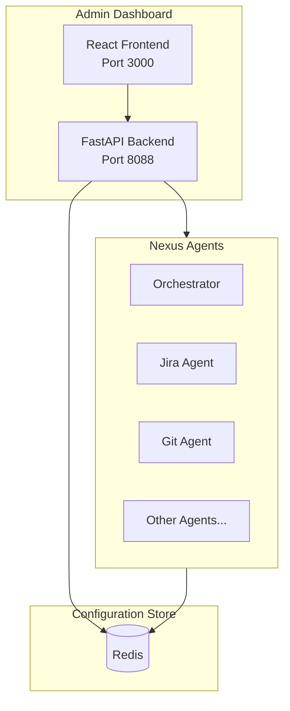

# Admin Dashboard

The Nexus Admin Dashboard is a web-based interface for managing and monitoring your Nexus release automation system. It provides real-time control over system configuration, agent health, and operational modes.

## Overview


The Admin Dashboard enables you to:

- **Authenticate Securely**: Enterprise SSO with Okta, Azure AD, Google, GitHub
- **Manage Users & Roles**: Full RBAC with 20+ granular permissions
- **Submit Feature Requests**: Create requests that auto-generate Jira tickets
- **Toggle System Mode**: Instantly switch between Mock and Live modes
- **Manage Credentials**: Securely update API keys and URLs
- **Monitor Health**: Real-time status of all connected agents
- **Configure Integrations**: Set up Jira, GitHub, Jenkins, Slack, and LLM providers
- **View Observability Metrics**: Integrated dashboards with Prometheus/Grafana data

## Quick Start

### Accessing the Dashboard

```bash
# Start the stack with Docker Compose
docker-compose up -d

# Access the dashboard
open http://localhost:8088
```

### First-Time Setup

1. Navigate to `http://localhost:8088`
2. The system starts in **Mock Mode** by default
3. Go to **Settings** to configure your integrations
4. Switch to **Live Mode** when ready to connect to real services

### Deployment Options

The Admin Dashboard can be deployed in several ways:

| Method | Best For | URL |
|--------|----------|-----|
| **Docker Compose** | Local development | `http://localhost:8088` |
| **Kubernetes** | Production backend | `https://your-cluster/dashboard` |
| **Vercel** | Production frontend | `https://your-app.vercel.app` |

#### Deploy to Vercel

For production frontend hosting with global CDN:

```bash
# Using automated script
python scripts/deploy_frontend.py --env production --api-url https://your-api.com

# Or manually
cd services/admin_dashboard/frontend
npm install --legacy-peer-deps
npm run build:prod
vercel deploy --prod
```

📖 See [Frontend Deployment Guide](frontend-deployment-guide.md) for detailed instructions.

## Features

### 🔄 Mode Switching

The central feature is the ability to toggle between **Mock Mode** and **Live Mode**:

| Mode | Description | Use Case |
|------|-------------|----------|
| **Mock** | All external API calls return simulated data | Development, testing, demos |
| **Live** | Connects to real Jira, GitHub, Jenkins, etc. | Production use |

When you switch modes:
- All agents automatically pick up the change
- No restart required
- Changes take effect within seconds

### 🔐 Credential Management

Securely manage all integration credentials:

- **Jira**: URL, username, API token, project key
- **GitHub**: Personal access token, organization, repository
- **Jenkins**: URL, username, API token
- **LLM**: Provider selection, API keys (Gemini/OpenAI)
- **Slack**: Bot token, signing secret, app token
- **Confluence**: URL, username, API token, space key

**Security Features:**
- Passwords and tokens are masked in the UI
- Sensitive values stored encrypted in Redis
- Environment variable fallback for secrets

### 📊 Health Monitoring

Real-time health status for all agents:

- **Status Indicators**: Healthy (green), Unhealthy (red)
- **Response Times**: Millisecond-level latency tracking
- **Auto-Refresh**: Updates every 10 seconds
- **Manual Check**: Force refresh individual agents

### 📈 Integrated Observability Dashboard

The Admin Dashboard includes a comprehensive observability page that consolidates metrics from Prometheus and Grafana:


**Key Metrics Displayed:**

| Metric | Description | Source |
|--------|-------------|--------|
| **Total Requests** | Aggregate request count across all agents | Prometheus |
| **Avg Latency** | Average response time (P50/P95/P99) | Prometheus |
| **Error Rate** | Percentage of failed requests | Prometheus |
| **LLM Cost** | Total cost of LLM API calls | Prometheus |
| **Hygiene Score** | Project data quality percentage | Hygiene Agent |
| **Release Decisions** | Go/No-Go decision counts | Orchestrator |

**Charts Available:**

- 📈 **Request Traffic**: Real-time request volume over time
- ⏱️ **Latency Trends**: Response time distribution
- 🖥️ **Agent Performance**: Per-agent metrics table
- ⚡ **LLM Token Usage**: Breakdown by model with cost tracking
- 🎯 **Hygiene Score**: Circular progress indicator

**Time Range Selection:**
- 1 hour (1h)
- 6 hours (6h)
- 24 hours (24h)
- 7 days (7d)

**External Dashboard Links:**
- One-click access to Grafana for detailed dashboards
- Direct link to Prometheus for raw metrics
- Link to Jaeger for distributed tracing

**Embedded Grafana Panels:**
- Configure Grafana to allow embedding (`allow_embedding = true`)
- Panels display directly in the Admin Dashboard
- Maintains dark theme consistency

### 📅 Release Management

The Admin Dashboard includes a comprehensive Release Management system that allows you to:


- **Track Release Versions**: Define and monitor multiple releases
- **Set Target Dates**: Configure release schedules with milestones
- **Import from External Sources**: Sync from Smartsheet, CSV, or webhooks
- **Monitor Readiness**: Real-time metrics and Go/No-Go decisions
- **Manage Milestones**: Track progress through release lifecycle

**Release Sources:**

| Source | Description | Integration |
|--------|-------------|-------------|
| **Manual** | Create releases directly in the UI | Built-in |
| **Smartsheet** | Sync from Smartsheet sheets | API integration |
| **CSV** | Import from CSV files | File upload |
| **Webhook** | Receive from external systems | REST API |
| **Jira** | Import from Jira fix versions | Agent integration |

**Release Lifecycle:**

```
Planning → In Progress → Code Freeze → Testing → UAT → Staging → Ready → Deployed
```

**Key Metrics per Release:**

| Metric | Description |
|--------|-------------|
| **Days Until Release** | Countdown to target date |
| **Ticket Completion** | % of Jira tickets completed |
| **Build Success Rate** | % of CI builds passing |
| **Test Coverage** | Code coverage percentage |
| **Critical Vulnerabilities** | Security scan results |
| **Readiness Score** | Overall release health (0-100) |

**External Source Sync:**

Smartsheet Integration:
```bash
curl -X POST http://localhost:8088/releases/sync/smartsheet \
  -H "Content-Type: application/json" \
  -d '{
    "api_token": "your-smartsheet-token",
    "sheet_id": "1234567890",
    "version_column": "Release Version",
    "target_date_column": "Target Date"
  }'
```

CSV Import:
```bash
curl -X POST http://localhost:8088/releases/sync/csv \
  -H "Content-Type: text/plain" \
  -d 'version,target_date,name,status
v2.1.0,2025-02-15,Phoenix,planning
v2.2.0,2025-03-01,Ember,planning'
```

Webhook (for external systems to push data):
```bash
curl -X POST http://localhost:8088/releases/sync/webhook \
  -H "Content-Type: application/json" \
  -d '{
    "action": "create",
    "source": "your-system",
    "release": {
      "version": "v2.1.0",
      "target_date": "2025-02-15T00:00:00Z",
      "name": "Phoenix"
    }
  }'
```

### 🔐 Authentication & SSO

The Admin Dashboard supports enterprise Single Sign-On (SSO) authentication with multiple providers.


**Supported Providers:**

| Provider | Protocol | Configuration |
|----------|----------|---------------|
| **Okta** | OIDC | Domain, Client ID, Client Secret |
| **Azure AD** | OAuth2/OIDC | Tenant ID, Client ID, Client Secret |
| **Google** | OAuth2 | Client ID, Client Secret |
| **GitHub** | OAuth2 | Client ID, Client Secret |
| **Local** | Email/Password | Development only |

**Authentication Flow:**

1. User clicks "Login with [Provider]"
2. Redirected to SSO provider for authentication
3. Provider redirects back with authorization code
4. Backend exchanges code for tokens and user info
5. JWT access and refresh tokens are issued
6. User is redirected to dashboard

**Environment Variables:**

```bash
# JWT Configuration
NEXUS_JWT_SECRET=your-secure-secret-key
NEXUS_TOKEN_EXPIRE_MINUTES=60
NEXUS_REFRESH_TOKEN_DAYS=7

# SSO Provider Selection
NEXUS_SSO_PROVIDER=okta  # okta, azure_ad, google, github, local

# Okta
OKTA_DOMAIN=your-domain.okta.com
OKTA_CLIENT_ID=your-client-id
OKTA_CLIENT_SECRET=your-client-secret

# Azure AD
AZURE_TENANT_ID=your-tenant-id
AZURE_CLIENT_ID=your-client-id
AZURE_CLIENT_SECRET=your-client-secret

# Google
GOOGLE_CLIENT_ID=your-client-id
GOOGLE_CLIENT_SECRET=your-client-secret

# GitHub
GITHUB_CLIENT_ID=your-client-id
GITHUB_CLIENT_SECRET=your-client-secret
```

**API Endpoints:**

| Endpoint | Method | Description |
|----------|--------|-------------|
| `/auth/login` | POST | Local email/password login |
| `/auth/sso/{provider}` | GET | Initiate SSO flow |
| `/auth/callback/{provider}` | GET | SSO callback handler |
| `/auth/me` | GET | Get current user info |
| `/auth/refresh` | POST | Refresh access token |
| `/auth/logout` | POST | Invalidate tokens |

### 👥 User Management

Administrators can manage users, assign roles, and control access to the system.


**Features:**

- **User List**: View all users with search and filters
- **Create User**: Add new users with role assignments
- **Edit User**: Update user details and roles
- **Delete User**: Remove user access (soft delete)
- **Role Assignment**: Assign multiple roles to users
- **SSO Sync**: Users auto-created on first SSO login

**User Statuses:**

| Status | Description |
|--------|-------------|
| `active` | User can access the system |
| `inactive` | User disabled, cannot login |
| `pending` | Awaiting activation |
| `suspended` | Temporarily blocked |

**API Endpoints:**

| Endpoint | Method | Permission | Description |
|----------|--------|------------|-------------|
| `/users` | GET | `users:view` | List all users |
| `/users` | POST | `users:create` | Create new user |
| `/users/{id}` | GET | `users:view` | Get user details |
| `/users/{id}` | PUT | `users:edit` | Update user |
| `/users/{id}` | DELETE | `users:delete` | Delete user |
| `/users/{id}/roles` | PUT | `users:roles:assign` | Update role assignments |

### 🛡️ Role Management

Create and manage dynamic roles with granular permissions.


**System Roles (Built-in):**

| Role | Description | Key Permissions |
|------|-------------|-----------------|
| **Admin** | Full system access | All permissions |
| **Developer** | Development team | View + API + Features |
| **Product Manager** | Product team | View + Releases + Features |
| **Project Manager** | Project oversight | View + Releases |
| **QA Engineer** | Quality assurance | View + Features |
| **Viewer** | Read-only access | View only |

**Permission Categories:**

```
dashboard:*     - Dashboard access
config:*        - Configuration management
agents:*        - Agent control
releases:*      - Release management
users:*         - User administration
roles:*         - Role management
features:*      - Feature requests
observability:* - Metrics and alerts
api:*           - API access
system:*        - System administration
```

**Creating Custom Roles:**

```bash
curl -X POST http://localhost:8088/roles \
  -H "Authorization: Bearer $TOKEN" \
  -H "Content-Type: application/json" \
  -d '{
    "name": "Release Manager",
    "description": "Manages releases and deployments",
    "permissions": [
      "dashboard:view",
      "releases:view",
      "releases:create",
      "releases:edit",
      "agents:view",
      "observability:view"
    ],
    "is_default": false
  }'
```

**API Endpoints:**

| Endpoint | Method | Permission | Description |
|----------|--------|------------|-------------|
| `/roles` | GET | `roles:view` | List all roles |
| `/roles` | POST | `roles:create` | Create new role |
| `/roles/permissions` | GET | `roles:view` | List all permissions |
| `/roles/{id}` | GET | `roles:view` | Get role details |
| `/roles/{id}` | PUT | `roles:edit` | Update role |
| `/roles/{id}` | DELETE | `roles:delete` | Delete custom role |

### 💡 Feature Requests

Submit feature requests and bug reports that automatically create Jira tickets.


**Request Types:**

| Type | Jira Type | Use Case |
|------|-----------|----------|
| `feature_request` | Story | New functionality |
| `bug_report` | Bug | Defect reports |
| `improvement` | Improvement | Enhancements |
| `documentation` | Task | Doc updates |
| `question` | Task | Technical questions |

**Priority Levels:**

| Priority | Jira Priority | SLA |
|----------|--------------|-----|
| `critical` | Highest | 24 hours |
| `high` | High | 3 days |
| `medium` | Medium | 1 week |
| `low` | Low | Best effort |

**Automatic Jira Integration:**

When a request is submitted:
1. Request is validated and stored
2. Background job creates Jira ticket
3. Fields are mapped automatically
4. Component determines assignee
5. Slack notification sent to team
6. Request updated with Jira key

**Field Mapping:**

```yaml
Feature Request:
  title → Summary
  description → Description
  priority → Priority
  component → Component (routes to team)
  use_case → Custom Field
  acceptance_criteria → Custom Field

Bug Report:
  title → Summary
  description → Description
  steps_to_reproduce → Steps to Reproduce
  expected_behavior → Expected Result
  actual_behavior → Actual Result
  environment → Environment
```

**API Endpoints:**

| Endpoint | Method | Permission | Description |
|----------|--------|------------|-------------|
| `/feature-requests` | GET | `features:view` | List requests |
| `/feature-requests` | POST | `features:submit` | Submit request |
| `/feature-requests/options` | GET | - | Get form options |
| `/feature-requests/stats` | GET | `features:view` | Get statistics |
| `/feature-requests/{id}` | GET | `features:view` | Get request details |
| `/feature-requests/{id}` | PUT | `features:manage` | Update request |
| `/feature-requests/{id}` | DELETE | `features:manage` | Delete request |

**Example: Submit Feature Request**

```bash
curl -X POST http://localhost:8088/feature-requests \
  -H "Authorization: Bearer $TOKEN" \
  -H "Content-Type: application/json" \
  -d '{
    "type": "feature_request",
    "title": "Add dark mode toggle",
    "description": "Users should be able to switch between light and dark themes in the dashboard.",
    "priority": "medium",
    "component": "admin-dashboard",
    "use_case": "As a user, I want dark mode so that I can reduce eye strain during night work.",
    "acceptance_criteria": "- Toggle visible in settings\n- Theme persists across sessions\n- All components styled correctly",
    "labels": ["ui", "enhancement"]
  }'
```

### ⚙️ Dynamic Configuration

The ConfigManager enables dynamic configuration without restarts:

```
Priority Order:
1. Redis (dynamic config) - Highest priority
2. Environment variables - Fallback
3. Default values - Last resort
```

## Architecture



## API Reference

### Core Endpoints

| Method | Endpoint | Description |
|--------|----------|-------------|
| `GET` | `/health` | Backend health check |
| `GET` | `/stats` | Dashboard statistics |
| `GET` | `/mode` | Get current system mode |
| `POST` | `/mode` | Set system mode |
| `GET` | `/config` | Get all configuration |
| `GET` | `/config/{key}` | Get specific config value |
| `POST` | `/config` | Update config value |
| `DELETE` | `/config/{key}` | Delete config value |
| `GET` | `/health-check` | Check all agent health |
| `GET` | `/health-check/{agent}` | Check specific agent |
| `GET` | `/config/templates` | Get config form templates |
| `GET` | `/api/metrics` | Get aggregated observability metrics |

### Release Management Endpoints

| Method | Endpoint | Description |
|--------|----------|-------------|
| `GET` | `/releases` | List all releases |
| `GET` | `/releases/calendar` | Get calendar view |
| `GET` | `/releases/templates` | Get release templates |
| `GET` | `/releases/{release_id}` | Get specific release |
| `POST` | `/releases` | Create new release |
| `PUT` | `/releases/{release_id}` | Update release |
| `DELETE` | `/releases/{release_id}` | Delete release |
| `GET` | `/releases/{release_id}/metrics` | Get release metrics |
| `POST` | `/releases/{release_id}/milestones` | Add milestone |
| `POST` | `/releases/{release_id}/risks` | Add risk item |
| `POST` | `/releases/sync/smartsheet` | Sync from Smartsheet |
| `POST` | `/releases/sync/csv` | Import from CSV |
| `POST` | `/releases/sync/webhook` | Receive webhook data |

### Set System Mode

```bash
# Switch to Live Mode
curl -X POST http://localhost:8088/mode \
  -H "Content-Type: application/json" \
  -d '{"mode": "live"}'

# Switch to Mock Mode
curl -X POST http://localhost:8088/mode \
  -H "Content-Type: application/json" \
  -d '{"mode": "mock"}'
```

### Update Configuration

```bash
# Set Jira URL
curl -X POST http://localhost:8088/config \
  -H "Content-Type: application/json" \
  -d '{
    "key": "nexus:config:jira_url",
    "value": "https://your-org.atlassian.net"
  }'

# Set Jira API Token (sensitive)
curl -X POST http://localhost:8088/config \
  -H "Content-Type: application/json" \
  -d '{
    "key": "nexus:config:jira_api_token",
    "value": "your-api-token"
  }'
```

### Check Agent Health

```bash
# Check all agents
curl http://localhost:8088/health-check

# Check specific agent
curl http://localhost:8088/health-check/jira_agent
```

## Configuration Reference

### System Mode

| Key | Values | Description |
|-----|--------|-------------|
| `nexus:mode` | `mock`, `live` | System operating mode |

### Jira Configuration

| Key | Description |
|-----|-------------|
| `nexus:config:jira_url` | Jira instance URL |
| `nexus:config:jira_username` | Username or email |
| `nexus:config:jira_api_token` | API token (sensitive) |
| `nexus:config:jira_project_key` | Default project key |

### GitHub Configuration

| Key | Description |
|-----|-------------|
| `nexus:config:github_token` | Personal access token (sensitive) |
| `nexus:config:github_org` | Organization name |
| `nexus:config:github_repo` | Default repository |

### Jenkins Configuration

| Key | Description |
|-----|-------------|
| `nexus:config:jenkins_url` | Jenkins server URL |
| `nexus:config:jenkins_username` | Jenkins username |
| `nexus:config:jenkins_api_token` | API token (sensitive) |

### LLM Configuration

| Key | Description |
|-----|-------------|
| `nexus:config:llm_provider` | `google`, `openai`, or `mock` |
| `nexus:config:llm_model` | Model name (e.g., `gemini-1.5-pro`) |
| `nexus:config:gemini_api_key` | Google AI API key (sensitive) |
| `nexus:config:openai_api_key` | OpenAI API key (sensitive) |

### Slack Configuration

| Key | Description |
|-----|-------------|
| `nexus:config:slack_bot_token` | Bot token (sensitive) |
| `nexus:config:slack_signing_secret` | Signing secret (sensitive) |
| `nexus:config:slack_app_token` | App token (sensitive) |

## Prometheus Metrics

```prometheus
# Configuration Changes
nexus_admin_config_changes_total{key, source}

# Health Checks
nexus_admin_health_checks_total{agent, status}

# Mode Switches
nexus_admin_mode_switches_total{from_mode, to_mode}

# Active Mode (0=mock, 1=live)
nexus_admin_active_mode
```

## Environment Variables

| Variable | Default | Description |
|----------|---------|-------------|
| `REDIS_URL` | `redis://localhost:6379` | Redis connection URL |
| `PORT` | `8088` | Backend server port |
| `ENV` | `development` | Environment (enables hot reload) |

## Deployment

### Docker Compose

```yaml
admin-dashboard:
  build:
    context: .
    dockerfile: infrastructure/docker/Dockerfile.admin-dashboard
  ports:
    - "8088:8088"
  environment:
    - REDIS_URL=redis://redis:6379
  depends_on:
    - redis
```

### Kubernetes

```yaml
# values.yaml
adminDashboard:
  enabled: true
  replicas: 1
  image:
    repository: nexus/admin-dashboard
    tag: latest
  service:
    type: ClusterIP
    port: 8088
  ingress:
    enabled: true
    host: admin.nexus.example.com
```

## Troubleshooting

### Redis Connection Failed

```
⚠️ Redis not available: Connection refused
```

**Solution**: Ensure Redis is running and `REDIS_URL` is correct.

### Agent Health Check Failed

```
Agent 'jira_agent' status: unhealthy
```

**Solution**: 
1. Check if the agent container is running
2. Verify the agent URL configuration
3. Check agent logs for errors

### Configuration Not Updating

**Possible causes**:
1. Redis connection issue
2. Cache not cleared
3. Agent not reading from Redis

**Solution**: 
1. Check Redis connectivity
2. Restart the affected agent
3. Clear ConfigManager cache via API

## Best Practices

1. **Start in Mock Mode**: Always develop and test in mock mode first
2. **Backup Config**: Export configuration before making changes
3. **Monitor Health**: Keep the health dashboard open during deployments
4. **Use Secrets Manager**: In production, use Kubernetes secrets or Vault
5. **Enable Auto-Refresh**: Keep health monitoring in auto-refresh mode

## 🔐 Authentication & Authorization (SSO/RBAC)

The Admin Dashboard includes enterprise-grade authentication and access control:


### Single Sign-On (SSO)

Supported SSO providers:

| Provider | Protocol | Configuration |
|----------|----------|---------------|
| **Okta** | OIDC/SAML | Client ID, Issuer URL |
| **Azure AD** | OIDC | Tenant ID, Client ID |
| **Google** | OAuth 2.0 | Client ID, Domain restriction |
| **GitHub** | OAuth 2.0 | Client ID, Org restriction |

### User Management


Manage users with full lifecycle control:

- **Create Users**: Manual or SSO-synced user creation
- **Assign Roles**: Dynamic role assignment
- **Status Management**: Active, Pending, Suspended states
- **SSO Sync**: Automatic user provisioning from identity provider

### Role-Based Access Control (RBAC)


**Built-in Roles:**

| Role | Permissions | Use Case |
|------|-------------|----------|
| **Admin** | Full system access | System administrators |
| **Engineering Manager** | Team management, releases, metrics | Engineering leads |
| **Developer** | View dashboards, submit requests | Development team |
| **Product Manager** | Releases, feature requests | Product team |
| **Project Manager** | Releases, reports | Project management |
| **Executive** | Read-only dashboards, reports | Leadership |
| **Viewer** | Read-only access | Stakeholders |

**Custom Roles:**
- Create custom roles with granular permissions
- 15+ configurable permissions
- Permission inheritance support

### Available Permissions

| Category | Permissions |
|----------|-------------|
| **Dashboard** | View, Edit Config |
| **Users** | View, Create, Edit, Delete |
| **Roles** | View, Manage |
| **Feature Requests** | Submit, View, Manage |
| **Releases** | View, Create, Edit |
| **Audit** | View Logs |
| **System** | Admin Config |

## 💡 Feature Requests & Bug Reports

The Admin Dashboard includes an integrated feature request system with automatic Jira ticket creation:


### Request Types

| Type | Description | Jira Issue Type |
|------|-------------|-----------------|
| **Feature Request** | New functionality | Story |
| **Bug Report** | Defect report | Bug |
| **Improvement** | Enhancement request | Improvement |
| **Documentation** | Doc updates | Task |

### Automatic Jira Integration

When a feature request is submitted:

1. **Stored** in persistent Redis storage
2. **Jira Ticket Created** with intelligent field mapping
3. **Component Assigned** based on selection
4. **Assignee Set** based on component ownership
5. **Notifications Sent** to Slack and webhooks

### Component-Based Assignment

| Component | Jira Component | Default Assignee |
|-----------|----------------|------------------|
| `orchestrator` | Orchestrator | `NEXUS_ORCHESTRATOR_LEAD` |
| `jira-agent` | Jira Agent | `NEXUS_JIRA_AGENT_LEAD` |
| `slack-agent` | Slack Agent | `NEXUS_SLACK_AGENT_LEAD` |
| `admin-dashboard` | Admin Dashboard | `NEXUS_ADMIN_LEAD` |
| `infrastructure` | Infrastructure | `NEXUS_INFRA_LEAD` |

### Feature Request API

```bash
# Submit a feature request
curl -X POST http://localhost:8088/feature-requests \
  -H "Authorization: Bearer $TOKEN" \
  -H "Content-Type: application/json" \
  -d '{
    "type": "feature_request",
    "title": "Add dark mode support",
    "description": "Implement dark mode toggle for the Admin Dashboard",
    "priority": "medium",
    "component": "admin-dashboard"
  }'

# List feature requests
curl http://localhost:8088/feature-requests \
  -H "Authorization: Bearer $TOKEN"

# Get Jira integration status
curl http://localhost:8088/feature-requests/jira/config \
  -H "Authorization: Bearer $TOKEN"
```

### Feature Request Endpoints

| Method | Endpoint | Description |
|--------|----------|-------------|
| `GET` | `/feature-requests` | List all requests |
| `POST` | `/feature-requests` | Submit new request |
| `GET` | `/feature-requests/{id}` | Get specific request |
| `PUT` | `/feature-requests/{id}` | Update request |
| `DELETE` | `/feature-requests/{id}` | Delete request |
| `GET` | `/feature-requests/stats` | Get statistics |
| `GET` | `/feature-requests/export` | Export to JSON/CSV |
| `GET` | `/feature-requests/{id}/audit` | Get audit trail |
| `GET` | `/feature-requests/jira/config` | Jira config |
| `POST` | `/feature-requests/{id}/sync-jira` | Sync from Jira |

## Security Considerations

1. **Access Control**: Built-in SSO and RBAC (OAuth, OIDC, SAML)
2. **HTTPS Only**: Use TLS in production
3. **Network Segmentation**: Restrict dashboard access to admin network
4. **Audit Logging**: Full audit trail for all actions
5. **Secret Rotation**: Regularly rotate API tokens and keys
6. **Role-Based Permissions**: Granular access control for all features

