# Architecture

This document describes the architecture of the Nexus Release Automation System, including its core components, communication patterns, and design decisions.

## System Overview

Nexus v3.0 is an enterprise AI platform built on **LangGraph** for stateful orchestration and the **Model Context Protocol (MCP)** for standardized tool connectivity. It coordinates specialized agents through an MCP Mesh architecture for intelligent release readiness assessments and proactive quality management.

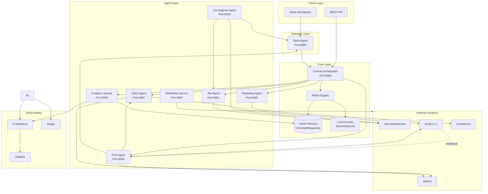

---

## High-Level Data Flow

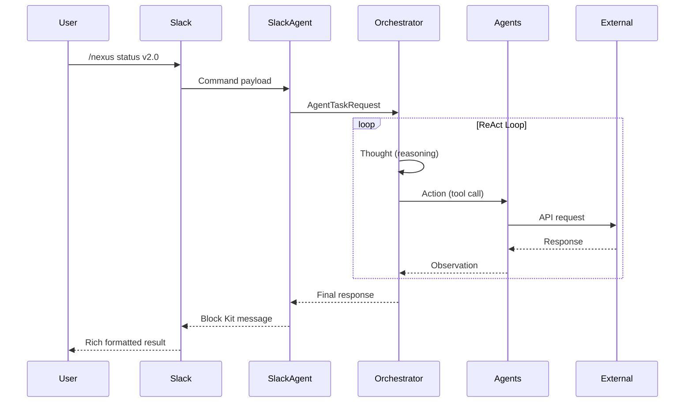

---

## Core Components

### 1. Central Orchestrator (LangGraph + MCP Client)

The brain of the system. Built on **LangGraph StateGraph** for durable, stateful workflows with **MCP Client Manager** for tool aggregation.

**Responsibilities:**
- Parse and understand user queries via LLM Factory
- Plan multi-step execution workflows (planner_node)
- Execute tools via MCP protocol (agent_node, tool_node)
- Support human-in-the-loop approvals (human_review_node)
- Persist conversation state to PostgreSQL
- Maintain context through vector memory (RAG)

**Technology:**
- **LangGraph** for stateful orchestration
- **MCP Client Manager** for tool aggregation
- **LLM Factory** for multi-provider support
- **AsyncPostgresSaver** for state persistence
- **FastAPI** for HTTP API
- **OpenTelemetry** for distributed tracing

### 2. LangGraph StateGraph Engine

The orchestrator uses a LangGraph **StateGraph** with multiple nodes for planning, execution, and human review.

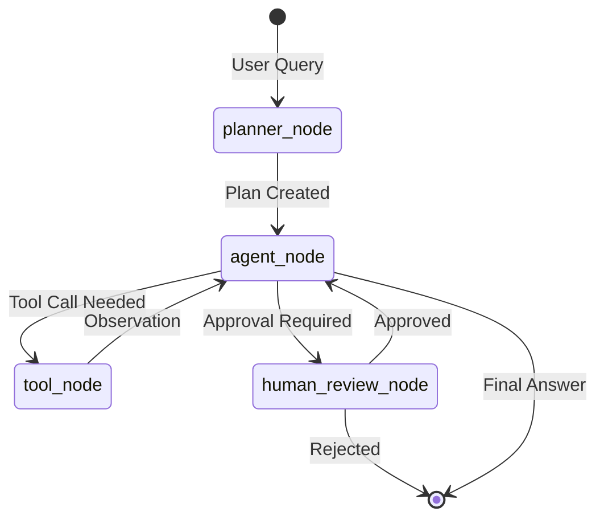

**Graph Nodes:**

| Node | Purpose |
|------|---------|
| `planner_node` | LLM creates execution plan from user query |
| `agent_node` | Decides which MCP tool to call next |
| `tool_node` | Executes tools via MCP protocol |
| `human_review_node` | Interrupts for high-risk action approval |

**State Persistence:**

State is persisted to PostgreSQL via `AsyncPostgresSaver`, enabling:
- **Conversation continuity**: Resume where you left off
- **Audit trail**: Complete history of tool executions
- **Human-in-the-loop**: Pause for approval, resume later

**Example Execution:**

```
User: "Is the v2.0 release ready?"

[planner_node]
Plan: ["Check Jira sprint stats", "Check security scan", "Check build status", "Make decision"]

[agent_node] → [tool_node]
Tool: get_sprint_stats (via MCP)
Observation: {"completed_tickets": 42, "total_tickets": 45, "completion_rate": 93.3}

[agent_node] → [tool_node]
Tool: get_security_scan (via MCP)
Observation: {"risk_score": 25, "critical_vulnerabilities": 0, "high_vulnerabilities": 2}

[agent_node] → [tool_node]
Tool: get_build_status (via MCP)
Observation: {"status": "SUCCESS", "test_results": {"passed": 245, "failed": 0}}

[agent_node]
Final Answer: The v2.0 release is READY (GO). 93.3% ticket completion,
              no critical vulnerabilities, and all tests passing.
```

### 3. Vector Memory

RAG-enabled memory system for maintaining context across conversations.

**Features:**
- Stores previous interactions and decisions
- Retrieves relevant context for new queries
- Supports ChromaDB (local) and pgvector (PostgreSQL)

**Use Cases:**
- "Last time we had a similar issue..."
- Historical release data retrieval
- Learning from past decisions

---

## Agent Contracts

All agents follow a standardized contract for communication.

### Request Schema

```python
class AgentTaskRequest(BaseModel):
    task_id: str           # Unique trace ID
    correlation_id: str    # Parent request ID
    action: str            # Action to execute
    payload: Dict          # Action parameters
    priority: TaskPriority # Execution priority
    user_context: Dict     # User metadata
    timeout_seconds: int   # Execution timeout
```

### Response Schema

```python
class AgentTaskResponse(BaseModel):
    task_id: str           # Original task ID
    status: TaskStatus     # success, failed, timeout
    data: Dict             # Result data
    error_message: str     # Error if failed
    execution_time_ms: float
    agent_type: AgentType
```

---

## Specialized Agents

### Jira Agent (Port 8081)

Handles all Jira-related operations including ticket fetching, updates, and hierarchy traversal.

**Capabilities:**
- Fetch ticket details and hierarchies
- Search using JQL
- Update ticket status and fields
- Add comments
- Get sprint statistics

**Endpoints:**

| Endpoint | Method | Description |
|----------|--------|-------------|
| `/issue/{key}` | GET | Fetch single ticket |
| `/hierarchy/{key}` | GET | Fetch epic → stories → subtasks |
| `/search` | GET | JQL search |
| `/update` | POST | Update status/add comment |
| `/update-ticket` | POST | Update multiple fields (for hygiene fixes) |
| `/sprint-stats/{project}` | GET | Sprint metrics |

### Git/CI Agent (Port 8082)

Manages GitHub and Jenkins interactions.

**Capabilities:**
- Check repository health
- Get PR status and approvals
- Trigger Jenkins builds
- Fetch build results
- Run security scans

**Endpoints:**

| Endpoint | Method | Description |
|----------|--------|-------------|
| `/repo/{name}/health` | GET | Repository health |
| `/repo/{name}/pr/{number}` | GET | PR details |
| `/build/{job}` | POST | Trigger build |
| `/build/{job}/status` | GET | Build status |
| `/security/{repo}` | GET | Security scan |

### Reporting Agent (Port 8083)

Generates and publishes reports.

**Capabilities:**
- Generate HTML reports with Jinja2
- Analyze release readiness
- Publish to Confluence
- Calculate Go/No-Go decisions

**Endpoints:**

| Endpoint | Method | Description |
|----------|--------|-------------|
| `/generate` | POST | Generate HTML report |
| `/analyze` | POST | Analyze for Go/No-Go |
| `/publish` | POST | Publish to Confluence |
| `/preview` | GET | Preview sample report |

### Slack Agent (Port 8084)

Handles Slack workspace interactions with rich interactive experiences.

**Capabilities:**
- Process slash commands
- Open Block Kit modals
- Send rich messages and DMs
- Handle button interactions
- Support hygiene fix modals

**Endpoints:**

| Endpoint | Method | Description |
|----------|--------|-------------|
| `/slack/commands` | POST | Slash command handler |
| `/slack/interactions` | POST | Button/modal interactions |
| `/slack/events` | POST | Events API handler |
| `/notify` | POST | Send channel notification |
| `/send-dm` | POST | Send direct message by email |

### Jira Hygiene Agent (Port 8005) 🆕

Proactive quality gatekeeper that monitors and enforces Jira data hygiene through scheduled checks and interactive notifications.

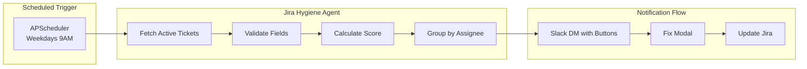

**Capabilities:**
- **Scheduled Hygiene Checks**: Runs automatically on weekdays at 9:00 AM
- **Field Validation**: Checks for missing Labels, Fix Version, Affected Version, Story Points, Team
- **Hygiene Scoring**: Calculates `nexus_project_hygiene_score` (0-100%)
- **Interactive Notifications**: Sends Slack DMs with "Fix Tickets Now" button
- **Modal-Based Fixes**: Users can fix violations directly from Slack without leaving the app

**Validation Rules:**

| Field | Jira Field ID | Why It Matters |
|-------|---------------|----------------|
| Labels | `labels` | Categorization and filtering |
| Fix Version | `fixVersions` | Release planning |
| Affected Version | `versions` | Impact analysis |
| Story Points | `customfield_10016` | Capacity planning |
| Team/Contributors | `customfield_10001` | Ownership tracking |

**Endpoints:**

| Endpoint | Method | Description |
|----------|--------|-------------|
| `/health` | GET | Health check with scheduler status |
| `/run-check` | POST | Manual trigger for hygiene check |
| `/status` | GET | Configuration and scheduler info |
| `/violations/{project}` | GET | Get violations for a project |
| `/execute` | POST | Orchestrator integration |

**Prometheus Metrics:**

```
# Hygiene Score (0-100%)
nexus_project_hygiene_score{project_key}

# Check Counters
nexus_hygiene_checks_total{project_key, trigger_type}
nexus_hygiene_violations_total{project_key, violation_type}

# Ticket Counts
nexus_hygiene_tickets_checked{project_key}
nexus_hygiene_compliant_tickets{project_key}
```

---

## Interactive Hygiene Fix Flow

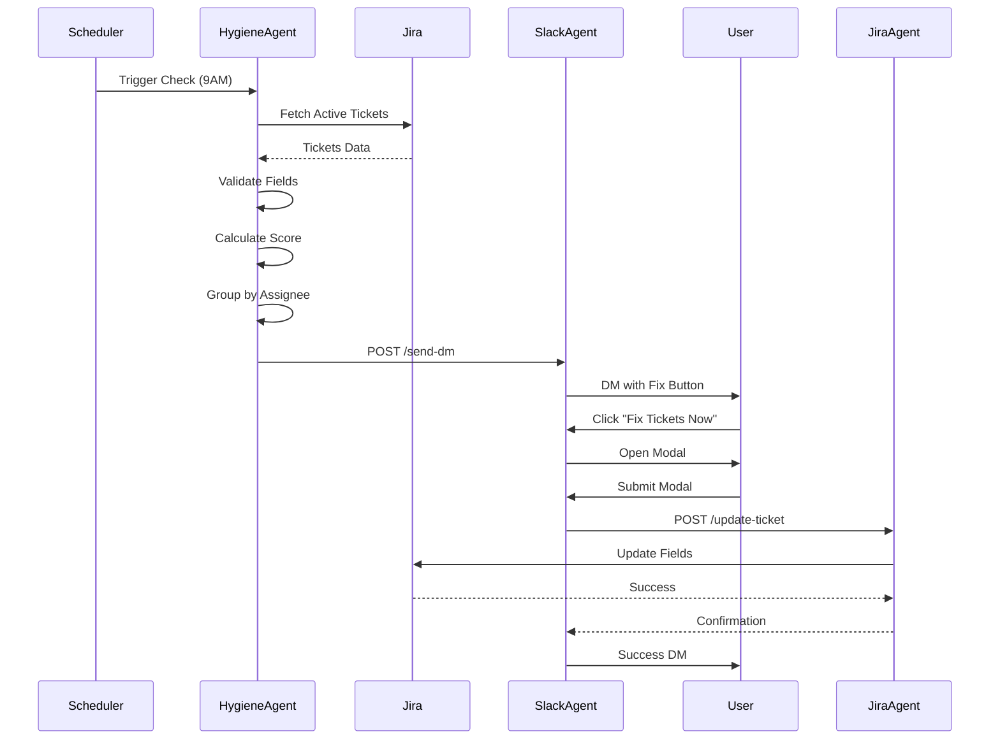

---

### RCA Agent (Port 8006) 🆕

Smart Root Cause Analysis agent that automatically diagnoses build failures using LLM-powered log analysis and git correlation.

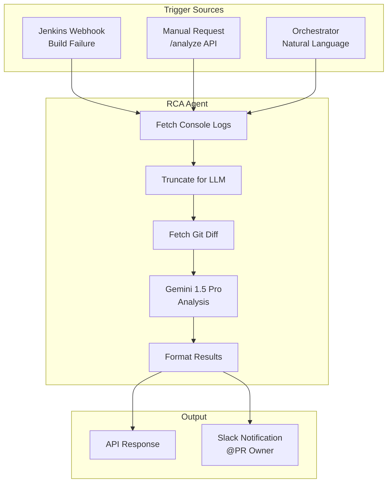

**Capabilities:**
- **Auto-Trigger**: Jenkins webhook triggers RCA on FAILURE/UNSTABLE builds
- **Slack Notifications**: Sends analysis to release channel with @PR-owner mention
- **Log Truncation**: Smart truncation preserves errors while fitting LLM context
- **Git Correlation**: Maps errors to specific files and commits
- **Confidence Scoring**: Rates analysis reliability (high/medium/low/uncertain)

**Analysis Flow:**

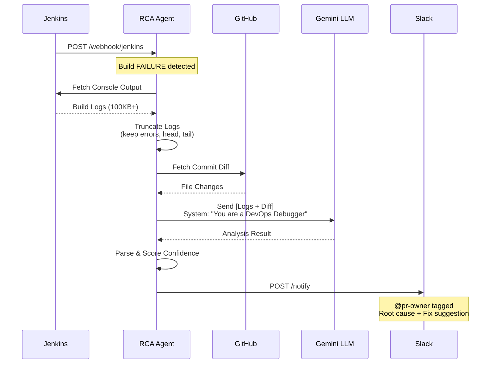

**Endpoints:**

| Endpoint | Method | Description |
|----------|--------|-------------|
| `/health` | GET | Health check with config status |
| `/analyze` | POST | Analyze build failure (with optional notify) |
| `/webhook/jenkins` | POST | Jenkins auto-trigger webhook |
| `/execute` | POST | Orchestrator integration |
| `/metrics` | GET | Prometheus metrics |

**Prometheus Metrics:**

```
# Request Metrics
nexus_rca_requests_total{status, error_type, trigger}
nexus_rca_duration_seconds{job_name}
nexus_rca_confidence_score  # Histogram 0.0-1.0

# Webhook Metrics
nexus_rca_webhooks_total{job_name, status}

# Notification Metrics
nexus_rca_notifications_total{channel, status}

# LLM Usage
nexus_llm_tokens_total{model, task_type="rca"}
nexus_rca_active_analyses  # Gauge
```

---

### Analytics Service (Port 8086) 🆕

Advanced analytics and insights service providing DORA metrics, predictions, and anomaly detection.

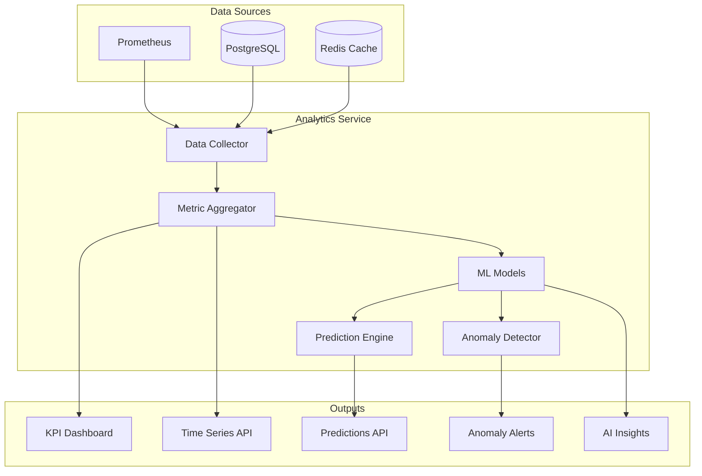

**Capabilities:**
- **DORA Metrics**: Deployment frequency, lead time, MTTR, change failure rate
- **KPI Dashboard**: Real-time quality scores and health indicators
- **Time Series Analysis**: Historical trends with flexible granularity
- **Predictive Analytics**: Release date and quality score forecasting
- **Anomaly Detection**: Automatic detection of unusual patterns
- **Team Performance**: Compare teams by velocity and quality
- **AI Insights**: Intelligent recommendations based on patterns

**Dashboard Preview:**


**Endpoints:**

| Endpoint | Method | Description |
|----------|--------|-------------|
| `/api/v1/kpis` | GET | Get KPI dashboard data |
| `/api/v1/timeseries/{metric}` | GET | Get time series data |
| `/api/v1/trends` | GET | Get trend analysis |
| `/api/v1/predict/release-date` | POST | Predict release date |
| `/api/v1/predict/quality` | POST | Predict quality score |
| `/api/v1/anomalies` | GET | Get detected anomalies |
| `/api/v1/teams` | GET | Get team performance |
| `/api/v1/insights` | GET | Get AI-powered insights |

**Prometheus Metrics:**

```
# Analytics Queries
nexus_analytics_queries_total{query_type, time_range}

# KPIs
nexus_release_velocity{project}
nexus_quality_score{project}
nexus_team_efficiency{team}

# Predictions
nexus_prediction_accuracy{prediction_type}
```

---

### Webhooks Service (Port 8087)

Event-driven webhook service for integrating with external systems.

**Capabilities:**
- **25+ Event Types**: Release, build, ticket, security, hygiene events
- **HMAC Security**: Cryptographic signature verification
- **Auto-Retry**: Exponential backoff with configurable attempts
- **Rate Limiting**: Per-subscription and global limits
- **Event Filtering**: Subscribe to specific event patterns
- **Delivery Tracking**: Full audit trail of deliveries

**Supported Event Types:**
- `release.*` - Release lifecycle events
- `build.*` - CI/CD pipeline events
- `ticket.*` - Jira ticket events
- `security.*` - Security scan events
- `hygiene.*` - Hygiene check events
- `rca.*` - RCA analysis events

---

## Observability

### Grafana Dashboard

The Nexus Grafana dashboard provides real-time visibility into system health, LLM economics, and release metrics.


**Dashboard Panels:**
- **LLM Token Usage**: Track Gemini and OpenAI consumption
- **LLM Cost**: Monitor daily and per-query costs
- **Hygiene Score**: Project compliance percentage with trend
- **Release Decisions**: GO/CONDITIONAL/NO-GO breakdown
- **Agent Response Times**: P95 latency per agent
- **ReAct Loop Analytics**: Iterations, duration, success rate

### Metrics (Prometheus)

Key metrics exported by all services:

```
# LLM Usage
nexus_llm_tokens_total{model_name, type}
nexus_llm_latency_seconds{model_name}
nexus_llm_cost_dollars_total{model_name}

# Tool Usage
nexus_tool_usage_total{tool_name, status}
nexus_tool_latency_seconds{tool_name}

# ReAct Loop
nexus_react_iterations_count{task_type}
nexus_react_loop_duration_seconds{task_type}

# Hygiene (NEW)
nexus_project_hygiene_score{project_key}
nexus_hygiene_checks_total{project_key, trigger_type}
nexus_hygiene_violations_total{project_key, violation_type}

# Business
nexus_release_decisions_total{decision}
nexus_reports_generated_total{type}
nexus_jira_tickets_processed_total{action}
```

### Tracing (OpenTelemetry)

Distributed tracing across all services using OpenTelemetry with Jaeger export.

**Trace Context:**
- Request ID propagation
- Span correlation across agents
- LLM call tracing
- Tool execution timing

### Logging

Structured JSON logging with correlation IDs:

```json
{
  "timestamp": "2025-11-30T10:30:00Z",
  "level": "INFO",
  "service": "jira-hygiene-agent",
  "request_id": "req-abc123",
  "message": "Hygiene check completed",
  "hygiene_score": 85.0,
  "tickets_checked": 45,
  "violations_found": 7
}
```

---

## Security

### Authentication

- **JWT Tokens**: Service-to-service authentication
- **Slack Verification**: Request signing for Slack events
- **API Keys**: External service authentication

### Authorization

- Role-based access (Slack user roles)
- Agent-level permissions
- Audit logging

### Secrets Management

- Environment variables for development
- Kubernetes Secrets for production
- Integration with external vaults (HashiCorp Vault)

---

## Deployment Architecture

### Development (Docker Compose)

```
┌─────────────────────────────────────────────────────────────────┐
│                        Docker Network                            │
├─────────────┬─────────────┬─────────────┬─────────────┬────────┤
│ Orchestrator│  Jira Agent │ Git/CI Agent│Report Agent │Hygiene │
│   :8080     │    :8081    │    :8082    │   :8083     │ :8005  │
├─────────────┴─────────────┴─────────────┴─────────────┴────────┤
│                    Slack Agent :8084                             │
├─────────────┬─────────────┬─────────────┬──────────────────────┤
│  PostgreSQL │    Redis    │  Prometheus │       Grafana        │
│    :5432    │    :6379    │    :9090    │       :3000          │
└─────────────┴─────────────┴─────────────┴──────────────────────┘
```

### Production (Kubernetes)

```
┌─────────────────────────────────────────────────────────────────┐
│                      Ingress (NGINX)                             │
├───────────────────────┬─────────────────────────────────────────┤
│        /api/*         │              /slack/*                    │
├───────────────────────┴─────────────────────────────────────────┤
│                                                                  │
│  ┌─────────────────┐    ┌─────────────────────────────────────┐ │
│  │  Orchestrator   │    │       Agent Deployments             │ │
│  │  (2+ replicas)  │────│  - Jira Agent                       │ │
│  │       HPA       │    │  - Git/CI Agent                     │ │
│  └─────────────────┘    │  - Reporting Agent                  │ │
│           │             │  - Slack Agent                       │ │
│           │             │  - Jira Hygiene Agent (NEW)         │ │
│           │             └─────────────────────────────────────┘ │
│           │                                                      │
│  ┌─────────────────┐    ┌─────────────────────────────────────┐ │
│  │   PostgreSQL    │    │     Redis (Cache/Pubsub)            │ │
│  │   (pgvector)    │    │                                     │ │
│  └─────────────────┘    └─────────────────────────────────────┘ │
└─────────────────────────────────────────────────────────────────┘
```

---

## Port Assignments

| Service | Port | Description |
|---------|------|-------------|
| Orchestrator | 8080 | Central coordination |
| Jira Agent | 8081 | Jira operations |
| Git/CI Agent | 8082 | GitHub + Jenkins |
| Reporting Agent | 8083 | Report generation |
| Slack Agent | 8084 | Slack interface |
| **Jira Hygiene Agent** | **8005** | **Proactive quality checks** |
| PostgreSQL | 5432 | Database |
| Redis | 6379 | Cache |
| Prometheus | 9090 | Metrics |
| Grafana | 3000 | Dashboards |
| Jaeger | 16686 | Tracing UI |

---

## Design Decisions

### Why LangGraph over Custom ReAct Loops?

1. **Statefulness**: Built-in state persistence to PostgreSQL
2. **Interruptibility**: Native support for human-in-the-loop
3. **Streaming**: Real-time progress updates via SSE
4. **Checkpointing**: Resume conversations after restarts
5. **Observability**: Built-in tracing and debugging

### Why MCP over REST APIs?

1. **Standardization**: All agents expose tools via the same protocol
2. **Discoverability**: Tools self-describe with JSON Schema
3. **Aggregation**: Single client connects to multiple servers
4. **Graceful Degradation**: Offline servers don't break the graph
5. **Ecosystem**: Compatible with growing MCP tool ecosystem

### Why Separate Agents as MCP Servers?

1. **Scalability**: Scale agents independently
2. **Fault Isolation**: Failures don't cascade to orchestrator
3. **Technology Flexibility**: Each agent can use optimal libraries
4. **Team Ownership**: Clear boundaries for teams
5. **Reusability**: MCP servers can be used by other MCP clients

### Why Vector Memory?

1. **Context Retention**: Learn from past interactions
2. **Semantic Search**: Find relevant historical data
3. **RAG Enhancement**: Better LLM responses with context

### Why Proactive Hygiene Agent?

1. **Data Quality**: Ensures Jira data is complete for accurate assessments
2. **Shift Left**: Catches issues before release readiness checks
3. **User Experience**: Interactive fixes reduce friction
4. **Automation**: Scheduled checks remove manual effort

---

## LLM Integration Layer (LangGraph + LLM Factory)

Nexus provides a production-ready, **LLM-agnostic** abstraction layer using **LangGraph** for stateful orchestration and a dynamic **LLM Factory** for provider switching. The architecture supports:

- **Dynamic Provider Switching**: Change LLM providers at runtime via Admin Dashboard
- **Redis-Backed Configuration**: No restart required for configuration changes
- **LangChain Integration**: Native LangChain Chat Models for all providers
- **Tool Binding**: Automatic MCP tool binding for function calling

### Supported Providers

| Provider | Models | Features | Config Source |
|----------|--------|----------|---------------|
| **OpenAI** | gpt-4o, gpt-4-turbo, o1-preview | Streaming, function calling | API Key |
| **Azure OpenAI** | gpt-4o, gpt-4-turbo | Streaming, function calling | Endpoint + Key |
| **Google Gemini** | gemini-2.0-flash, gemini-1.5-pro | Streaming, function calling, 1M context | API Key |
| **Anthropic Claude** | claude-sonnet-4, claude-3.5-sonnet | Streaming, function calling | API Key |
| **Ollama** | llama3.1, mistral, codellama | Local inference, no API costs | Base URL |
| **Groq** | llama-3.1-70b, mixtral-8x7b | Ultra-fast LPU inference | API Key |
| **vLLM** | Self-hosted models | OpenAI-compatible, high throughput | Base URL |
| **Mock** | - | Development/testing without API costs | None |

### LLM Factory Architecture

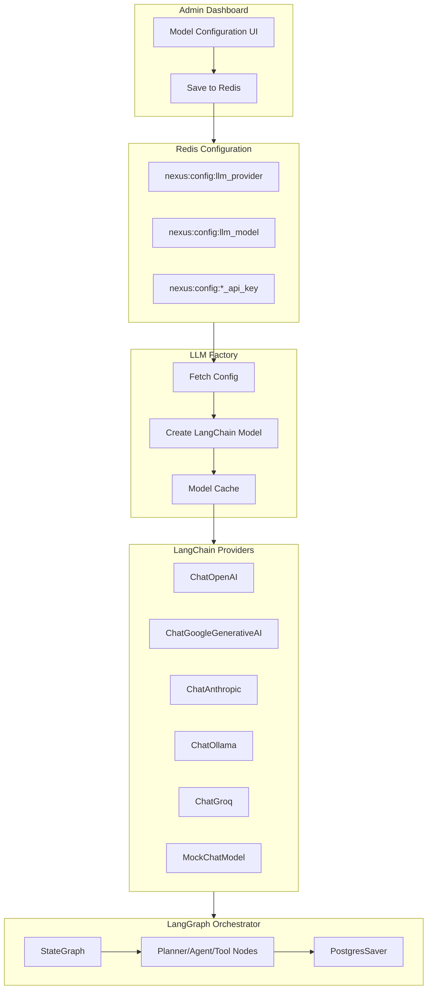

### LangGraph StateGraph Architecture

The orchestrator uses LangGraph's `StateGraph` for stateful, interruptible workflows:

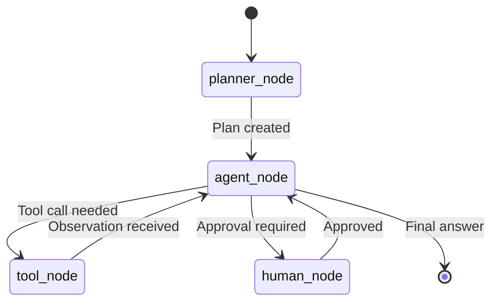

**State Schema:**

```python
class AgentState(TypedDict):
    messages: Annotated[list, add_messages]  # Chat history
    plan_id: str                              # Current plan ID
    human_approval_required: bool             # Interrupt flag
    current_step: int                         # Execution step
    tools_called: list[str]                   # Tool audit trail
```

**Graph Nodes:**

| Node | Purpose |
|------|---------|
| `planner_node` | Uses LLM to break user query into steps |
| `agent_node` | Decides which tool to call next |
| `tool_node` | Executes tools via MCP |
| `human_node` | Interrupt for high-risk actions |

### Dynamic Configuration via Admin Dashboard

The Admin Dashboard provides a visual interface for LLM configuration:

```
┌─────────────────────────────────────────────────────────────────┐
│  🤖 Model Configuration                                          │
├─────────────────────────────────────────────────────────────────┤
│                                                                  │
│  ┌──────────────────────────────────────────────────────────┐   │
│  │  Provider Selection                                       │   │
│  │  ┌─────────┐ ┌─────────┐ ┌─────────┐ ┌─────────┐        │   │
│  │  │ OpenAI  │ │ Gemini ✓│ │Anthropic│ │ Ollama  │        │   │
│  │  └─────────┘ └─────────┘ └─────────┘ └─────────┘        │   │
│  │  ┌─────────┐ ┌─────────┐ ┌─────────┐ ┌─────────┐        │   │
│  │  │  Groq   │ │  vLLM   │ │Azure OAI│ │  Mock   │        │   │
│  │  └─────────┘ └─────────┘ └─────────┘ └─────────┘        │   │
│  └──────────────────────────────────────────────────────────┘   │
│                                                                  │
│  ┌──────────────────────────────────────────────────────────┐   │
│  │  Model: [gemini-2.0-flash         ▼]                      │   │
│  │                                                           │   │
│  │  API Key: [••••••••••••••••••] 👁                         │   │
│  │                                                           │   │
│  │  Temperature: [0.7] ────●──────────────                   │   │
│  │  Max Tokens:  [4096            ]                          │   │
│  └──────────────────────────────────────────────────────────┘   │
│                                                                  │
│  [Test Connection]                    [Save Configuration]       │
└─────────────────────────────────────────────────────────────────┘
```

### LLM Factory Usage

```python
from app.core.llm_factory import LLMFactory, get_llm, get_llm_with_tools

# Get the factory singleton
factory = LLMFactory()

# Get LLM based on current Redis configuration
llm = await factory.get_llm()

# Use with LangChain
response = await llm.ainvoke([
    SystemMessage(content="You are a release automation assistant."),
    HumanMessage(content="Is the v2.0 release ready?")
])

# Get LLM with MCP tools bound
from app.core.mcp_manager import MCPClientManager

mcp = MCPClientManager()
tools = await mcp.get_all_tools()
llm_with_tools = await factory.get_llm_with_tools(tools)

# Use in LangGraph
from langgraph.graph import StateGraph

def agent_node(state: AgentState):
    llm = await get_llm()
    response = await llm.ainvoke(state["messages"])
    return {"messages": [response]}
```

### Provider-Specific Configuration

Each provider has specific configuration requirements stored in Redis:

| Provider | Redis Keys |
|----------|------------|
| OpenAI | `nexus:config:openai_api_key`, `nexus:config:openai_org` |
| Azure OpenAI | `nexus:config:openai_api_key`, `nexus:config:azure_openai_endpoint`, `nexus:config:azure_openai_deployment` |
| Gemini | `nexus:config:gemini_api_key` |
| Anthropic | `nexus:config:anthropic_api_key` |
| Ollama | `nexus:config:ollama_base_url` |
| Groq | `nexus:config:groq_api_key` |
| vLLM | `nexus:config:vllm_base_url` |

### MCP Tool Integration

Tools are exposed via **Model Context Protocol (MCP)** using SSE transport:

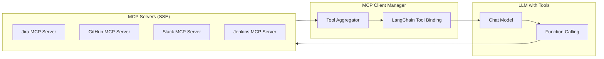

---

## Multi-Tenancy Architecture

Nexus supports multi-tenant deployments for enterprise use cases.

### Tenant Isolation Model

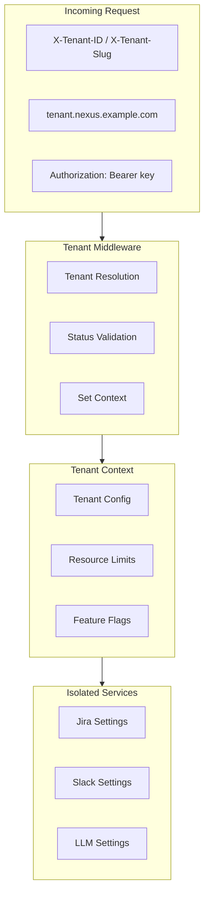

### Tenant Plans

| Plan | API Requests | LLM Tokens/Day | Users | Projects |
|------|--------------|----------------|-------|----------|
| **Free** | 500/day | 50K | 3 | 2 |
| **Starter** | 2,000/day | 200K | 10 | 5 |
| **Professional** | 10,000/day | 1M | 50 | 20 |
| **Enterprise** | 100,000/day | 10M | 500 | 100 |

### Tenant Resolution Strategies

1. **Header**: `X-Tenant-ID` or `X-Tenant-Slug`
2. **Subdomain**: `acme.nexus.example.com`
3. **Path Prefix**: `/t/acme/api/...`
4. **API Key**: Tenant association via Bearer token

### Configuration Isolation

Each tenant has isolated configuration for:

```python
class TenantConfig:
    # Jira settings
    jira_url: str
    jira_api_token: str
    jira_projects: List[str]
    
    # GitHub settings
    github_token: str
    github_org: str
    
    # Slack settings
    slack_bot_token: str
    slack_workspace_id: str
    
    # LLM settings (optional per-tenant override)
    llm_api_key: Optional[str]
    
    # Feature flags
    features: Dict[str, bool] = {
        "react_engine": True,
        "hygiene_agent": True,
        "ai_recommendations": True,
    }
```

---

## AI Recommendations Engine

The recommendation engine analyzes patterns to provide intelligent suggestions.

### Recommendation Flow

```mermaid
flowchart LR
    subgraph Data["Data Sources"]
        Releases[Release History]
        Hygiene[Hygiene Scores]
        Velocity[Sprint Velocity]
        Risks[Risk Factors]
    end
    
    subgraph Analyzers["Pattern Analyzers"]
        RelAnalyzer[Release Analyzer]
        HygAnalyzer[Hygiene Analyzer]
        VelAnalyzer[Velocity Analyzer]
        RiskAnalyzer[Risk Analyzer]
    end
    
    subgraph Engine["Recommendation Engine"]
        Aggregate[Aggregate Findings]
        Prioritize[Prioritize]
        Format[Format Output]
    end
    
    Data --> Analyzers
    Analyzers --> Engine
    Engine --> Recommendations[Recommendations]
```

### Recommendation Types

| Type | Priority Levels | Example |
|------|-----------------|---------|
| `RELEASE_TIMING` | Medium | "Consider releasing Tuesday instead of Friday" |
| `HYGIENE_IMPROVEMENT` | High | "5 tickets missing Story Points" |
| `VELOCITY_OPTIMIZATION` | Medium | "Velocity dropped 30% - check blockers" |
| `RISK_MITIGATION` | Critical | "2 critical vulnerabilities blocking release" |
| `BLOCKERS_RESOLUTION` | Critical | "3 blocking issues need immediate attention" |
| `PROCESS_IMPROVEMENT` | Low | "Automate release readiness checks" |

### Analyzers

#### Release Pattern Analyzer
- Analyzes day-of-week success rates
- Identifies risky release windows
- Tracks failure patterns

#### Hygiene Pattern Analyzer
- Detects score trends (improving/declining)
- Identifies most common violations
- Tracks compliance over time

#### Velocity Analyzer
- Calculates predictability score
- Detects velocity drops
- Identifies capacity issues

#### Risk Analyzer
- Assesses blocker impact
- Evaluates security vulnerabilities
- Calculates overall risk score

---

## Slack App Home Dashboard

The App Home provides a rich dashboard when users open the Nexus app.

### Dashboard Layout

```
┌─────────────────────────────────────────────────────────────┐
│  🚀 Nexus Release Automation                                 │
│  Good morning! Here's your release management dashboard.     │
│  📅 Sunday, November 30, 2025 | Last updated: 9:30 AM       │
├─────────────────────────────────────────────────────────────┤
│  ⚡ Quick Actions                                            │
│  [📊 Release Status] [🔧 Hygiene Check] [📝 Report] [❓ Help] │
├─────────────────────────────────────────────────────────────┤
│  📈 Release Status Overview                                  │
│  ┌──────────────┬──────────────┬──────────────┐             │
│  │ Version      │ Decision     │ Completion   │             │
│  │ v2.0.0       │ 🟡 CONDITIONAL│ 87%         │             │
│  ├──────────────┼──────────────┼──────────────┤             │
│  │ Build Status │ Security     │ Blockers     │             │
│  │ ✅ Passing   │ 75/100       │ 2            │             │
│  └──────────────┴──────────────┴──────────────┘             │
├─────────────────────────────────────────────────────────────┤
│  🔧 Jira Hygiene                          [View Details]     │
│  🟡 78% - Good                                               │
│  ████████░░ 78%                                              │
│  ⚠️ You have 3 ticket(s) needing attention    [Fix Now]     │
├─────────────────────────────────────────────────────────────┤
│  📋 Recent Activity                                          │
│  ✅ Release readiness check completed (2h ago)               │
│  🔧 Fixed 2 hygiene violations (5h ago)                      │
│  📝 Generated v1.9 release report (1d ago)                   │
├─────────────────────────────────────────────────────────────┤
│  💡 AI Recommendations                       [View All]      │
│  🟠 Address blocking issues before release                   │
│  🟡 Improve hygiene score to 90%+                           │
│  🟢 Consider releasing mid-week                              │
├─────────────────────────────────────────────────────────────┤
│  🤖 Powered by Nexus | /nexus help for commands              │
└─────────────────────────────────────────────────────────────┘
```

### Event Handling

The App Home responds to:
- `app_home_opened` - Rebuilds and publishes the view
- Button actions - Quick actions, fix hygiene, view details

### Why App Home?

1. **At-a-Glance Status**: See release health without commands
2. **Reduced Friction**: One-click actions
3. **Personalization**: User-specific hygiene issues
4. **Discoverability**: Surfaces AI recommendations proactively
