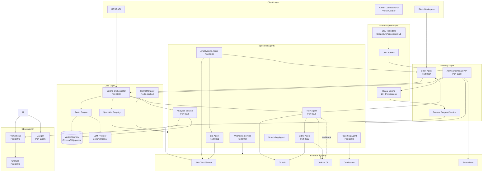
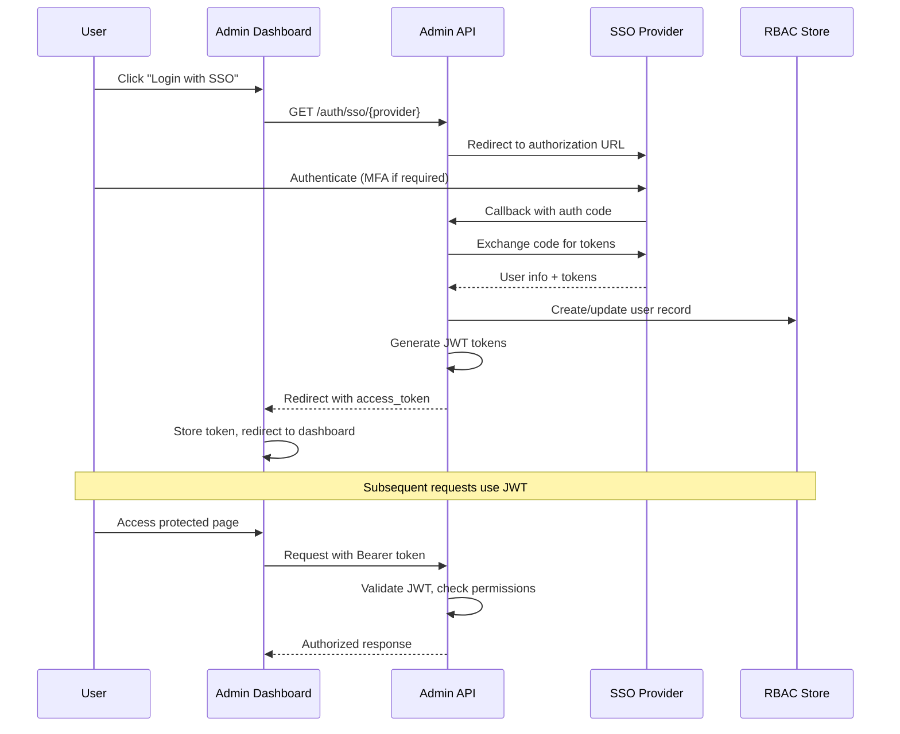
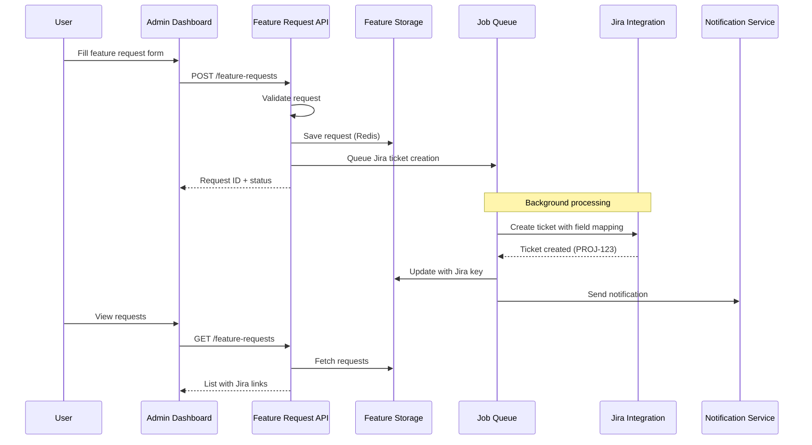
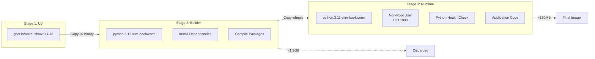

# Architecture

This document describes the architecture of the Nexus Release Automation System, including its core components, communication patterns, and design decisions.

## System Overview

Nexus is a multi-agent system that uses a ReAct (Reasoning + Acting) architecture to orchestrate specialized agents for release readiness assessments and proactive quality management.



---

## High-Level Data Flow


---

## Core Components

### 1. Central Orchestrator

The brain of the system. Receives requests and coordinates multi-agent workflows using the ReAct engine.

**Responsibilities:**
- Parse and understand user queries
- Plan multi-step execution workflows
- Coordinate agent interactions
- Aggregate results and generate responses
- Maintain conversation context

**Technology:**
- FastAPI for HTTP API
- Pydantic for data validation
- OpenTelemetry for distributed tracing

### 2. ReAct Reasoning Engine

The ReAct (Reasoning + Acting) engine implements an LLM-powered reasoning loop that combines thinking with action.


**The ReAct Loop:**

1. **Thought**: The LLM reasons about what information is needed
2. **Action**: Calls a tool to gather data
3. **Observation**: Reviews the tool's response
4. **Repeat**: Continue until sufficient information
5. **Final Answer**: Synthesize and respond

**Example Trace:**

```
User: "Is the v2.0 release ready?"

Thought: I need to check the Jira sprint status to understand ticket completion.
Action: get_sprint_stats
Action Input: {"project_key": "PROJ"}
Observation: {"completed_tickets": 42, "total_tickets": 45, "completion_rate": 93.3}

Thought: Good progress on tickets. Now I should check security.
Action: get_security_scan
Action Input: {"repo_name": "nexus/backend"}
Observation: {"risk_score": 25, "critical_vulnerabilities": 0, "high_vulnerabilities": 2}

Thought: No critical vulnerabilities. Let me check the build status.
Action: get_build_status
Action Input: {"job_name": "nexus-main"}
Observation: {"status": "SUCCESS", "test_results": {"passed": 245, "failed": 0}}

Thought: I have enough information to make a decision.
Final Answer: The v2.0 release is READY (GO). 93.3% ticket completion, 
              no critical vulnerabilities, and all tests passing.
```

### 3. Vector Memory

RAG-enabled memory system for maintaining context across conversations.

**Features:**
- Stores previous interactions and decisions
- Retrieves relevant context for new queries
- Supports ChromaDB (local) and pgvector (PostgreSQL)

**Use Cases:**
- "Last time we had a similar issue..."
- Historical release data retrieval
- Learning from past decisions

---

## Authentication & Authorization

Nexus implements enterprise-grade authentication and authorization through SSO integration and Role-Based Access Control (RBAC).

### Authentication Flow



### SSO Providers

| Provider | Protocol | Features |
|----------|----------|----------|
| **Okta** | OIDC | MFA, group sync, SCIM |
| **Azure AD** | OAuth2/OIDC | Microsoft 365, conditional access |
| **Google** | OAuth2 | Google Workspace integration |
| **GitHub** | OAuth2 | Developer-friendly, org membership |
| **Local** | Email/Password | Development and testing |

### Role-Based Access Control (RBAC)

```mermaid
flowchart TB
    subgraph Users["Users"]
        Admin[admin@company.com<br/>Admin Role]
        Dev[dev@company.com<br/>Developer Role]
        PM[pm@company.com<br/>Product Manager]
        Viewer[viewer@company.com<br/>Viewer Role]
    end
    
    subgraph Roles["Roles"]
        AdminRole[Admin<br/>All Permissions]
        DevRole[Developer<br/>View + Edit + API]
        PMRole[Product Manager<br/>View + Features]
        ViewRole[Viewer<br/>View Only]
    end
    
    subgraph Permissions["Permissions (20+)"]
        Dashboard[dashboard:view]
        Config[config:edit]
        Users_Perm[users:manage]
        Roles_Perm[roles:manage]
        Features[features:submit]
        API[api:write]
    end
    
    Admin --> AdminRole
    Dev --> DevRole
    PM --> PMRole
    Viewer --> ViewRole
    
    AdminRole --> Dashboard
    AdminRole --> Config
    AdminRole --> Users_Perm
    AdminRole --> Roles_Perm
    AdminRole --> Features
    AdminRole --> API
    
    DevRole --> Dashboard
    DevRole --> API
    DevRole --> Features
    
    PMRole --> Dashboard
    PMRole --> Features
    
    ViewRole --> Dashboard
```

### Permission Categories

| Category | Permissions | Description |
|----------|-------------|-------------|
| **Dashboard** | `dashboard:view`, `dashboard:metrics:view` | View system dashboards |
| **Configuration** | `config:view`, `config:edit`, `config:credentials:edit` | Manage system settings |
| **Agents** | `agents:view`, `agents:restart`, `agents:configure` | Monitor and control agents |
| **Releases** | `releases:view`, `releases:create`, `releases:edit` | Release management |
| **Users** | `users:view`, `users:create`, `users:edit`, `users:delete` | User administration |
| **Roles** | `roles:view`, `roles:create`, `roles:edit`, `roles:delete` | Role management |
| **Features** | `features:submit`, `features:view`, `features:manage` | Feature request system |
| **Observability** | `observability:view`, `observability:alerts:configure` | Metrics and alerts |
| **API** | `api:read`, `api:write`, `api:admin` | Programmatic access |
| **System** | `system:admin`, `system:audit:view` | System administration |

---

## Feature Request System

The Feature Request system allows users to submit feature requests and bug reports that automatically create Jira tickets.

### Feature Request Flow



### Request Types

| Type | Jira Issue Type | Description |
|------|-----------------|-------------|
| `feature_request` | Story | New functionality |
| `bug_report` | Bug | Defect reports |
| `improvement` | Improvement | Enhancements |
| `documentation` | Task | Doc updates |
| `question` | Task | Technical questions |

### Jira Field Mapping

```yaml
Feature Request → Jira Story:
  title → Summary
  description → Description
  priority → Priority (Critical → Highest, High → High, etc.)
  component → Component (routes to team)
  type → Issue Type
  labels → Labels
  use_case → Custom Field (Use Case)
  acceptance_criteria → Custom Field (AC)

Bug Report → Jira Bug:
  title → Summary
  description → Description + Steps to Reproduce
  priority → Priority
  steps_to_reproduce → Steps to Reproduce field
  expected_behavior → Expected Result
  actual_behavior → Actual Result
  environment → Environment field
  browser → Affects Version
```

### Notification Channels

| Channel | Trigger | Content |
|---------|---------|---------|
| **Slack** | Request submitted | Block Kit message with details |
| **Slack** | Status changed | Update notification |
| **Webhook** | Any event | HMAC-signed JSON payload |

---

## Agent Contracts

All agents follow a standardized contract for communication.

### Request Schema

```python
class AgentTaskRequest(BaseModel):
    task_id: str           # Unique trace ID
    correlation_id: str    # Parent request ID
    action: str            # Action to execute
    payload: Dict          # Action parameters
    priority: TaskPriority # Execution priority
    user_context: Dict     # User metadata
    timeout_seconds: int   # Execution timeout
```

### Response Schema

```python
class AgentTaskResponse(BaseModel):
    task_id: str           # Original task ID
    status: TaskStatus     # success, failed, timeout
    data: Dict             # Result data
    error_message: str     # Error if failed
    execution_time_ms: float
    agent_type: AgentType
```

---

## Specialized Agents

### Jira Agent (Port 8081)

Handles all Jira-related operations including ticket fetching, updates, and hierarchy traversal.

**Capabilities:**
- Fetch ticket details and hierarchies
- Search using JQL
- Update ticket status and fields
- Add comments
- Get sprint statistics

**Endpoints:**

| Endpoint | Method | Description |
|----------|--------|-------------|
| `/issue/{key}` | GET | Fetch single ticket |
| `/hierarchy/{key}` | GET | Fetch epic → stories → subtasks |
| `/search` | GET | JQL search |
| `/update` | POST | Update status/add comment |
| `/update-ticket` | POST | Update multiple fields (for hygiene fixes) |
| `/sprint-stats/{project}` | GET | Sprint metrics |

### Git/CI Agent (Port 8082)

Manages GitHub and Jenkins interactions.

**Capabilities:**
- Check repository health
- Get PR status and approvals
- Trigger Jenkins builds
- Fetch build results
- Run security scans

**Endpoints:**

| Endpoint | Method | Description |
|----------|--------|-------------|
| `/repo/{name}/health` | GET | Repository health |
| `/repo/{name}/pr/{number}` | GET | PR details |
| `/build/{job}` | POST | Trigger build |
| `/build/{job}/status` | GET | Build status |
| `/security/{repo}` | GET | Security scan |

### Reporting Agent (Port 8083)

Generates and publishes reports.

**Capabilities:**
- Generate HTML reports with Jinja2
- Analyze release readiness
- Publish to Confluence
- Calculate Go/No-Go decisions

**Endpoints:**

| Endpoint | Method | Description |
|----------|--------|-------------|
| `/generate` | POST | Generate HTML report |
| `/analyze` | POST | Analyze for Go/No-Go |
| `/publish` | POST | Publish to Confluence |
| `/preview` | GET | Preview sample report |

### Slack Agent (Port 8084)

Handles Slack workspace interactions with rich interactive experiences.

**Capabilities:**
- Process slash commands
- Open Block Kit modals
- Send rich messages and DMs
- Handle button interactions
- Support hygiene fix modals

**Endpoints:**

| Endpoint | Method | Description |
|----------|--------|-------------|
| `/slack/commands` | POST | Slash command handler |
| `/slack/interactions` | POST | Button/modal interactions |
| `/slack/events` | POST | Events API handler |
| `/notify` | POST | Send channel notification |
| `/send-dm` | POST | Send direct message by email |

### Jira Hygiene Agent (Port 8085)

Proactive quality gatekeeper that monitors and enforces Jira data hygiene through scheduled checks and interactive notifications.


**Capabilities:**
- **Scheduled Hygiene Checks**: Runs automatically on weekdays at 9:00 AM
- **Field Validation**: Checks for missing Labels, Fix Version, Affected Version, Story Points, Team
- **Hygiene Scoring**: Calculates `nexus_project_hygiene_score` (0-100%)
- **Interactive Notifications**: Sends Slack DMs with "Fix Tickets Now" button
- **Modal-Based Fixes**: Users can fix violations directly from Slack without leaving the app

**Validation Rules:**

| Field | Jira Field ID | Why It Matters |
|-------|---------------|----------------|
| Labels | `labels` | Categorization and filtering |
| Fix Version | `fixVersions` | Release planning |
| Affected Version | `versions` | Impact analysis |
| Story Points | `customfield_10016` | Capacity planning |
| Team/Contributors | `customfield_10001` | Ownership tracking |

**Endpoints:**

| Endpoint | Method | Description |
|----------|--------|-------------|
| `/health` | GET | Health check with scheduler status |
| `/run-check` | POST | Manual trigger for hygiene check |
| `/status` | GET | Configuration and scheduler info |
| `/violations/{project}` | GET | Get violations for a project |
| `/execute` | POST | Orchestrator integration |

**Prometheus Metrics:**

```
# Hygiene Score (0-100%)
nexus_project_hygiene_score{project_key}

# Check Counters
nexus_hygiene_checks_total{project_key, trigger_type}
nexus_hygiene_violations_total{project_key, violation_type}

# Ticket Counts
nexus_hygiene_tickets_checked{project_key}
nexus_hygiene_compliant_tickets{project_key}
```

---

## Interactive Hygiene Fix Flow


---

### RCA Agent (Port 8006) 🆕

Smart Root Cause Analysis agent that automatically diagnoses build failures using LLM-powered log analysis and git correlation.


**Capabilities:**
- **Auto-Trigger**: Jenkins webhook triggers RCA on FAILURE/UNSTABLE builds
- **Slack Notifications**: Sends analysis to release channel with @PR-owner mention
- **Log Truncation**: Smart truncation preserves errors while fitting LLM context
- **Git Correlation**: Maps errors to specific files and commits
- **Confidence Scoring**: Rates analysis reliability (high/medium/low/uncertain)

**Analysis Flow:**


**Endpoints:**

| Endpoint | Method | Description |
|----------|--------|-------------|
| `/health` | GET | Health check with config status |
| `/analyze` | POST | Analyze build failure (with optional notify) |
| `/webhook/jenkins` | POST | Jenkins auto-trigger webhook |
| `/execute` | POST | Orchestrator integration |
| `/metrics` | GET | Prometheus metrics |

**Prometheus Metrics:**

```
# Request Metrics
nexus_rca_requests_total{status, error_type, trigger}
nexus_rca_duration_seconds{job_name}
nexus_rca_confidence_score  # Histogram 0.0-1.0

# Webhook Metrics
nexus_rca_webhooks_total{job_name, status}

# Notification Metrics
nexus_rca_notifications_total{channel, status}

# LLM Usage
nexus_llm_tokens_total{model, task_type="rca"}
nexus_rca_active_analyses  # Gauge
```

---

### Analytics Service (Port 8086) 🆕

Advanced analytics and insights service providing DORA metrics, predictions, and anomaly detection.


**Capabilities:**
- **DORA Metrics**: Deployment frequency, lead time, MTTR, change failure rate
- **KPI Dashboard**: Real-time quality scores and health indicators
- **Time Series Analysis**: Historical trends with flexible granularity
- **Predictive Analytics**: Release date and quality score forecasting
- **Anomaly Detection**: Automatic detection of unusual patterns
- **Team Performance**: Compare teams by velocity and quality
- **AI Insights**: Intelligent recommendations based on patterns

**Dashboard Preview:**


**Endpoints:**

| Endpoint | Method | Description |
|----------|--------|-------------|
| `/api/v1/kpis` | GET | Get KPI dashboard data |
| `/api/v1/timeseries/{metric}` | GET | Get time series data |
| `/api/v1/trends` | GET | Get trend analysis |
| `/api/v1/predict/release-date` | POST | Predict release date |
| `/api/v1/predict/quality` | POST | Predict quality score |
| `/api/v1/anomalies` | GET | Get detected anomalies |
| `/api/v1/teams` | GET | Get team performance |
| `/api/v1/insights` | GET | Get AI-powered insights |

**Prometheus Metrics:**

```
# Analytics Queries
nexus_analytics_queries_total{query_type, time_range}

# KPIs
nexus_release_velocity{project}
nexus_quality_score{project}
nexus_team_efficiency{team}

# Predictions
nexus_prediction_accuracy{prediction_type}
```

---

### Webhooks Service (Port 8087)

Event-driven webhook service for integrating with external systems.

**Capabilities:**
- **25+ Event Types**: Release, build, ticket, security, hygiene events
- **HMAC Security**: Cryptographic signature verification
- **Auto-Retry**: Exponential backoff with configurable attempts
- **Rate Limiting**: Per-subscription and global limits
- **Event Filtering**: Subscribe to specific event patterns
- **Delivery Tracking**: Full audit trail of deliveries

**Supported Event Types:**
- `release.*` - Release lifecycle events
- `build.*` - CI/CD pipeline events
- `ticket.*` - Jira ticket events
- `security.*` - Security scan events
- `hygiene.*` - Hygiene check events
- `rca.*` - RCA analysis events

---

### Admin Dashboard (Port 8088)

Web-based management interface for system configuration, monitoring, and release management.


**Capabilities:**
- **Dynamic Configuration**: Change settings without service restarts
- **Mode Switching**: Toggle Mock/Live mode instantly across all agents
- **Health Monitoring**: Real-time agent health with auto-refresh
- **Observability Dashboard**: Integrated metrics, charts, and Grafana links
- **Release Management**: Track versions, dates, milestones from external sources

**Release Management Features:**
- Create and track releases with target dates
- Import from Smartsheet, CSV, or webhooks
- Visual release calendar view
- Milestone and risk tracking
- Release readiness metrics

**Endpoints:**

| Endpoint | Method | Description |
|----------|--------|-------------|
| `/health-check` | GET | Service health |
| `/mode` | GET/POST | Get/set mock/live mode |
| `/config` | GET/PUT | Configuration management |
| `/agents/health` | GET | All agents health status |
| `/api/metrics` | GET | Aggregated observability metrics |
| `/releases` | GET/POST | Release CRUD |
| `/releases/calendar` | GET | Calendar view data |
| `/releases/sync/smartsheet` | POST | Import from Smartsheet |

**Deployment Options:**
- **Docker**: Included in docker-compose with backend API
- **Vercel**: Frontend deployed to Vercel CDN for production
- **Kubernetes**: Helm chart with separate frontend/backend pods

---

### Specialist Registry

The Specialist Registry is a centralized service discovery and health monitoring system for all agents.


**Capabilities:**
- **Service Discovery**: Dynamic URL resolution from environment or K8s
- **Health Monitoring**: Background health checks every 30 seconds
- **Tool Registry**: Central catalog of all available tools per agent
- **Critical Verification**: Validates essential specialists on startup

**Registered Specialists (9 agents):**

| Specialist | Tools |
|------------|-------|
| Jira | get_ticket, search_tickets, update_ticket, get_sprint_stats |
| Git/CI | get_repo_health, get_pr_status, trigger_build, get_build_status |
| Slack | send_notification, open_modal, send_dm |
| Reporting | generate_report, analyze_release, publish_report |
| Hygiene | run_hygiene_check, get_hygiene_report, get_rules |
| RCA | analyze_failure, get_rca_history |
| Analytics | get_dora_metrics, get_kpis, get_trends, get_predictions |
| Webhooks | subscribe, unsubscribe, send_event |
| Scheduling | schedule_check, list_schedules, cancel_schedule |

**API Endpoints:**

| Endpoint | Method | Description |
|----------|--------|-------------|
| `/specialists` | GET | List all specialists with health |
| `/specialists/{id}` | GET | Get specialist details |
| `/specialists/{id}/health` | POST | Trigger health check |
| `/specialists/tools/all` | GET | List all available tools |

---

### Dynamic Configuration (ConfigManager)

Redis-backed configuration management with real-time propagation.


**Features:**
- **Priority Resolution**: Redis > Environment > Default
- **Caching**: 60-second TTL for performance
- **Mode Switching**: Instant mock/live toggle across all agents
- **Sensitive Masking**: Auto-mask API keys and tokens
- **Templates**: Pre-built configurations for integrations

**Usage:**
```python
from nexus_lib import ConfigManager

config = ConfigManager()

# Check mode
if config.is_mock_mode():
    return mock_data()

# Get config with fallback
jira_url = config.get("JIRA_URL", default="https://jira.example.com")

# Set config (propagates to all agents)
await config.set("SYSTEM_MODE", "live")
```

---

## Observability

### Grafana Dashboard

The Nexus Grafana dashboard provides real-time visibility into system health, LLM economics, and release metrics.


**Dashboard Panels:**
- **LLM Token Usage**: Track Gemini and OpenAI consumption
- **LLM Cost**: Monitor daily and per-query costs
- **Hygiene Score**: Project compliance percentage with trend
- **Release Decisions**: GO/CONDITIONAL/NO-GO breakdown
- **Agent Response Times**: P95 latency per agent
- **ReAct Loop Analytics**: Iterations, duration, success rate

### Metrics (Prometheus)

Key metrics exported by all services:

```
# LLM Usage
nexus_llm_tokens_total{model_name, type}
nexus_llm_latency_seconds{model_name}
nexus_llm_cost_dollars_total{model_name}

# Tool Usage
nexus_tool_usage_total{tool_name, status}
nexus_tool_latency_seconds{tool_name}

# ReAct Loop
nexus_react_iterations_count{task_type}
nexus_react_loop_duration_seconds{task_type}

# Hygiene (NEW)
nexus_project_hygiene_score{project_key}
nexus_hygiene_checks_total{project_key, trigger_type}
nexus_hygiene_violations_total{project_key, violation_type}

# Business
nexus_release_decisions_total{decision}
nexus_reports_generated_total{type}
nexus_jira_tickets_processed_total{action}
```

### Tracing (OpenTelemetry)

Distributed tracing across all services using OpenTelemetry with Jaeger export.

**Trace Context:**
- Request ID propagation
- Span correlation across agents
- LLM call tracing
- Tool execution timing

### Logging

Structured JSON logging with correlation IDs:

```json
{
  "timestamp": "2025-11-30T10:30:00Z",
  "level": "INFO",
  "service": "jira-hygiene-agent",
  "request_id": "req-abc123",
  "message": "Hygiene check completed",
  "hygiene_score": 85.0,
  "tickets_checked": 45,
  "violations_found": 7
}
```

---

## Security

### Authentication

- **JWT Tokens**: Service-to-service authentication
- **Slack Verification**: Request signing for Slack events
- **API Keys**: External service authentication

### Authorization

- Role-based access (Slack user roles)
- Agent-level permissions
- Audit logging

### Secrets Management

- Environment variables for development
- Kubernetes Secrets for production
- Integration with external vaults (HashiCorp Vault)

---

## Docker Build Architecture (v2.5.0)

Nexus uses modern, optimized multi-stage Dockerfiles for all services.

### Dockerfile Structure

```
infrastructure/docker/
├── .dockerignore                 # Build context optimization (~500MB → ~50MB)
├── Dockerfile.base               # Shared foundation (non-root user, health check)
├── Dockerfile.orchestrator       # Central brain (3-stage build)
├── Dockerfile.agent              # Unified template for all agents
├── Dockerfile.admin-dashboard    # React frontend + FastAPI backend
├── Dockerfile.analytics          # Analytics service
├── Dockerfile.webhooks           # Webhooks service
└── docker-compose.yml            # Local development orchestration
```

### Multi-Stage Build Pattern



### Key Optimizations

| Feature | Traditional | Nexus Optimized | Improvement |
|---------|-------------|-----------------|-------------|
| **Package Manager** | pip | UV (Rust-based) | 10x faster |
| **Image Size** | ~1.2GB | ~150MB | 85% smaller |
| **Build Time** | ~5 min | ~45 sec | 6x faster |
| **Root User** | Yes | No (UID 1000) | More secure |
| **Health Checks** | curl | Python-native | No extra deps |
| **Filesystem** | Read-write | Read-only | More secure |

### Security Features

```yaml
# Container Security Context (applied to all services)
securityContext:
  runAsNonRoot: true
  runAsUser: 1000
  runAsGroup: 1000
  readOnlyRootFilesystem: true
  allowPrivilegeEscalation: false
  capabilities:
    drop: [ALL]
  seccompProfile:
    type: RuntimeDefault
```

📖 **[Docker for Beginners Guide](docker-for-beginners.md)** - Visual tutorial for understanding Docker concepts.

---

## Deployment Architecture

### Development (Docker Compose)

```
┌─────────────────────────────────────────────────────────────────────────┐
│                           Docker Network                                 │
├─────────────┬─────────────┬─────────────┬─────────────┬─────────────────┤
│ Orchestrator│  Jira Agent │ Git/CI Agent│Report Agent │   Slack Agent   │
│   :8080     │    :8081    │    :8082    │   :8083     │      :8084      │
├─────────────┼─────────────┼─────────────┼─────────────┼─────────────────┤
│   Hygiene   │  RCA Agent  │  Analytics  │  Webhooks   │ Admin Dashboard │
│   :8085     │    :8006    │    :8086    │   :8087     │      :8088      │
├─────────────┴─────────────┴─────────────┴─────────────┴─────────────────┤
│                       Observability Stack                                │
├─────────────┬─────────────┬─────────────┬──────────────────────────────┤
│  Prometheus │   Grafana   │   Jaeger    │                              │
│    :9090    │    :3000    │   :16686    │                              │
├─────────────┴─────────────┴─────────────┴──────────────────────────────┤
│                          Data Layer                                      │
├─────────────┬─────────────┬─────────────────────────────────────────────┤
│  PostgreSQL │    Redis    │                                              │
│    :5432    │    :6379    │   (ConfigManager, Cache, Sessions)          │
└─────────────┴─────────────┴─────────────────────────────────────────────┘
```

### Production (Kubernetes)

```
┌─────────────────────────────────────────────────────────────────────────┐
│                         Ingress (NGINX)                                  │
├──────────────┬───────────────┬───────────────┬──────────────────────────┤
│    /api/*    │   /slack/*    │   /admin/*    │     Static Assets        │
├──────────────┴───────────────┴───────────────┴──────────────────────────┤
│                                                                          │
│  ┌──────────────────┐    ┌────────────────────────────────────────────┐ │
│  │   Orchestrator   │    │           Specialist Agents                │ │
│  │   (2+ replicas)  │────│  - Jira Agent        - Analytics           │ │
│  │        HPA       │    │  - Git/CI Agent      - Webhooks            │ │
│  │ SpecialistRegist │    │  - Reporting Agent   - Scheduling          │ │
│  └──────────────────┘    │  - Slack Agent       - RCA Agent           │ │
│           │              │  - Jira Hygiene Agent                      │ │
│           │              └────────────────────────────────────────────┘ │
│           │                                                              │
│  ┌──────────────────┐    ┌────────────────────────────────────────────┐ │
│  │ Admin Dashboard  │    │         Frontend (Vercel CDN)             │ │
│  │    Backend API   │    │  nexus-admin.vercel.app                    │ │
│  │      :8088       │    │  - React + Vite                            │ │
│  └──────────────────┘    │  - Auto-deploy on push                     │ │
│           │              └────────────────────────────────────────────┘ │
│           │                                                              │
│  ┌──────────────────┐    ┌────────────────────────────────────────────┐ │
│  │    PostgreSQL    │    │       Redis (ConfigManager/Cache)          │ │
│  │    (pgvector)    │    │                                            │ │
│  └──────────────────┘    └────────────────────────────────────────────┘ │
└─────────────────────────────────────────────────────────────────────────┘
```

### Frontend Deployment (Vercel)

The Admin Dashboard frontend can be deployed to Vercel for production:

```
┌─────────────────────────────────────────────────────────────────────────┐
│                         Vercel Edge Network                              │
├─────────────────────────────────────────────────────────────────────────┤
│  nexus-admin.vercel.app                                                  │
│  ├── Preview Deployments (PR-based)                                      │
│  ├── Production (main branch)                                            │
│  └── Staging (develop branch)                                            │
├─────────────────────────────────────────────────────────────────────────┤
│  Features:                                                               │
│  - Automatic HTTPS & CDN                                                 │
│  - Zero-config deployments                                               │
│  - Preview URLs for every PR                                             │
│  - Environment variable management                                       │
│  - Rollback support                                                      │
└─────────────────────────────────────────────────────────────────────────┘
```

---

## Port Assignments

| Service | Port | Description |
|---------|------|-------------|
| Orchestrator | 8080 | Central coordination with Specialist Registry |
| Jira Agent | 8081 | Jira operations |
| Git/CI Agent | 8082 | GitHub + Jenkins |
| Reporting Agent | 8083 | Report generation |
| Slack Agent | 8084 | Slack interface |
| Jira Hygiene Agent | 8085 | Proactive quality checks |
| RCA Agent | 8006 | Root cause analysis |
| Analytics Service | 8086 | DORA metrics & KPIs |
| Webhooks Service | 8087 | Event distribution |
| **Admin Dashboard** | **8088** | **Web-based management UI** |
| PostgreSQL | 5432 | Database |
| Redis | 6379 | Cache & ConfigManager |
| Prometheus | 9090 | Metrics |
| Grafana | 3000 | Dashboards |
| Jaeger | 16686 | Tracing UI |

---

## Design Decisions

### Why ReAct over Simple Chains?

1. **Flexibility**: Can handle unexpected scenarios
2. **Transparency**: Shows reasoning for decisions
3. **Self-correction**: Can recover from tool failures
4. **Extensibility**: Easy to add new tools

### Why Separate Agents?

1. **Scalability**: Scale agents independently
2. **Fault Isolation**: Failures don't cascade
3. **Technology Flexibility**: Each agent can use optimal libraries
4. **Team Ownership**: Clear boundaries for teams

### Why Vector Memory?

1. **Context Retention**: Learn from past interactions
2. **Semantic Search**: Find relevant historical data
3. **RAG Enhancement**: Better LLM responses with context

### Why Proactive Hygiene Agent?

1. **Data Quality**: Ensures Jira data is complete for accurate assessments
2. **Shift Left**: Catches issues before release readiness checks
3. **User Experience**: Interactive fixes reduce friction
4. **Automation**: Scheduled checks remove manual effort

---

## LLM Integration Layer

Nexus provides a production-ready LLM abstraction layer supporting multiple providers.

### Supported Providers

| Provider | Models | Features |
|----------|--------|----------|
| **Google Gemini** | gemini-2.0-flash, gemini-1.5-pro | Streaming, function calling, 1M context |
| **OpenAI** | gpt-4o, gpt-4-turbo, gpt-3.5-turbo | Streaming, function calling |
| **Mock** | - | Development/testing without API costs |

### LLM Client Architecture


### Configuration

```python
from nexus_lib.llm import create_llm_client, LLMConfig

# From environment (recommended)
client = create_llm_client()  # Uses LLM_PROVIDER, LLM_MODEL, LLM_API_KEY

# Explicit configuration
config = LLMConfig(
    provider="google",
    model="gemini-2.0-flash",
    api_key="your-api-key",
    temperature=0.7,
    max_tokens=4096,
)
client = create_llm_client(**config.dict())
```

### Usage Example

```python
# Simple generation
response = await client.generate(
    prompt="Is the v2.0 release ready?",
    system_prompt="You are a release automation assistant."
)
print(response.content)
print(f"Tokens: {response.usage.total_tokens}")
print(f"Cost: ${response.usage.cost_estimate:.4f}")

# Streaming
async for chunk in client.stream("Summarize the release status"):
    print(chunk, end="")
```

---

## Multi-Tenancy Architecture

Nexus supports multi-tenant deployments for enterprise use cases.

### Tenant Isolation Model


### Tenant Plans

| Plan | API Requests | LLM Tokens/Day | Users | Projects |
|------|--------------|----------------|-------|----------|
| **Free** | 500/day | 50K | 3 | 2 |
| **Starter** | 2,000/day | 200K | 10 | 5 |
| **Professional** | 10,000/day | 1M | 50 | 20 |
| **Enterprise** | 100,000/day | 10M | 500 | 100 |

### Tenant Resolution Strategies

1. **Header**: `X-Tenant-ID` or `X-Tenant-Slug`
2. **Subdomain**: `acme.nexus.example.com`
3. **Path Prefix**: `/t/acme/api/...`
4. **API Key**: Tenant association via Bearer token

### Configuration Isolation

Each tenant has isolated configuration for:

```python
class TenantConfig:
    # Jira settings
    jira_url: str
    jira_api_token: str
    jira_projects: List[str]
    
    # GitHub settings
    github_token: str
    github_org: str
    
    # Slack settings
    slack_bot_token: str
    slack_workspace_id: str
    
    # LLM settings (optional per-tenant override)
    llm_api_key: Optional[str]
    
    # Feature flags
    features: Dict[str, bool] = {
        "react_engine": True,
        "hygiene_agent": True,
        "ai_recommendations": True,
    }
```

---

## AI Recommendations Engine

The recommendation engine analyzes patterns to provide intelligent suggestions.

### Recommendation Flow


### Recommendation Types

| Type | Priority Levels | Example |
|------|-----------------|---------|
| `RELEASE_TIMING` | Medium | "Consider releasing Tuesday instead of Friday" |
| `HYGIENE_IMPROVEMENT` | High | "5 tickets missing Story Points" |
| `VELOCITY_OPTIMIZATION` | Medium | "Velocity dropped 30% - check blockers" |
| `RISK_MITIGATION` | Critical | "2 critical vulnerabilities blocking release" |
| `BLOCKERS_RESOLUTION` | Critical | "3 blocking issues need immediate attention" |
| `PROCESS_IMPROVEMENT` | Low | "Automate release readiness checks" |

### Analyzers

#### Release Pattern Analyzer
- Analyzes day-of-week success rates
- Identifies risky release windows
- Tracks failure patterns

#### Hygiene Pattern Analyzer
- Detects score trends (improving/declining)
- Identifies most common violations
- Tracks compliance over time

#### Velocity Analyzer
- Calculates predictability score
- Detects velocity drops
- Identifies capacity issues

#### Risk Analyzer
- Assesses blocker impact
- Evaluates security vulnerabilities
- Calculates overall risk score

---

## Slack App Home Dashboard

The App Home provides a rich dashboard when users open the Nexus app.

### Dashboard Layout

```
┌─────────────────────────────────────────────────────────────┐
│  🚀 Nexus Release Automation                                 │
│  Good morning! Here's your release management dashboard.     │
│  📅 Sunday, November 30, 2025 | Last updated: 9:30 AM       │
├─────────────────────────────────────────────────────────────┤
│  ⚡ Quick Actions                                            │
│  [📊 Release Status] [🔧 Hygiene Check] [📝 Report] [❓ Help] │
├─────────────────────────────────────────────────────────────┤
│  📈 Release Status Overview                                  │
│  ┌──────────────┬──────────────┬──────────────┐             │
│  │ Version      │ Decision     │ Completion   │             │
│  │ v2.0.0       │ 🟡 CONDITIONAL│ 87%         │             │
│  ├──────────────┼──────────────┼──────────────┤             │
│  │ Build Status │ Security     │ Blockers     │             │
│  │ ✅ Passing   │ 75/100       │ 2            │             │
│  └──────────────┴──────────────┴──────────────┘             │
├─────────────────────────────────────────────────────────────┤
│  🔧 Jira Hygiene                          [View Details]     │
│  🟡 78% - Good                                               │
│  ████████░░ 78%                                              │
│  ⚠️ You have 3 ticket(s) needing attention    [Fix Now]     │
├─────────────────────────────────────────────────────────────┤
│  📋 Recent Activity                                          │
│  ✅ Release readiness check completed (2h ago)               │
│  🔧 Fixed 2 hygiene violations (5h ago)                      │
│  📝 Generated v1.9 release report (1d ago)                   │
├─────────────────────────────────────────────────────────────┤
│  💡 AI Recommendations                       [View All]      │
│  🟠 Address blocking issues before release                   │
│  🟡 Improve hygiene score to 90%+                           │
│  🟢 Consider releasing mid-week                              │
├─────────────────────────────────────────────────────────────┤
│  🤖 Powered by Nexus | /nexus help for commands              │
└─────────────────────────────────────────────────────────────┘
```

### Event Handling

The App Home responds to:
- `app_home_opened` - Rebuilds and publishes the view
- Button actions - Quick actions, fix hygiene, view details

### Why App Home?

1. **At-a-Glance Status**: See release health without commands
2. **Reduced Friction**: One-click actions
3. **Personalization**: User-specific hygiene issues
4. **Discoverability**: Surfaces AI recommendations proactively

---

## Testing Architecture

Nexus employs a comprehensive multi-layered testing strategy with **1,449 tests** ensuring reliability across all components.

### Test Pyramid

```mermaid
flowchart TB
    subgraph Tests["Test Layers (1,449 total)"]
        direction TB
        Unit["🧪 Unit Tests<br/>875 tests<br/>Isolated component testing"]
        E2E["🔄 E2E Tests<br/>410 tests<br/>Service endpoint testing"]
        Integration["🔗 Integration Tests<br/>60 tests<br/>Inter-service workflows"]
        Smoke["💨 Smoke Tests<br/>72 tests<br/>Health verification"]
        Performance["⚡ Performance Tests<br/>32 tests<br/>Load & latency"]
    end
    
    Unit --> E2E
    E2E --> Integration
    Integration --> Smoke
    Smoke --> Performance
```



### Test Coverage by Component

| Component | Unit | E2E | Total | Coverage |
|-----------|------|-----|-------|----------|
| **Orchestrator** | 30 | 72 | 102 | 100% |
| **Jira Agent** | 100 | 26 | 126 | 100% |
| **Git/CI Agent** | 94 | 24 | 118 | 100% |
| **Slack Agent** | 106 | 50 | 156 | 100% |
| **Admin Dashboard** | - | 110 | 110 | 100% |
| **Shared Library** | 94 | - | 94 | 100% |
| **Hygiene Agent** | 40 | 20 | 60 | 80% |
| **RCA Agent** | 30 | 24 | 54 | 80% |
| **Analytics** | 42 | - | 42 | 84% |
| **Webhooks** | 34 | - | 34 | 68% |

### Test Infrastructure


### Test Categories

| Category | Purpose | Speed | When to Run |
|----------|---------|-------|-------------|
| **Unit** | Isolated component testing | ⚡ Fast | Every commit |
| **E2E** | Service endpoint testing | 🚀 Medium | Every PR |
| **Integration** | Inter-service workflows | 🔗 Medium | Pre-merge |
| **Smoke** | Health verification | 💨 Fast | Post-deploy |
| **Performance** | Load & latency testing | ⏱️ Slow | Release |

### Key Test Files

| File | Tests | Coverage |
|------|-------|----------|
| `tests/unit/test_jira_agent.py` | 100 | JiraClient, parsing, operations |
| `tests/unit/test_slack_agent.py` | 106 | SlackClient, BlockKitBuilder, modals |
| `tests/unit/test_git_ci_agent.py` | 94 | GitHub, Jenkins, Security clients |
| `tests/unit/test_shared_lib.py` | 94 | Schemas, LLM, ConfigManager |
| `tests/unit/test_error_handling.py` | 40 | Error scenarios, edge cases |
| `tests/e2e/test_admin_dashboard.py` | 110 | Dashboard, releases, metrics |
| `tests/e2e/test_orchestrator.py` | 72 | Queries, specialists, memory |
| `tests/e2e/test_slack_agent.py` | 50 | Commands, events, interactions |
| `tests/integration/test_full_workflows.py` | 36 | Complete workflow chains |
| `tests/smoke/test_comprehensive_smoke.py` | 47 | Full system verification |
| `tests/performance/test_load.py` | 32 | Load testing, latency |

### Running Tests

```bash
# All tests
pytest

# By category
pytest -m unit           # 875 tests
pytest -m e2e            # 410 tests
pytest -m integration    # 60 tests
pytest -m smoke          # 72 tests
pytest -m performance    # 32 tests

# With coverage
pytest --cov=shared --cov=services --cov-report=html

# Generate report
python scripts/generate_test_report.py
```

📖 **[Full Testing Documentation](testing.md)**
