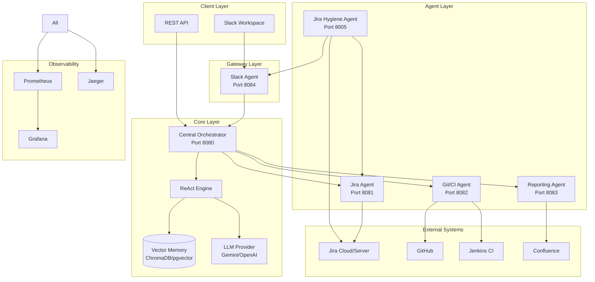

# Architecture

This document describes the architecture of the Nexus Release Automation System, including its core components, communication patterns, and design decisions.

## System Overview

Nexus is a multi-agent system that uses a ReAct (Reasoning + Acting) architecture to orchestrate specialized agents for release readiness assessments and proactive quality management.



---

## High-Level Data Flow


---

## Core Components

### 1. Central Orchestrator

The brain of the system. Receives requests and coordinates multi-agent workflows using the ReAct engine.

**Responsibilities:**
- Parse and understand user queries
- Plan multi-step execution workflows
- Coordinate agent interactions
- Aggregate results and generate responses
- Maintain conversation context

**Technology:**
- FastAPI for HTTP API
- Pydantic for data validation
- OpenTelemetry for distributed tracing

### 2. ReAct Reasoning Engine

The ReAct (Reasoning + Acting) engine implements an LLM-powered reasoning loop that combines thinking with action.


**The ReAct Loop:**

1. **Thought**: The LLM reasons about what information is needed
2. **Action**: Calls a tool to gather data
3. **Observation**: Reviews the tool's response
4. **Repeat**: Continue until sufficient information
5. **Final Answer**: Synthesize and respond

**Example Trace:**

```
User: "Is the v2.0 release ready?"

Thought: I need to check the Jira sprint status to understand ticket completion.
Action: get_sprint_stats
Action Input: {"project_key": "PROJ"}
Observation: {"completed_tickets": 42, "total_tickets": 45, "completion_rate": 93.3}

Thought: Good progress on tickets. Now I should check security.
Action: get_security_scan
Action Input: {"repo_name": "nexus/backend"}
Observation: {"risk_score": 25, "critical_vulnerabilities": 0, "high_vulnerabilities": 2}

Thought: No critical vulnerabilities. Let me check the build status.
Action: get_build_status
Action Input: {"job_name": "nexus-main"}
Observation: {"status": "SUCCESS", "test_results": {"passed": 245, "failed": 0}}

Thought: I have enough information to make a decision.
Final Answer: The v2.0 release is READY (GO). 93.3% ticket completion, 
              no critical vulnerabilities, and all tests passing.
```

### 3. Vector Memory

RAG-enabled memory system for maintaining context across conversations.

**Features:**
- Stores previous interactions and decisions
- Retrieves relevant context for new queries
- Supports ChromaDB (local) and pgvector (PostgreSQL)

**Use Cases:**
- "Last time we had a similar issue..."
- Historical release data retrieval
- Learning from past decisions

---

## Agent Contracts

All agents follow a standardized contract for communication.

### Request Schema

```python
class AgentTaskRequest(BaseModel):
    task_id: str           # Unique trace ID
    correlation_id: str    # Parent request ID
    action: str            # Action to execute
    payload: Dict          # Action parameters
    priority: TaskPriority # Execution priority
    user_context: Dict     # User metadata
    timeout_seconds: int   # Execution timeout
```

### Response Schema

```python
class AgentTaskResponse(BaseModel):
    task_id: str           # Original task ID
    status: TaskStatus     # success, failed, timeout
    data: Dict             # Result data
    error_message: str     # Error if failed
    execution_time_ms: float
    agent_type: AgentType
```

---

## Specialized Agents

### Jira Agent (Port 8081)

Handles all Jira-related operations including ticket fetching, updates, and hierarchy traversal.

**Capabilities:**
- Fetch ticket details and hierarchies
- Search using JQL
- Update ticket status and fields
- Add comments
- Get sprint statistics

**Endpoints:**

| Endpoint | Method | Description |
|----------|--------|-------------|
| `/issue/{key}` | GET | Fetch single ticket |
| `/hierarchy/{key}` | GET | Fetch epic → stories → subtasks |
| `/search` | GET | JQL search |
| `/update` | POST | Update status/add comment |
| `/update-ticket` | POST | Update multiple fields (for hygiene fixes) |
| `/sprint-stats/{project}` | GET | Sprint metrics |

### Git/CI Agent (Port 8082)

Manages GitHub and Jenkins interactions.

**Capabilities:**
- Check repository health
- Get PR status and approvals
- Trigger Jenkins builds
- Fetch build results
- Run security scans

**Endpoints:**

| Endpoint | Method | Description |
|----------|--------|-------------|
| `/repo/{name}/health` | GET | Repository health |
| `/repo/{name}/pr/{number}` | GET | PR details |
| `/build/{job}` | POST | Trigger build |
| `/build/{job}/status` | GET | Build status |
| `/security/{repo}` | GET | Security scan |

### Reporting Agent (Port 8083)

Generates and publishes reports.

**Capabilities:**
- Generate HTML reports with Jinja2
- Analyze release readiness
- Publish to Confluence
- Calculate Go/No-Go decisions

**Endpoints:**

| Endpoint | Method | Description |
|----------|--------|-------------|
| `/generate` | POST | Generate HTML report |
| `/analyze` | POST | Analyze for Go/No-Go |
| `/publish` | POST | Publish to Confluence |
| `/preview` | GET | Preview sample report |

### Slack Agent (Port 8084)

Handles Slack workspace interactions with rich interactive experiences.

**Capabilities:**
- Process slash commands
- Open Block Kit modals
- Send rich messages and DMs
- Handle button interactions
- Support hygiene fix modals

**Endpoints:**

| Endpoint | Method | Description |
|----------|--------|-------------|
| `/slack/commands` | POST | Slash command handler |
| `/slack/interactions` | POST | Button/modal interactions |
| `/slack/events` | POST | Events API handler |
| `/notify` | POST | Send channel notification |
| `/send-dm` | POST | Send direct message by email |

### Jira Hygiene Agent (Port 8005) 🆕

Proactive quality gatekeeper that monitors and enforces Jira data hygiene through scheduled checks and interactive notifications.


**Capabilities:**
- **Scheduled Hygiene Checks**: Runs automatically on weekdays at 9:00 AM
- **Field Validation**: Checks for missing Labels, Fix Version, Affected Version, Story Points, Team
- **Hygiene Scoring**: Calculates `nexus_project_hygiene_score` (0-100%)
- **Interactive Notifications**: Sends Slack DMs with "Fix Tickets Now" button
- **Modal-Based Fixes**: Users can fix violations directly from Slack without leaving the app

**Validation Rules:**

| Field | Jira Field ID | Why It Matters |
|-------|---------------|----------------|
| Labels | `labels` | Categorization and filtering |
| Fix Version | `fixVersions` | Release planning |
| Affected Version | `versions` | Impact analysis |
| Story Points | `customfield_10016` | Capacity planning |
| Team/Contributors | `customfield_10001` | Ownership tracking |

**Endpoints:**

| Endpoint | Method | Description |
|----------|--------|-------------|
| `/health` | GET | Health check with scheduler status |
| `/run-check` | POST | Manual trigger for hygiene check |
| `/status` | GET | Configuration and scheduler info |
| `/violations/{project}` | GET | Get violations for a project |
| `/execute` | POST | Orchestrator integration |

**Prometheus Metrics:**

```
# Hygiene Score (0-100%)
nexus_project_hygiene_score{project_key}

# Check Counters
nexus_hygiene_checks_total{project_key, trigger_type}
nexus_hygiene_violations_total{project_key, violation_type}

# Ticket Counts
nexus_hygiene_tickets_checked{project_key}
nexus_hygiene_compliant_tickets{project_key}
```

---

## Interactive Hygiene Fix Flow


---

## Observability

### Metrics (Prometheus)

Key metrics exported by all services:

```
# LLM Usage
nexus_llm_tokens_total{model_name, type}
nexus_llm_latency_seconds{model_name}
nexus_llm_cost_dollars_total{model_name}

# Tool Usage
nexus_tool_usage_total{tool_name, status}
nexus_tool_latency_seconds{tool_name}

# ReAct Loop
nexus_react_iterations_count{task_type}
nexus_react_loop_duration_seconds{task_type}

# Hygiene (NEW)
nexus_project_hygiene_score{project_key}
nexus_hygiene_checks_total{project_key, trigger_type}
nexus_hygiene_violations_total{project_key, violation_type}

# Business
nexus_release_decisions_total{decision}
nexus_reports_generated_total{type}
nexus_jira_tickets_processed_total{action}
```

### Tracing (OpenTelemetry)

Distributed tracing across all services using OpenTelemetry with Jaeger export.

**Trace Context:**
- Request ID propagation
- Span correlation across agents
- LLM call tracing
- Tool execution timing

### Logging

Structured JSON logging with correlation IDs:

```json
{
  "timestamp": "2024-01-15T10:30:00Z",
  "level": "INFO",
  "service": "jira-hygiene-agent",
  "request_id": "req-abc123",
  "message": "Hygiene check completed",
  "hygiene_score": 85.0,
  "tickets_checked": 45,
  "violations_found": 7
}
```

---

## Security

### Authentication

- **JWT Tokens**: Service-to-service authentication
- **Slack Verification**: Request signing for Slack events
- **API Keys**: External service authentication

### Authorization

- Role-based access (Slack user roles)
- Agent-level permissions
- Audit logging

### Secrets Management

- Environment variables for development
- Kubernetes Secrets for production
- Integration with external vaults (HashiCorp Vault)

---

## Deployment Architecture

### Development (Docker Compose)

```
┌─────────────────────────────────────────────────────────────────┐
│                        Docker Network                            │
├─────────────┬─────────────┬─────────────┬─────────────┬────────┤
│ Orchestrator│  Jira Agent │ Git/CI Agent│Report Agent │Hygiene │
│   :8080     │    :8081    │    :8082    │   :8083     │ :8005  │
├─────────────┴─────────────┴─────────────┴─────────────┴────────┤
│                    Slack Agent :8084                             │
├─────────────┬─────────────┬─────────────┬──────────────────────┤
│  PostgreSQL │    Redis    │  Prometheus │       Grafana        │
│    :5432    │    :6379    │    :9090    │       :3000          │
└─────────────┴─────────────┴─────────────┴──────────────────────┘
```

### Production (Kubernetes)

```
┌─────────────────────────────────────────────────────────────────┐
│                      Ingress (NGINX)                             │
├───────────────────────┬─────────────────────────────────────────┤
│        /api/*         │              /slack/*                    │
├───────────────────────┴─────────────────────────────────────────┤
│                                                                  │
│  ┌─────────────────┐    ┌─────────────────────────────────────┐ │
│  │  Orchestrator   │    │       Agent Deployments             │ │
│  │  (2+ replicas)  │────│  - Jira Agent                       │ │
│  │       HPA       │    │  - Git/CI Agent                     │ │
│  └─────────────────┘    │  - Reporting Agent                  │ │
│           │             │  - Slack Agent                       │ │
│           │             │  - Jira Hygiene Agent (NEW)         │ │
│           │             └─────────────────────────────────────┘ │
│           │                                                      │
│  ┌─────────────────┐    ┌─────────────────────────────────────┐ │
│  │   PostgreSQL    │    │     Redis (Cache/Pubsub)            │ │
│  │   (pgvector)    │    │                                     │ │
│  └─────────────────┘    └─────────────────────────────────────┘ │
└─────────────────────────────────────────────────────────────────┘
```

---

## Port Assignments

| Service | Port | Description |
|---------|------|-------------|
| Orchestrator | 8080 | Central coordination |
| Jira Agent | 8081 | Jira operations |
| Git/CI Agent | 8082 | GitHub + Jenkins |
| Reporting Agent | 8083 | Report generation |
| Slack Agent | 8084 | Slack interface |
| **Jira Hygiene Agent** | **8005** | **Proactive quality checks** |
| PostgreSQL | 5432 | Database |
| Redis | 6379 | Cache |
| Prometheus | 9090 | Metrics |
| Grafana | 3000 | Dashboards |
| Jaeger | 16686 | Tracing UI |

---

## Design Decisions

### Why ReAct over Simple Chains?

1. **Flexibility**: Can handle unexpected scenarios
2. **Transparency**: Shows reasoning for decisions
3. **Self-correction**: Can recover from tool failures
4. **Extensibility**: Easy to add new tools

### Why Separate Agents?

1. **Scalability**: Scale agents independently
2. **Fault Isolation**: Failures don't cascade
3. **Technology Flexibility**: Each agent can use optimal libraries
4. **Team Ownership**: Clear boundaries for teams

### Why Vector Memory?

1. **Context Retention**: Learn from past interactions
2. **Semantic Search**: Find relevant historical data
3. **RAG Enhancement**: Better LLM responses with context

### Why Proactive Hygiene Agent?

1. **Data Quality**: Ensures Jira data is complete for accurate assessments
2. **Shift Left**: Catches issues before release readiness checks
3. **User Experience**: Interactive fixes reduce friction
4. **Automation**: Scheduled checks remove manual effort
