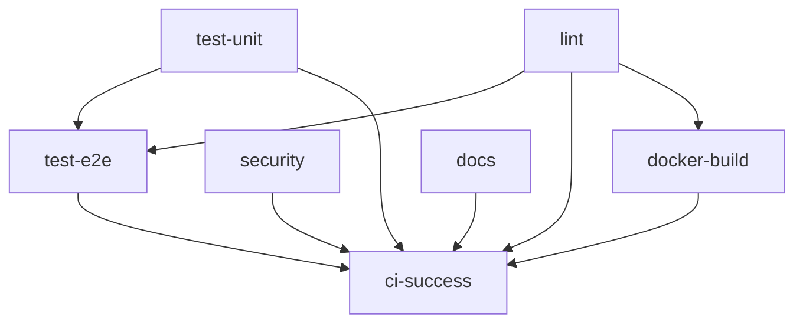

# CI Workflow Deep Dive

This document provides detailed documentation for the Continuous Integration (CI) workflow.

## Overview

The CI workflow (`ci.yml`) is the main quality gate for all code changes. It runs on every push and pull request to ensure code quality, security, and functionality.

---

## Workflow File

**Location:** `.github/workflows/ci.yml`

**Triggers:**
- Push to `main` or `develop` branches
- Pull requests targeting `main` or `develop`

---

## Jobs

### 1. Lint & Format (`lint`)

**Purpose:** Ensure code follows project style guidelines.

**Tools Used:**
| Tool | Purpose | Configuration |
|------|---------|---------------|
| **Black** | Code formatting | `--check --diff` |
| **isort** | Import sorting | `--check-only --diff` |
| **flake8** | Linting | `--max-line-length=120` |
| **mypy** | Type checking | `--ignore-missing-imports` |

**What It Checks:**
- Code is formatted with Black
- Imports are sorted correctly
- No linting errors (PEP 8 compliance)
- Type hints are valid

**How to Fix Locally:**
```bash
# Format code
black shared/ services/ tests/

# Sort imports
isort shared/ services/ tests/

# Check linting
flake8 shared/ services/ --max-line-length=120

# Type check
mypy shared/ --ignore-missing-imports
```

---

### 2. Security Scan (`security`)

**Purpose:** Identify security vulnerabilities in code and dependencies.

**Tools Used:**
| Tool | Purpose |
|------|---------|
| **Bandit** | Python security linter |
| **pip-audit** | Dependency vulnerability scanner |

**What It Checks:**
- Common security issues in Python code
- Known vulnerabilities in dependencies
- Insecure coding patterns

**Bandit Rules Skipped:**
- `B101`: Assert statements (used in tests)
- `B104`: Binding to all interfaces (intentional for containers)

**Output:**
- `bandit-report.json` artifact with detailed findings

**How to Fix Locally:**
```bash
# Run Bandit
bandit -r shared/ services/ -ll

# Check dependencies
pip-audit

# Fix vulnerabilities
pip install --upgrade <vulnerable-package>
```

---

### 3. Unit Tests (`test-unit`)

**Purpose:** Verify individual components work correctly.

**Matrix:**
| Python Version | Status |
|----------------|--------|
| 3.10 | ✅ Tested |
| 3.11 | ✅ Tested (primary) |
| 3.12 | ✅ Tested |

**Coverage:**
- Minimum coverage is tracked but not enforced
- Coverage reports uploaded to Codecov
- XML and terminal reports generated

**What It Tests:**
- `tests/unit/` directory
- Shared library functions
- Agent logic
- Orchestrator components

**How to Run Locally:**
```bash
# Run all unit tests
pytest tests/unit/ -v

# Run with coverage
pytest tests/unit/ --cov=shared --cov-report=html

# Run specific test file
pytest tests/unit/test_hygiene_logic.py -v
```

**Artifacts:**
- `test-results-unit-{python-version}.xml` - JUnit test results
- Coverage uploaded to Codecov (Python 3.11 only)

---

### 4. E2E Tests (`test-e2e`)

**Purpose:** Verify end-to-end functionality across services.

**Dependencies:** Runs after `lint` and `test-unit` pass.

**What It Tests:**
- `tests/e2e/` directory
- API endpoint integration
- Service communication
- Full request/response cycles

**How to Run Locally:**
```bash
# Start services first
./scripts/dev.sh start

# Run E2E tests
pytest tests/e2e/ -v

# Or use dev script
./scripts/dev.sh test-e2e
```

---

### 5. Docker Build (`docker-build`)

**Purpose:** Verify Docker images build successfully.

**Services Built:**
| Service | Dockerfile |
|---------|------------|
| orchestrator | `Dockerfile.orchestrator` |
| jira-agent | `Dockerfile.generic-agent` |
| jira-hygiene-agent | `Dockerfile.generic-agent` |
| slack-agent | `Dockerfile.generic-agent` |

**Features:**
- Uses Docker Buildx for multi-platform support
- Caches layers with GitHub Actions cache
- Does NOT push images (CI only validates build)

**How to Build Locally:**
```bash
# Build specific service
docker build -f infrastructure/docker/Dockerfile.orchestrator -t nexus/orchestrator .

# Build with docker-compose
docker-compose build
```

---

### 6. Documentation (`docs`)

**Purpose:** Ensure documentation builds without errors.

**Tools:**
- MkDocs with Material theme
- Link checking (when enabled)

**What It Checks:**
- MkDocs configuration is valid
- All pages render correctly
- No broken internal links

**How to Build Locally:**
```bash
# Install MkDocs
pip install mkdocs mkdocs-material

# Build documentation
mkdocs build --strict

# Serve locally
mkdocs serve
```

---

### 7. CI Success (`ci-success`)

**Purpose:** Final check to confirm all required jobs passed.

**Behavior:**
- Runs after all other jobs complete
- Checks `lint` and `test-unit` are successful
- Required for branch protection status checks

---

## Job Dependencies



---

## Caching

The workflow uses GitHub Actions cache for:

| Cache | Key Pattern | Purpose |
|-------|-------------|---------|
| pip dependencies | `{os}-pip-{hash}` | Speed up installs |
| Docker layers | `gha` type cache | Speed up builds |

**Cache Invalidation:**
- Changes to `requirements.txt` files
- Weekly rotation for security

---

## Timeouts

| Job | Timeout |
|-----|---------|
| lint | 10 minutes |
| security | 10 minutes |
| test-unit | 15 minutes |
| test-e2e | 20 minutes |
| docker-build | 30 minutes |

---

## Artifacts

| Artifact | Retention | Contents |
|----------|-----------|----------|
| `security-report` | 30 days | Bandit JSON report |
| `test-results-unit-{version}` | 30 days | JUnit XML results |
| `test-results-e2e` | 30 days | JUnit XML results |

---

## Common Patterns

### Skip CI

To skip CI for trivial changes (docs typos, etc.):

```bash
git commit -m "docs: fix typo [skip ci]"
```

### Rerun Failed Jobs

1. Go to Actions tab
2. Find the failed workflow run
3. Click "Re-run failed jobs"

### View Detailed Logs

1. Click on the workflow run
2. Click on the failed job
3. Expand the failed step
4. Click "View raw logs" for full output

---

## Status Badges

Add to README:

```markdown

```

---

## Next Steps

- [Release Workflow](./release-workflow.md)
- [Troubleshooting](./troubleshooting.md)

