# CI/CD Pipeline Overview

This document provides a comprehensive overview of the Nexus Release Automation CI/CD pipelines built with GitHub Actions.

## Table of Contents

- [Pipeline Architecture](#pipeline-architecture)
- [Workflow Summary](#workflow-summary)
- [Pipeline Flow](#pipeline-flow)
- [Getting Started](#getting-started)
- [Configuration](#configuration)

---

## Pipeline Architecture

```
┌─────────────────────────────────────────────────────────────────────────────┐
│                         GitHub Repository                                    │
│                                                                              │
│  ┌──────────────┐    ┌──────────────┐    ┌──────────────┐                  │
│  │   Push to    │    │  Pull Request │    │  Version Tag │                  │
│  │    main      │    │   Created     │    │   Created    │                  │
│  └──────┬───────┘    └──────┬────────┘    └──────┬───────┘                  │
│         │                   │                    │                           │
│         ▼                   ▼                    ▼                           │
│  ┌──────────────────────────────────────────────────────────────────┐      │
│  │                        CI Workflow                                │      │
│  │  ┌─────────┐ ┌─────────┐ ┌─────────┐ ┌─────────┐ ┌─────────┐    │      │
│  │  │  Lint   │ │Security │ │  Unit   │ │   E2E   │ │ Docker  │    │      │
│  │  │ & Format│ │  Scan   │ │  Tests  │ │  Tests  │ │  Build  │    │      │
│  │  └─────────┘ └─────────┘ └─────────┘ └─────────┘ └─────────┘    │      │
│  └──────────────────────────────────────────────────────────────────┘      │
│         │                   │                    │                           │
│         │                   │                    ▼                           │
│         │                   │           ┌───────────────┐                   │
│         │                   │           │Release Workflow│                   │
│         │                   │           │ ┌───────────┐  │                   │
│         │                   │           │ │Build Images│  │                   │
│         │                   │           │ └───────────┘  │                   │
│         │                   │           │ ┌───────────┐  │                   │
│         │                   │           │ │Push to GHCR│  │                   │
│         │                   │           │ └───────────┘  │                   │
│         │                   │           │ ┌───────────┐  │                   │
│         │                   │           │ │Create      │  │                   │
│         │                   │           │ │Release     │  │                   │
│         │                   │           │ └───────────┘  │                   │
│         │                   │           └───────────────┘                   │
│         │                   │                                                │
│         │                   ▼                                                │
│         │           ┌───────────────┐                                       │
│         │           │  PR Workflows │                                       │
│         │           │ ┌───────────┐ │                                       │
│         │           │ │Auto-Label │ │                                       │
│         │           │ └───────────┘ │                                       │
│         │           │ ┌───────────┐ │                                       │
│         │           │ │Dependency │ │                                       │
│         │           │ │ Review    │ │                                       │
│         │           │ └───────────┘ │                                       │
│         │           └───────────────┘                                       │
│         │                                                                    │
│         ▼                                                                    │
│  ┌──────────────────────────────────────────────────────────────────┐      │
│  │                    Scheduled Workflows                            │      │
│  │  ┌─────────────┐          ┌─────────────┐                        │      │
│  │  │ Dependabot  │          │Stale Issues │                        │      │
│  │  │  (Weekly)   │          │  (Daily)    │                        │      │
│  │  └─────────────┘          └─────────────┘                        │      │
│  └──────────────────────────────────────────────────────────────────┘      │
│                                                                              │
└─────────────────────────────────────────────────────────────────────────────┘
```

---

## Workflow Summary

| Workflow | File | Trigger | Purpose |
|----------|------|---------|---------|
| **CI** | `ci.yml` | Push, PR | Main continuous integration pipeline |
| **Release** | `release.yml` | Tags (`v*.*.*`) | Build, push, and release |
| **Deploy Frontend** | `deploy-frontend.yml` | PR, Push to main | Vercel deployment |
| **Dependency Review** | `dependency-review.yml` | PR | Scan dependencies for vulnerabilities |
| **Labeler** | `labeler.yml` | PR | Auto-label PRs by changed files |
| **Stale** | `stale.yml` | Schedule (daily) | Mark inactive issues/PRs |
| **Dependabot** | `dependabot.yml` | Schedule (weekly) | Update dependencies |

## Docker Build Architecture

Nexus uses optimized multi-stage Dockerfiles (v2.5.0):

| Dockerfile | Purpose | Key Features |
|------------|---------|--------------|
| `Dockerfile.base` | Shared foundation | Non-root user, Python health check |
| `Dockerfile.orchestrator` | Central brain | 3-stage build, UV package manager |
| `Dockerfile.agent` | All agents | Build args for agent selection |
| `Dockerfile.admin-dashboard` | Web UI | React + FastAPI |
| `Dockerfile.analytics` | Analytics | Data processing optimized |
| `Dockerfile.webhooks` | Event delivery | High-throughput optimized |

**Key Optimizations:**
- 🚀 **UV Package Manager** - 10x faster than pip
- 📦 **Multi-stage builds** - ~150MB images (85% smaller)
- 🔒 **Security** - Non-root, read-only filesystem, seccomp profiles

---

## Pipeline Flow

### On Every Push to `main`

```mermaid
flowchart LR
    A[Push to main] --> B[CI Workflow]
    B --> C{All Checks Pass?}
    C -->|Yes| D[✅ Success]
    C -->|No| E[❌ Failure]
```



### On Pull Request


### On Version Tag


---

## Getting Started

### Prerequisites

Before the CI/CD pipelines can run successfully, ensure:

1. **Repository Access**
   - `GITHUB_TOKEN` is automatically provided
   - Write access to packages (for Docker images)

2. **Branch Protection**
   - Configure branch protection rules (see [GitHub Setup](../GITHUB_SETUP.md))
   - Required status checks configured

3. **Secrets (Optional)**
   - `CODECOV_TOKEN` for coverage reporting
   - `SLACK_WEBHOOK_URL` for notifications

### Running Workflows

#### Automatic Triggers

| Event | Workflows Triggered |
|-------|---------------------|
| Push to `main` | CI |
| Push to `develop` | CI |
| Pull Request opened | CI, Labeler, Dependency Review |
| Pull Request updated | CI, Labeler |
| Tag pushed (`v*.*.*`) | Release |
| Daily (9 AM UTC) | Stale |
| Weekly (Monday) | Dependabot |

#### Manual Triggers

Some workflows support manual triggering via `workflow_dispatch`:

```bash
# Trigger release workflow manually
gh workflow run release.yml -f version=v2.1.0 -f prerelease=false
```

Or via GitHub UI: **Actions → Select Workflow → Run workflow**

---

## Configuration

### Environment Variables

| Variable | Default | Description |
|----------|---------|-------------|
| `PYTHON_VERSION` | `3.11` | Python version for CI jobs |

### Workflow Inputs

#### Release Workflow

| Input | Type | Required | Description |
|-------|------|----------|-------------|
| `version` | string | Yes | Version to release (e.g., v2.1.0) |
| `prerelease` | boolean | No | Is this a pre-release? |

### Concurrency

The CI workflow uses concurrency groups to cancel redundant runs:

```yaml
concurrency:
  group: ${{ github.workflow }}-${{ github.ref }}
  cancel-in-progress: true
```

This means:
- New pushes cancel in-progress runs for the same branch
- Saves CI minutes
- Gets feedback on latest code faster

---

## Next Steps

- [CI Workflow Details](./ci-workflow.md)
- [Release Workflow Details](./release-workflow.md)
- [Troubleshooting Guide](./troubleshooting.md)

