# Release Workflow Deep Dive

This document provides detailed documentation for the Release workflow, which handles building, publishing, and releasing new versions of Nexus.

## Overview

The Release workflow (`release.yml`) automates the entire release process from version validation to GitHub release creation.

---

## Workflow File

**Location:** `.github/workflows/release.yml`

**Triggers:**
- Push of tags matching `v*.*.*` (e.g., `v2.0.0`, `v2.1.0-beta.1`)
- Manual trigger via `workflow_dispatch`

---

## Release Process

```mermaid
flowchart TD
    A[Tag Created] --> B[Validate Version]
    B --> C{Valid Format?}
    C -->|No| D[❌ Fail]
    C -->|Yes| E[Run Tests]
    E --> F{Tests Pass?}
    F -->|No| D
    F -->|Yes| G[Build Docker Images]
    G --> H[Push to GHCR]
    H --> I[Generate Changelog]
    I --> J[Create GitHub Release]
    J --> K[✅ Release Complete]
```



---

## Jobs

### 1. Validate (`validate`)

**Purpose:** Ensure the version tag is valid before proceeding.

**Validations:**
- Version matches semantic versioning pattern
- Format: `v{major}.{minor}.{patch}` or `v{major}.{minor}.{patch}-{prerelease}`

**Valid Examples:**
```
v1.0.0
v2.0.0
v2.1.0-alpha.1
v2.1.0-beta.2
v2.1.0-rc.1
```

**Invalid Examples:**
```
1.0.0        # Missing 'v' prefix
v1.0         # Missing patch version
v1.0.0.0     # Too many version parts
release-2.0  # Wrong format
```

**Outputs:**
| Output | Description |
|--------|-------------|
| `version` | The validated version string |
| `is_prerelease` | `true` if version contains `-` |

---

### 2. Test (`test`)

**Purpose:** Run tests before building release artifacts.

**What It Does:**
- Sets up Python 3.11
- Installs dependencies
- Runs full test suite

**Why It Runs:**
- Prevents releasing broken code
- Catches issues before Docker builds

---

### 3. Build (`build`)

**Purpose:** Build and push Docker images for all services.

**Services Built:**

| Service | Image Name | Dockerfile |
|---------|------------|------------|
| Orchestrator | `nexus-orchestrator` | `Dockerfile.orchestrator` |
| Jira Agent | `nexus-jira-agent` | `Dockerfile.generic-agent` |
| Git/CI Agent | `nexus-git-ci-agent` | `Dockerfile.generic-agent` |
| Reporting Agent | `nexus-reporting-agent` | `Dockerfile.generic-agent` |
| Slack Agent | `nexus-slack-agent` | `Dockerfile.generic-agent` |
| Jira Hygiene Agent | `nexus-jira-hygiene-agent` | `Dockerfile.generic-agent` |

**Image Tags:**
For version `v2.1.0`:
```
ghcr.io/ikredhat/nexus-orchestrator:2.1.0
ghcr.io/ikredhat/nexus-orchestrator:2.1
ghcr.io/ikredhat/nexus-orchestrator:2
ghcr.io/ikredhat/nexus-orchestrator:latest  # Only for non-prereleases
```

**Registry:**
- GitHub Container Registry (ghcr.io)
- Public images (readable by anyone)
- Write requires `packages: write` permission

---

### 4. Release (`release`)

**Purpose:** Create the GitHub release with changelog.

**Changelog Generation:**

The workflow automatically generates a changelog by categorizing commits:

| Prefix | Category |
|--------|----------|
| `feat:` | ✨ New Features |
| `fix:` | 🐛 Bug Fixes |
| `docs:` | 📖 Documentation |
| `chore:`, `ci:`, `refactor:` | 🔧 Maintenance |

**Release Contents:**
- Generated changelog
- Docker image references
- Installation instructions
- Quick start commands

**Example Release Notes:**
```markdown
## What's Changed in v2.1.0

### ✨ New Features
- feat(hygiene): add interactive Slack modal
- feat(orchestrator): add Gemini 2.0 support

### 🐛 Bug Fixes
- fix(slack): resolve modal timeout issue

### 📖 Documentation
- docs: update API reference

## 🚀 Quick Start
git clone https://github.com/IKRedHat/Nexus-Release-Readiness-Bot.git
cd Nexus-Release-Readiness-Bot
git checkout v2.1.0
./scripts/setup.sh

## 🐳 Docker Images
| Service | Image |
|---------|-------|
| Orchestrator | ghcr.io/ikredhat/nexus-orchestrator:2.1.0 |
...
```

---

## Creating a Release

### Method 1: Git Tag (Recommended)

```bash
# Ensure you're on main with latest changes
git checkout main
git pull origin main

# Create and push tag
git tag v2.1.0
git push origin v2.1.0
```

### Method 2: Manual Trigger

1. Go to **Actions** tab
2. Select **Release** workflow
3. Click **Run workflow**
4. Enter version (e.g., `v2.1.0`)
5. Check "prerelease" if applicable
6. Click **Run workflow**

### Method 3: GitHub UI

1. Go to **Releases**
2. Click **Draft a new release**
3. Create a new tag (e.g., `v2.1.0`)
4. The workflow will trigger automatically

---

## Version Numbering

Follow [Semantic Versioning](https://semver.org/):

```
v{MAJOR}.{MINOR}.{PATCH}[-{PRERELEASE}]
```

| Component | When to Increment |
|-----------|-------------------|
| **MAJOR** | Breaking changes |
| **MINOR** | New features (backward compatible) |
| **PATCH** | Bug fixes (backward compatible) |
| **PRERELEASE** | Alpha, beta, release candidate |

**Examples:**
```
v1.0.0 → v1.0.1  # Bug fix
v1.0.1 → v1.1.0  # New feature
v1.1.0 → v2.0.0  # Breaking change
v2.0.0-alpha.1   # Alpha release
v2.0.0-beta.1    # Beta release
v2.0.0-rc.1      # Release candidate
```

---

## Pre-releases

Pre-releases are marked with a hyphen suffix:

```bash
# Alpha (early testing)
git tag v2.1.0-alpha.1
git push origin v2.1.0-alpha.1

# Beta (feature complete, testing)
git tag v2.1.0-beta.1
git push origin v2.1.0-beta.1

# Release Candidate (final testing)
git tag v2.1.0-rc.1
git push origin v2.1.0-rc.1
```

**Pre-release Behavior:**
- Marked as "Pre-release" on GitHub
- `latest` Docker tag NOT updated
- Users must explicitly choose to use

---

## Docker Image Usage

### Pulling Images

```bash
# Latest stable
docker pull ghcr.io/ikredhat/nexus-orchestrator:latest

# Specific version
docker pull ghcr.io/ikredhat/nexus-orchestrator:2.1.0

# Major version (gets latest 2.x.x)
docker pull ghcr.io/ikredhat/nexus-orchestrator:2
```

### Using in docker-compose

```yaml
services:
  orchestrator:
    image: ghcr.io/ikredhat/nexus-orchestrator:2.1.0
```

### Using in Kubernetes

```yaml
spec:
  containers:
    - name: orchestrator
      image: ghcr.io/ikredhat/nexus-orchestrator:2.1.0
```

---

## Rollback

If a release has issues:

### 1. Create Hotfix

```bash
git checkout -b hotfix/critical-fix
# Make fixes
git commit -m "fix: critical issue"
git push origin hotfix/critical-fix
# Create PR, merge, then tag
git tag v2.1.1
git push origin v2.1.1
```

### 2. Delete Bad Release (if needed)

```bash
# Delete tag locally
git tag -d v2.1.0

# Delete tag remotely
git push origin :refs/tags/v2.1.0
```

Then delete the release on GitHub UI.

---

## Permissions Required

| Permission | Scope | Purpose |
|------------|-------|---------|
| `contents: read` | Repository | Clone code |
| `packages: write` | GHCR | Push Docker images |
| `contents: write` | Repository | Create releases |

---

## Next Steps

- [Troubleshooting Guide](./troubleshooting.md)
- [CI Workflow](./ci-workflow.md)

