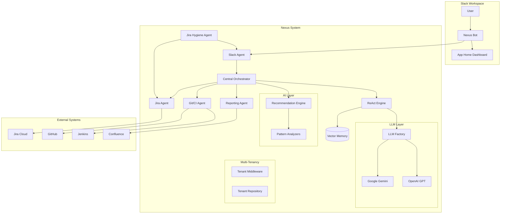

# Nexus Release Automation System

<div style="text-align: center; margin-bottom: 2em;">
  
  
  
</div>

**Nexus** is an intelligent multi-agent system that automates release readiness assessments. It uses a ReAct (Reasoning + Acting) architecture powered by LLMs to coordinate specialized agents that gather data from Jira, GitHub, Jenkins, and other systems to provide Go/No-Go release decisions.

## 🚀 Quick Start

### Prerequisites

- Python 3.10+
- Docker & Docker Compose
- Kubernetes (for production deployment)
- Google Cloud API key (for Gemini) or OpenAI API key

### Local Development

```bash
# Clone the repository
git clone https://github.com/IKRedHat/Nexus-Release-Readiness-Bot.git
cd Nexus-Release-Readiness-Bot

# Start the development stack
docker-compose up -d

# Access services
# - Orchestrator: http://localhost:8080
# - Jira Hygiene Agent: http://localhost:8085
# - Analytics Dashboard: http://localhost:8086
# - Webhook Service: http://localhost:8087
# - Grafana: http://localhost:3000 (admin/nexus_admin)
# - Prometheus: http://localhost:9090
# - Jaeger: http://localhost:16686
```

### Try it out

```bash
# Check health
curl http://localhost:8080/health

# Run a query (uses Gemini or mock LLM)
curl -X POST http://localhost:8080/query \
  -H "Content-Type: application/json" \
  -d '{"query": "What is the release readiness status for v2.0?"}'

# Trigger a hygiene check
curl -X POST http://localhost:8085/run-check \
  -H "Content-Type: application/json" \
  -d '{"project_key": "PROJ", "notify": false}'

# Get AI recommendations
curl http://localhost:8080/recommendations

# Get analytics KPIs
curl http://localhost:8086/api/v1/kpis?time_range=7d

# Create a webhook subscription
curl -X POST http://localhost:8087/api/v1/subscriptions \
  -H "Content-Type: application/json" \
  -d '{"name": "My Webhook", "url": "https://example.com/hook", "events": ["release.completed"]}'
```

## 🏗️ Architecture Overview



## 🎯 Key Features

### 🤖 Google Gemini Integration
Production-ready LLM client with full Gemini 2.0 support:
- **Async Generation**: Non-blocking API calls
- **Streaming**: Real-time token streaming
- **Function Calling**: Native tool use support
- **Cost Tracking**: Token usage and cost estimation
- **Fallback**: Automatic fallback to mock mode

### 🏢 Multi-Tenant Support
Enterprise-ready organization isolation:
- **Tenant Plans**: Free, Starter, Professional, Enterprise
- **Resource Limits**: Per-tenant API, LLM, and storage limits
- **Configuration Isolation**: Separate Jira, GitHub, Slack settings per tenant
- **Feature Flags**: Enable/disable features per organization

### 💡 AI-Powered Recommendations
Intelligent suggestions based on historical patterns:
- **Release Timing**: Best days to release, failure patterns
- **Hygiene Improvement**: Trend detection, violation patterns
- **Velocity Optimization**: Predictability scoring
- **Risk Mitigation**: Blocker and vulnerability assessment

### 🏠 Slack App Home Dashboard
Rich interactive dashboard when opening the app:
- **Quick Actions**: One-click status, hygiene, reports
- **Release Overview**: Current status, blockers, scores
- **Hygiene Widget**: Score with fix button
- **AI Recommendations**: Top suggestions preview


### 🔧 Proactive Jira Hygiene
The Jira Hygiene Agent ensures data quality:
- **Scheduled Checks**: Weekdays at 9:00 AM
- **Field Validation**: Labels, Fix Version, Story Points, Team
- **Interactive Fixes**: Fix violations directly from Slack modals
- **Hygiene Scoring**: Track compliance percentage

### 📈 Real-time Observability
Full visibility into system performance:
- LLM token usage and costs
- Agent latency and error rates
- ReAct loop analytics
- Hygiene score tracking
- Business metrics (Go/No-Go decisions)

### 💬 Slack Integration
Natural Slack interface with:
- `/nexus status` - Check release readiness
- `/jira-update` - Update tickets via modal
- App Home dashboard with widgets
- Hygiene notifications with fix buttons
- Block Kit rich messages

## 📖 Documentation

| Section | Description |
|---------|-------------|
| [User Guide](user_guide.md) | How to use Nexus commands and features |
| [Architecture](architecture.md) | System design and technical details |
| [API Reference](api-specs/overview.md) | OpenAPI specifications for all agents |
| [Deployment](runbooks/deployment.md) | Production deployment guide |

## 🛠️ Technology Stack

| Component | Technology |
|-----------|------------|
| Backend | Python 3.11, FastAPI, Pydantic |
| LLM | Google Gemini 2.0, OpenAI GPT-4 (configurable) |
| Vector Store | ChromaDB, PostgreSQL + pgvector |
| Messaging | Slack Bolt SDK |
| Scheduling | APScheduler |
| Multi-tenancy | Custom middleware with tenant isolation |
| Observability | Prometheus, Grafana, Jaeger, OpenTelemetry |
| Infrastructure | Docker, Kubernetes, Helm |

## 🔌 Service Ports

| Service | Port | Description |
|---------|------|-------------|
| Orchestrator | 8080 | Central brain with Gemini/GPT |
| Jira Agent | 8081 | Jira operations |
| Git/CI Agent | 8082 | GitHub + Jenkins |
| Reporting Agent | 8083 | Reports |
| Slack Agent | 8084 | Slack interface + App Home |
| **Jira Hygiene Agent** | **8005** | **Proactive quality checks** |

## 🆕 What's New in v2.0

- ✅ **Google Gemini 2.0 Flash** - Production LLM integration
- ✅ **Multi-tenant Architecture** - Enterprise organization isolation
- ✅ **AI Recommendations Engine** - Intelligent pattern-based suggestions
- ✅ **Slack App Home** - Rich dashboard with widgets

## 🤝 Contributing

Contributions are welcome! Please see our [Contributing Guide](https://github.com/IKRedHat/Nexus-Release-Readiness-Bot/CONTRIBUTING.md) for details.

## 📄 License

This project is licensed under the MIT License - see the [LICENSE](https://github.com/IKRedHat/Nexus-Release-Readiness-Bot/LICENSE) file for details.
