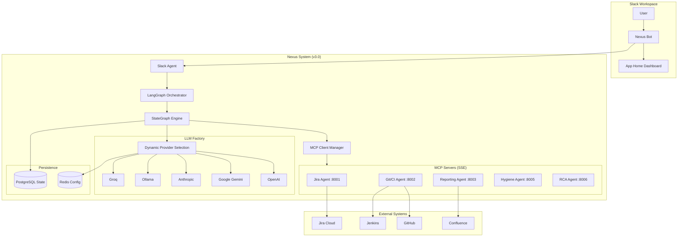

# Nexus Release Automation System

<div style="text-align: center; margin-bottom: 2em;">
  
  
  
  
  
  
</div>

**Nexus** is an intelligent multi-agent system that automates release readiness assessments. It uses **LangGraph** for stateful orchestration, **MCP (Model Context Protocol)** for tool connectivity, and an **LLM Factory** for multi-provider AI support.

## 🚀 What's New in v3.0

### 🧠 LangGraph + MCP Architecture

Nexus 3.0 introduces a completely redesigned orchestration layer:

- **LangGraph StateGraph**: Replaces the legacy ReAct loop with a stateful, graph-based workflow engine
- **MCP Tool Connectivity**: All agents expose tools via the Model Context Protocol over SSE
- **LLM Factory**: Dynamic multi-provider LLM support with runtime switching
- **Human-in-the-Loop**: Optional approval workflows for sensitive actions
- **PostgreSQL State Persistence**: Stateful conversations across sessions

### 🤖 Multi-Provider LLM Support

Choose from 7 different LLM providers via the Admin Dashboard:

| Provider | Models | Best For |
|----------|--------|----------|
| **OpenAI** | gpt-4o, gpt-4-turbo | General purpose, high quality |
| **Azure OpenAI** | Azure-hosted GPT | Enterprise compliance |
| **Google Gemini** | gemini-2.0-flash, gemini-1.5-pro | Large context, cost-effective |
| **Anthropic** | claude-3.5-sonnet | Code-focused analysis |
| **Ollama** | llama3, mistral, codellama | Self-hosted, privacy |
| **Groq** | llama-3.1-70b | Ultra-fast inference |
| **vLLM** | Any OpenAI-compatible | Self-hosted at scale |

## 🏗️ Architecture Overview



## 🎯 Key Features

### 🎛️ Admin Dashboard
Web-based UI for system management and LLM configuration:
- **LLM Provider Selection**: Choose and configure AI providers with test connection
- **Mode Switching**: Toggle Mock/Live mode instantly for all agents
- **Credential Management**: Securely update API keys and URLs
- **MCP Server Monitoring**: View connected agents and available tools


### 🤖 LLM Configuration
Dynamic multi-provider support with runtime switching:
- **Provider Grid**: Visual selection of LLM providers
- **Test Connection**: Verify configuration before saving
- **Cost Tracking**: Monitor token usage by provider


### 🔧 Proactive Jira Hygiene
The Jira Hygiene Agent ensures data quality:
- **Scheduled Checks**: Weekdays at 9:00 AM
- **Field Validation**: Labels, Fix Version, Story Points, Team
- **Interactive Fixes**: Fix violations directly from Slack modals
- **MCP Tool Exposure**: Tools available via Model Context Protocol

### 🔍 Smart Root Cause Analysis (RCA)
AI-powered build failure analysis with auto-trigger:
- **Auto-Trigger**: Jenkins webhook for automatic analysis
- **Multi-Provider LLM**: Use any configured provider for analysis
- **Slack Notifications**: Results sent to release channel with @PR-owner
- **Fix Suggestions**: Actionable code fixes with confidence scores

### 📊 Advanced Analytics Dashboard
Comprehensive insights into your release automation metrics:


- **DORA Metrics**: Deployment frequency, lead time, MTTR
- **LLM Cost Tracking**: By provider and model
- **MCP Tool Usage**: Monitor tool invocations

### 💬 Slack Integration
Natural Slack interface with:
- `/nexus status` - Check release readiness
- `/jira-update` - Update tickets via modal
- App Home dashboard with widgets
- Hygiene notifications with fix buttons

## 📖 Documentation

| Section | Description |
|---------|-------------|
| [User Guide](user_guide.md) | How to use Nexus commands and features |
| [Architecture](architecture.md) | System design with LangGraph + MCP |
| [Admin Dashboard](admin-dashboard.md) | Dashboard usage and LLM configuration |
| [Admin Dashboard Tutorial](admin-dashboard-tutorial.md) | Step-by-step configuration guide |
| [API Reference](api-specs/overview.md) | OpenAPI specifications for all services |
| [RCA Guide](rca.md) | Root Cause Analysis documentation |
| [Testing Guide](testing.md) | Testing strategy and test files |
| [Deployment](runbooks/deployment.md) | Production deployment guide |

## 🛠️ Technology Stack

| Component | Technology |
|-----------|------------|
| Orchestration | **LangGraph** (StateGraph), AsyncPostgresSaver |
| Tool Protocol | **MCP** (Model Context Protocol) over SSE |
| LLM Integration | **LLM Factory** (OpenAI, Gemini, Anthropic, Ollama, Groq, vLLM) |
| Backend | Python 3.11, FastAPI, Pydantic |
| Vector Store | ChromaDB, PostgreSQL + pgvector |
| Messaging | Slack Bolt SDK |
| Scheduling | APScheduler |
| Multi-tenancy | Custom middleware with tenant isolation |
| Observability | Prometheus, Grafana, Jaeger, OpenTelemetry |
| Infrastructure | Docker, Kubernetes, Helm |

## 🔌 Service Ports

| Service | Port | Protocol | Description |
|---------|------|----------|-------------|
| Orchestrator | 8080 | REST | LangGraph engine with LLM Factory |
| Jira Agent | 8001 | MCP/SSE | Jira operations |
| Git/CI Agent | 8002 | MCP/SSE | GitHub + Jenkins |
| Reporting Agent | 8003 | MCP/SSE | Reports |
| Slack Agent | 8084 | REST | Slack interface + App Home |
| **Jira Hygiene Agent** | **8005** | **MCP/SSE** | **Proactive quality checks** |
| **RCA Agent** | **8006** | **MCP/SSE** | **Root cause analysis** |
| **Analytics** | **8086** | REST | **Advanced analytics** |
| **Webhooks** | **8087** | REST | **Webhook integrations** |
| **Admin Dashboard** | **8088** | REST | **System management UI** |

## 🚀 Quick Start

### Prerequisites

- Python 3.10+
- Node.js 18+ (for MCP sidecars)
- Docker & Docker Compose
- An LLM API key (OpenAI, Gemini, Anthropic, or Groq)

### Local Development

```bash
# Clone the repository
git clone https://github.com/IKRedHat/Nexus-Release-Readiness-Bot.git
cd Nexus-Release-Readiness-Bot

# Run automated setup
./scripts/setup.sh

# Or start with Docker Compose
docker-compose up -d

# Access services
# - Admin Dashboard: http://localhost:8088
# - Orchestrator: http://localhost:8080
# - Grafana: http://localhost:3000
```

### Configure LLM Provider

1. Open Admin Dashboard: http://localhost:8088
2. Go to **Configuration** → **LLM**
3. Select your provider (OpenAI, Gemini, etc.)
4. Enter API key and test connection
5. Save configuration

### Try it out

```bash
# Check health
curl http://localhost:8080/health

# Run a query (uses configured LLM)
curl -X POST http://localhost:8080/query \
  -H "Content-Type: application/json" \
  -d '{"query": "What is the release readiness status for v2.0?"}'

# List available MCP tools
curl http://localhost:8080/tools

# Test LLM connection
curl -X POST http://localhost:8088/llm/test
```

## 🆕 Version History

### v3.0 - LangGraph + MCP Architecture
- ✅ **LangGraph Orchestration** - Stateful graph-based workflow engine
- ✅ **MCP Tool Protocol** - All agents expose tools via MCP/SSE
- ✅ **LLM Factory** - Multi-provider support with runtime switching
- ✅ **Human-in-the-Loop** - Optional approval workflows
- ✅ **PostgreSQL State** - Persistent conversation state

### v2.3 - Admin Dashboard
- ✅ **Admin Dashboard** - Web UI for system management
- ✅ **Dynamic Configuration** - Redis-backed live configuration
- ✅ **Mode Switching** - Instant Mock/Live toggle

### v2.2 - Smart RCA
- ✅ **RCA Agent** - AI-powered build failure analysis
- ✅ **Auto-Trigger** - Jenkins webhook integration
- ✅ **Slack Notifications** - Results to release channel

### v2.1 - Analytics & Webhooks
- ✅ **Analytics Dashboard** - DORA metrics, predictions
- ✅ **Webhook Service** - Event delivery to external systems

### v2.0 - Core Platform
- ✅ **Google Gemini 2.0 Flash** - Production LLM integration
- ✅ **Multi-tenant Architecture** - Enterprise organization isolation
- ✅ **AI Recommendations Engine** - Intelligent pattern-based suggestions
- ✅ **Slack App Home** - Rich dashboard with widgets

## 🤝 Contributing

Contributions are welcome! Please see our [Contributing Guide](https://github.com/IKRedHat/Nexus-Release-Readiness-Bot/CONTRIBUTING.md) for details.

## 📄 License

This project is licensed under the MIT License - see the [LICENSE](https://github.com/IKRedHat/Nexus-Release-Readiness-Bot/LICENSE) file for details.
