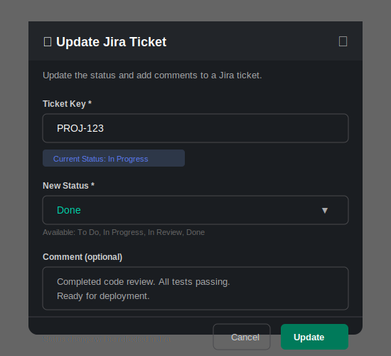
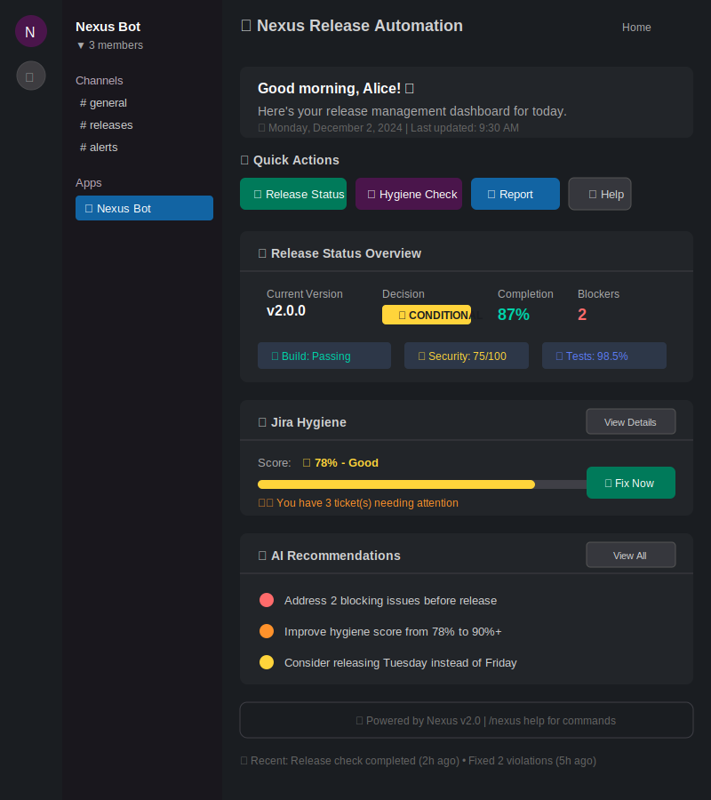
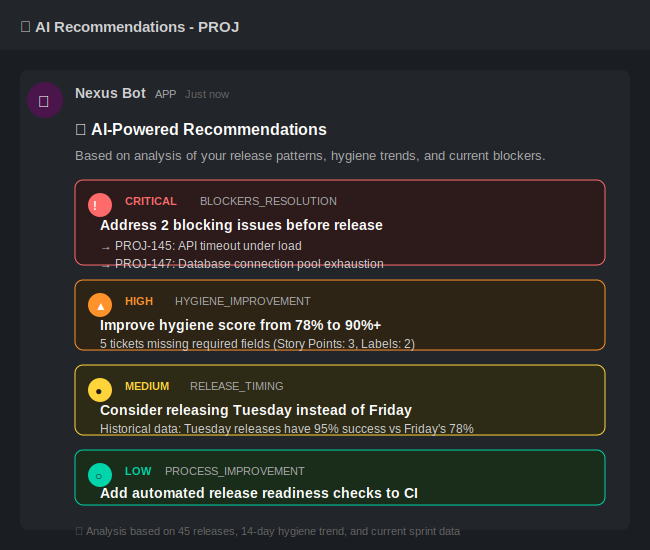
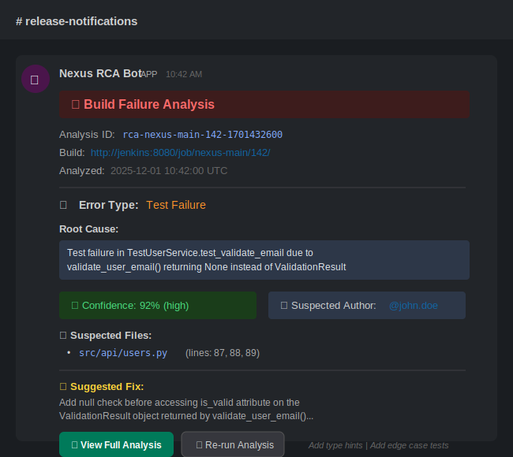
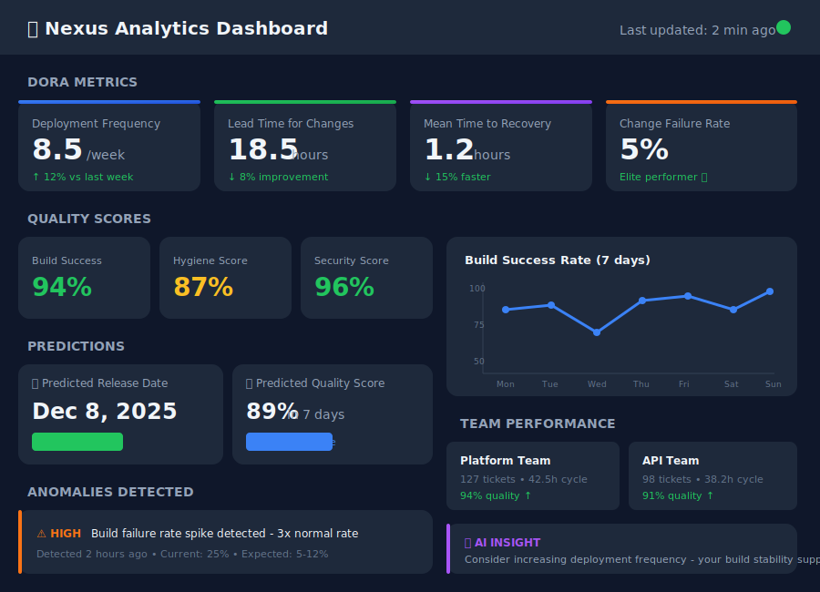
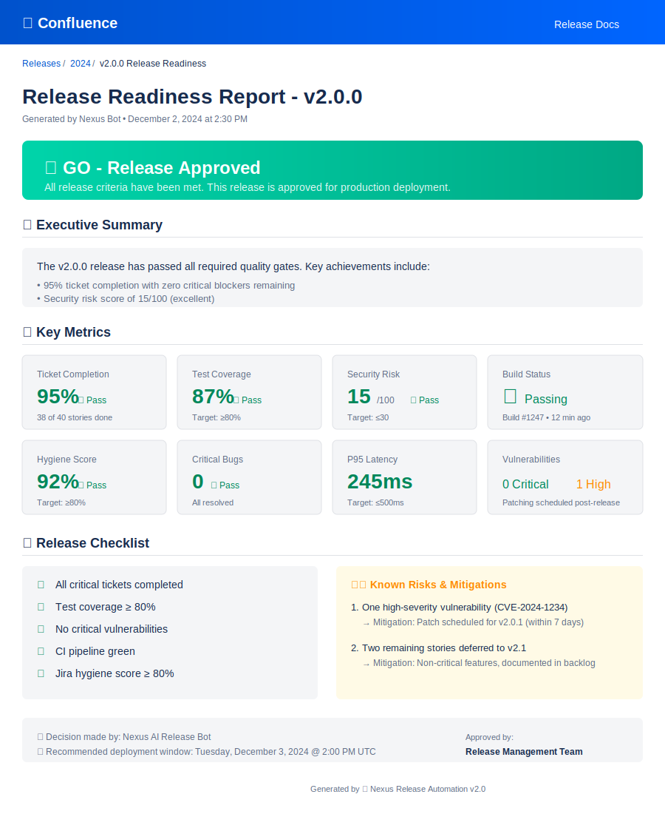
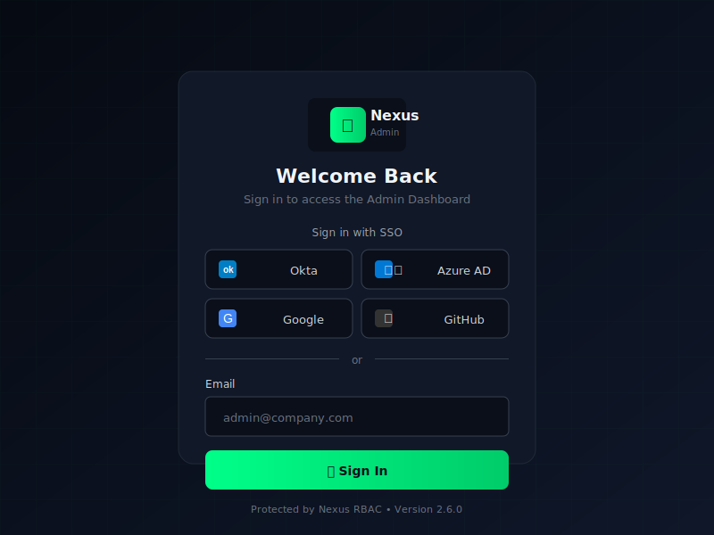
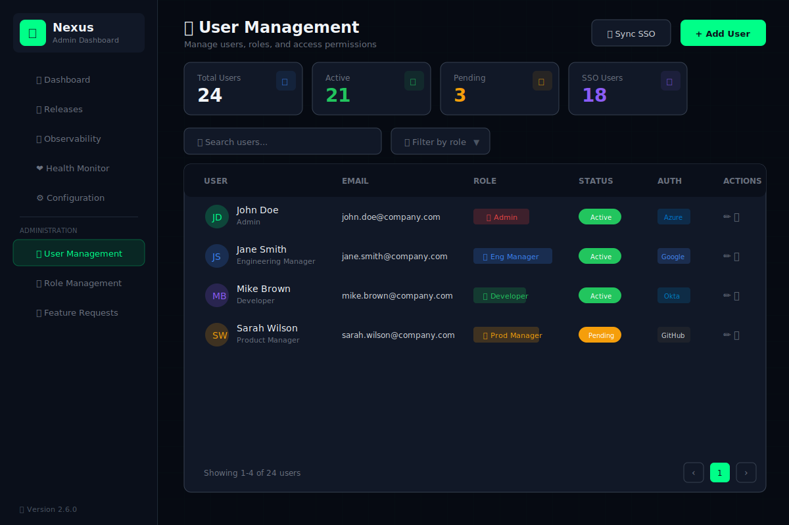
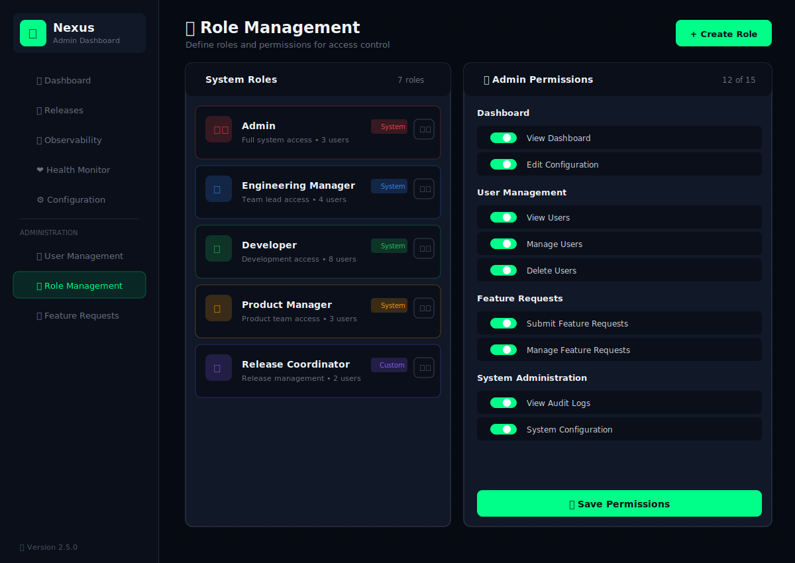
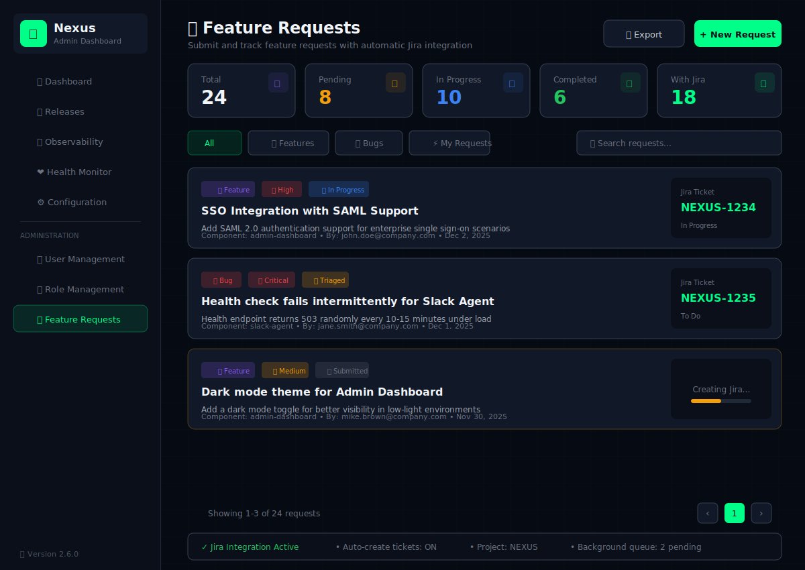

# User Guide

Welcome to the Nexus Release Automation System! This guide will help you understand how to use Nexus to streamline your release readiness assessments and maintain high-quality Jira data.

## Overview

Nexus is your AI-powered release automation assistant. It connects to your existing tools (Jira, GitHub, Jenkins, Confluence) and provides intelligent insights about your release readiness through natural language interactions.

**Key Capabilities:**
- 🧠 **Intelligent Queries** - Ask questions in natural language (powered by Google Gemini or OpenAI)
- 📊 **Release Assessments** - Automated Go/No-Go decisions
- 🔧 **Jira Hygiene** - Proactive data quality management
- 🔍 **Smart RCA** - AI-powered build failure analysis with auto-trigger
- 📈 **Advanced Analytics** - DORA metrics, predictions, anomaly detection
- 📝 **Rich Reports** - Beautiful Confluence reports
- 💡 **AI Recommendations** - Pattern-based intelligent suggestions
- 🏠 **App Home Dashboard** - Rich Slack dashboard with widgets
- 🏢 **Multi-Tenant** - Enterprise-ready organization isolation
- 🔐 **Enterprise SSO** - Single Sign-On with Okta, Azure AD, Google, GitHub
- 👥 **User Management** - Full user lifecycle with role assignments
- 🛡️ **Role-Based Access** - Granular permissions with custom roles
- 💡 **Feature Requests** - Submit requests with automatic Jira integration

## Getting Started

### Slack Setup

1. **Install the Nexus Bot** to your Slack workspace
2. **Invite the bot** to your desired channels: `/invite @nexus`
3. **Start using commands** - see below for available options

---

## Slack Commands

### `/nexus` - General Queries

The primary command for interacting with Nexus. Ask anything in natural language!

```
/nexus What is the status of PROJ-123?
/nexus Is the v2.0 release ready to go?
/nexus Show me all blocked tickets in the current sprint
/nexus What are the security vulnerabilities in our codebase?
```

**Examples:**

| Query | What Nexus Does |
|-------|-----------------|
| `/nexus status v2.0` | Checks overall release readiness for version 2.0 |
| `/nexus ticket PROJ-456` | Fetches details of a specific Jira ticket |
| `/nexus blockers` | Lists all blocking issues for the current release |
| `/nexus security check` | Runs security scan analysis |

### `/nexus help`

Display available commands and usage examples.

```
/nexus help
```

### `/jira-update` - Update Jira Tickets

Opens a modal dialog to update Jira ticket status.



**Fields:**
- **Ticket Key**: Enter the Jira ticket key (e.g., PROJ-123)
- **New Status**: Select from available transitions
- **Comment**: Optional comment to add to the ticket

### `/nexus release` - Release Readiness Check

Opens a modal to configure and run a comprehensive release readiness check.

**Parameters:**
- **Release Version**: The version being assessed (e.g., v2.0.0)
- **Epic/Project Key**: The Jira epic or project to analyze
- **Repository**: GitHub repository name
- **Environment**: Target environment (dev, staging, prod)

### `/nexus report` - Generate Reports

Generate and optionally publish release readiness reports.

**Report Types:**
- **Release Readiness**: Comprehensive Go/No-Go assessment
- **Sprint Summary**: Current sprint progress and metrics
- **Security Scan**: Vulnerability assessment report

---

## 🏠 App Home Dashboard

When you open the Nexus app in Slack, you'll see a personalized dashboard with quick actions and real-time status widgets.

### What You'll See



The dashboard includes:
- **Welcome Message**: Personalized greeting with current date
- **Quick Actions**: One-click buttons for common tasks
- **Release Status**: Current version, decision, completion percentage
- **Hygiene Score**: Visual progress bar with fix button
- **AI Recommendations**: Top 3 actionable suggestions

### Quick Actions

Click any button to instantly:
- **📊 Release Status**: Get the current release readiness assessment
- **🔧 Hygiene Check**: Run a hygiene check on your project
- **📝 Generate Report**: Create a release readiness report
- **❓ Help**: View available commands

### Hygiene Widget

The hygiene widget shows:
- Your project's current hygiene score
- Number of tickets needing your attention
- **Fix Now** button to open the hygiene fix modal

### AI Recommendations Widget

The top 3 recommendations based on:
- Release timing patterns
- Hygiene trends
- Blocker analysis

---

## 💡 AI Recommendations

Nexus analyzes historical patterns to provide intelligent recommendations for improving your release process.



### Viewing Recommendations

**From Slack:**
```
/nexus recommendations
```

**From App Home:**
Click **"View All"** in the AI Recommendations widget.

### Recommendation Types

| Type | Icon | Example |
|------|------|---------|
| **Blocker Resolution** | 🔴 | "2 blocking issues need immediate attention" |
| **Risk Mitigation** | 🔴 | "Critical vulnerability CVE-2025-1234 detected" |
| **Hygiene Improvement** | 🟠 | "5 tickets missing Story Points" |
| **Release Timing** | 🟡 | "Consider releasing Tuesday - lower failure rate" |
| **Velocity Optimization** | 🟡 | "Velocity dropped 30% - review blockers" |
| **Process Improvement** | 🟢 | "Add automated release checks to CI" |

### Priority Levels

- **Critical (🔴)**: Requires immediate attention - blocks release
- **High (🟠)**: Should be addressed before release
- **Medium (🟡)**: Consider addressing for improvement
- **Low (🟢)**: Nice to have - improves long-term process

### Recommendation Sources

1. **Release Pattern Analyzer**: Day-of-week success rates, failure patterns
2. **Hygiene Pattern Analyzer**: Score trends, common violations
3. **Velocity Analyzer**: Predictability, capacity issues
4. **Risk Analyzer**: Blockers, vulnerabilities, risk scores

---

## 🔧 Jira Hygiene Notifications

Nexus proactively monitors your Jira data quality through the **Jira Hygiene Agent**. This ensures your tickets are properly filled out before release assessments.

### How It Works

1. **Scheduled Checks**: Every weekday at 9:00 AM, Nexus scans active sprint tickets
2. **Validation**: Checks for missing required fields
3. **Notifications**: Sends DM to assignees with violation details
4. **Interactive Fixes**: Fix issues directly from Slack without leaving the app

### What Gets Checked

| Field | Why It Matters |
|-------|----------------|
| 🏷️ **Labels** | Categorization and filtering |
| 📦 **Fix Version** | Release planning and tracking |
| 🔍 **Affected Version** | Impact and regression analysis |
| 📊 **Story Points** | Capacity planning and velocity |
| 👥 **Team/Contributors** | Ownership and accountability |

### Receiving a Hygiene Notification

When tickets assigned to you have missing fields, you'll receive a DM like this:


The notification includes:
- Personalized greeting
- Count of tickets needing attention
- Current project hygiene score
- List of specific tickets with their missing fields
- Interactive action buttons

### Fixing Violations from Slack

Click **"🔧 Fix Tickets Now"** to open an interactive modal:


**How it works:**

1. **Modal Opens**: Shows all tickets with their missing fields
2. **Fill In Values**: Enter the missing information for each ticket
   - Labels: `backend, api, security` (comma-separated)
   - Fix Version: `v2.0.0`
   - Story Points: Select from dropdown (1, 2, 3, 5, 8, 13, 21)
   - Team: `Platform Team`
3. **Submit**: Click "Update All"
4. **Confirmation**: Receive a confirmation DM when updates complete

### Snoozing Reminders

Click **"⏰ Remind Me Later"** to snooze the notification. You'll be reminded again in 24 hours.

### Hygiene Score

The **Project Hygiene Score** is calculated as:

```
Hygiene Score = (Compliant Tickets / Total Tickets) × 100%
```

- **90-100%**: Excellent ✅
- **70-89%**: Good 🟡
- **50-69%**: Needs Improvement ⚠️
- **Below 50%**: Critical 🔴

---

## 🔍 Smart Root Cause Analysis (RCA)

Nexus automatically analyzes build failures to identify root causes and suggest fixes. The **RCA Agent** uses AI (Google Gemini 1.5 Pro) to correlate error logs with code changes.

### How It Works

1. **Auto-Trigger**: When a Jenkins build fails, a webhook triggers the RCA Agent
2. **Log Analysis**: Fetches and intelligently truncates console logs
3. **Git Correlation**: Maps errors to recent code changes
4. **AI Analysis**: Gemini analyzes logs + diffs to identify root cause
5. **Slack Notification**: Sends results to release channel, tagging the PR owner

### Asking About Failures

You can also ask Nexus about build failures naturally:

```
/nexus Why did the last build fail?
/nexus What caused the nexus-main build to fail?
/nexus Diagnose the error in job nexus-api build 142
/nexus Analyze the latest CI failure
```

### Receiving RCA Notifications

When a build fails, the release channel receives an automatic notification:



The notification includes:
- **Error Type**: Color-coded badge (🧪 Test, 🔧 Compilation, 📦 Dependency)
- **Root Cause**: AI-generated summary of the failure
- **Confidence Score**: How sure the analysis is (🟢 high / 🟡 medium / 🔴 low)
- **@PR Owner**: Tagged so they get notified immediately
- **Suspected Files**: With specific line numbers
- **Fix Suggestion**: Actionable recommendation
- **Action Buttons**: View full analysis or re-run

### Confidence Levels

| Level | Score | Meaning |
|-------|-------|---------|
| 🟢 High | 80%+ | Strong correlation between error and code change |
| 🟡 Medium | 50-79% | Likely cause, may need manual verification |
| 🔴 Low | 30-49% | Possible cause, review recommended |
| ⚪ Uncertain | <30% | Unable to determine, check logs manually |

### Manual Analysis

You can also trigger RCA analysis manually via API:

```bash
curl -X POST http://localhost:8006/analyze \
  -H "Content-Type: application/json" \
  -d '{
    "job_name": "nexus-main",
    "build_number": 142,
    "notify": true,
    "channel": "#release-notifications",
    "pr_owner_email": "developer@example.com"
  }'
```

---

## 📊 Advanced Analytics Dashboard

Nexus provides a comprehensive analytics service for tracking DORA metrics, predictions, and anomaly detection.

### Accessing Analytics

**Via API:**
```bash
# Get KPI Dashboard
curl "http://localhost:8086/api/v1/kpis?time_range=7d"

# Get trend analysis
curl "http://localhost:8086/api/v1/trends?time_range=30d"
```

**Via Slack:**
```
/nexus show analytics
/nexus what are our DORA metrics?
/nexus predict release date for v2.1
```

### Dashboard Overview



The dashboard provides:

#### DORA Metrics
The four key DevOps Research and Assessment metrics:

| Metric | Elite Benchmark | What It Measures |
|--------|-----------------|------------------|
| **Deployment Frequency** | Multiple/day | How often you deploy |
| **Lead Time** | < 1 hour | Commit to production time |
| **MTTR** | < 1 hour | Recovery time after incidents |
| **Change Failure Rate** | < 15% | % of deployments causing failures |

#### Quality Scores
- **Build Success Rate**: CI/CD pipeline reliability
- **Hygiene Score**: Jira data quality compliance
- **Security Score**: Vulnerability assessment

#### Predictions
AI-powered forecasting:
- **Release Date**: When the release will be ready
- **Quality Score**: Predicted future quality
- **Resource Needs**: Team capacity planning

#### Anomaly Detection
Automatic alerts for unusual patterns:
- Build failure rate spikes
- Velocity drops
- Quality degradation

### Using Predictions

**Predict Release Date:**
```bash
curl -X POST "http://localhost:8086/api/v1/predict/release-date" \
  -d '{"project": "NEXUS", "target_tickets": 100, "current_completed": 65}'
```

**Response:**
```json
{
  "predicted_value": "2025-12-08T10:30:00Z",
  "confidence": 0.85,
  "factors": [
    "Historical velocity: 5.2 tickets/day",
    "Remaining tickets: 35"
  ]
}
```

### Anomaly Alerts

When anomalies are detected, you'll see alerts in the dashboard with severity levels:
- 🔴 **Critical**: Immediate action required
- 🟠 **High**: Address within hours
- 🟡 **Medium**: Monitor and address soon
- ⚪ **Low**: Informational

---

## Understanding Reports

### Release Readiness Report

The release readiness report provides a comprehensive assessment and is automatically published to Confluence.



#### 1. Decision Banner

Possible decisions:
- 🟢 **GO**: All required criteria passed
- 🔴 **NO-GO**: Critical blockers present
- 🟡 **CONDITIONAL**: Approved with conditions
- ⚪ **PENDING**: Assessment in progress

#### 2. Key Metrics

| Metric | Description | Target |
|--------|-------------|--------|
| **Ticket Completion** | Percentage of stories done | ≥ 90% |
| **Test Coverage** | Code coverage percentage | ≥ 80% |
| **Security Risk Score** | 0-100 risk assessment | ≤ 30 |
| **Build Success Rate** | CI pipeline reliability | ≥ 95% |
| **Hygiene Score** | Data quality percentage | ≥ 80% |

#### 3. Checklist Items

Each release criterion is evaluated:

- ✅ All critical tickets completed
- ✅ Test coverage ≥ 80%
- ✅ No critical vulnerabilities
- ✅ CI pipeline green
- ✅ Jira hygiene score ≥ 80%
- ⚠️ Documentation updated (optional)

#### 4. Blockers & Risks

**Blockers** - Issues that must be resolved:
- PROJ-105: API timeout issue (Critical)

**Risks** - Items requiring attention:
- 2 high-severity vulnerabilities require patching within 7 days
- 5 tickets missing Story Points (affects velocity calculation)

---

## Natural Language Examples

Nexus understands natural language queries. Here are some examples:

### Status Checks

```
"What's the status of our release?"
"Are we ready to deploy to production?"
"How's Sprint 42 looking?"
"Any blockers I should know about?"
```

### Jira Queries

```
"Show me all in-progress tickets for PROJ"
"What tickets are assigned to John?"
"List all bugs in the current sprint"
"What's the story points completion rate?"
```

### CI/CD Queries

```
"Is the main branch healthy?"
"What was the last build status?"
"Any failing tests?"
"Show me open pull requests"
```

### Security

```
"Run a security check on our repo"
"Any critical vulnerabilities?"
"What's our security risk score?"
```

### Hygiene

```
"What's our project hygiene score?"
"Which tickets are missing labels?"
"Run a hygiene check on PROJ"
```

---

## API Access

For programmatic access, Nexus exposes REST APIs:

### Orchestrator API

```bash
# Run a query
curl -X POST http://localhost:8080/query \
  -H "Content-Type: application/json" \
  -d '{"query": "Is v2.0 ready for release?"}'

# Check health
curl http://localhost:8080/health
```

### Hygiene Agent API

```bash
# Manual hygiene check
curl -X POST http://localhost:8005/run-check \
  -H "Content-Type: application/json" \
  -d '{"project_key": "PROJ", "notify": true}'

# Get violations for a project
curl http://localhost:8005/violations/PROJ

# Check scheduler status
curl http://localhost:8005/status
```

---

## 🎛️ Admin Dashboard

The Admin Dashboard provides a web-based interface for managing Nexus with enterprise features.

### Accessing the Dashboard

**Local Development:**
```
http://localhost:8088
```

**Production (Vercel + Render):**
```
https://your-app.vercel.app
```

### Logging In



**SSO Login:**
1. Click your organization's SSO provider (Okta, Azure AD, Google, or GitHub)
2. Authenticate with your corporate credentials
3. You'll be redirected to the dashboard automatically

**Local Login (Development):**
1. Enter email: `admin@nexus.dev`
2. Enter any password (development mode accepts any)
3. Click "Sign In"

### User Management

If you have admin privileges, you can manage users in the dashboard.



**Adding a User:**
1. Navigate to **User Management** in the sidebar
2. Click **"Add User"**
3. Enter email, name, and department
4. Select roles to assign
5. Click **"Create User"**

**Editing a User:**
1. Click the **⋮** menu next to a user
2. Select **"Edit User"**
3. Modify details or roles
4. Click **"Save Changes"**

### Role Management

Create and manage custom roles with specific permissions.



**Built-in Roles:**
- **Admin**: Full system access
- **Developer**: View + API access + Feature requests
- **Product Manager**: View + Releases + Feature requests
- **Viewer**: Read-only access

**Creating a Custom Role:**
1. Navigate to **Role Management**
2. Click **"Create Role"**
3. Enter name and description
4. Select permissions by category
5. Click **"Create Role"**

### Feature Requests

Submit feature requests and bug reports that automatically create Jira tickets.



**Submitting a Request:**
1. Navigate to **Feature Requests**
2. Click **"New Request"**
3. Select request type:
   - Feature Request
   - Bug Report
   - Improvement
   - Documentation
   - Question
4. Fill in title, description, and priority
5. For bugs: Add steps to reproduce, expected/actual behavior
6. For features: Add use case and acceptance criteria
7. Select component (routes to appropriate team)
8. Click **"Submit Request"**

**What Happens Next:**
1. Request is stored in the system
2. Jira ticket is automatically created
3. Slack notification sent to the team
4. You can track status on the Feature Requests page

**Viewing Your Requests:**
- See all requests with status, priority, and Jira links
- Click on a request to view details
- Track progress through Jira integration

---

## Tips & Best Practices

### 1. Be Specific

While Nexus understands natural language, specific queries yield better results:

❌ "Status?"  
✅ "What is the release readiness status for v2.0?"

### 2. Use Ticket Keys

When asking about specific tickets, include the full key:

✅ "What's the status of PROJ-123?"

### 3. Include Context

For release checks, include the version and project:

✅ "Is version 2.0 of the backend service ready for release?"

### 4. Review the Trace

When Nexus provides an answer, it also shows its reasoning steps. Review these to understand how conclusions were reached.

### 5. Maintain Hygiene

Regularly address hygiene notifications to:
- Improve release assessment accuracy
- Keep velocity metrics reliable
- Ensure proper release tracking

---

## Troubleshooting

### "Command not found"

Make sure the Nexus bot is installed in your workspace and invited to the channel.

### Slow Response

Complex queries involving multiple agents may take 10-30 seconds. Nexus will show a "thinking" indicator.

### Missing Data

If Nexus can't find data:
1. Verify the ticket/project key is correct
2. Check that Nexus has access to the required systems
3. Ensure the integrations are configured correctly

### No Hygiene Notifications

If you're not receiving hygiene notifications:
1. Check that your Slack email matches your Jira email
2. Verify the Hygiene Agent is running: `curl http://localhost:8005/health`
3. Check your Slack DM settings

### Modal Not Opening

If the "Fix Tickets Now" button doesn't open a modal:
1. Try again - there may be a temporary network issue
2. Check that you're using the Slack desktop or web app (not mobile)
3. Contact your administrator

### Error Messages

If you receive an error:
1. Try rephrasing your query
2. Check the Nexus status page for system issues
3. Contact your administrator

---

## Getting Help

- **In Slack**: `/nexus help`
- **Documentation**: You're reading it!
- **Architecture**: [Architecture Guide](architecture.md)
- **API Reference**: [API Specs](api-specs/overview.md)
- **Issues**: [GitHub Issues](https://github.com/IKRedHat/Nexus-Release-Readiness-Bot/issues)
